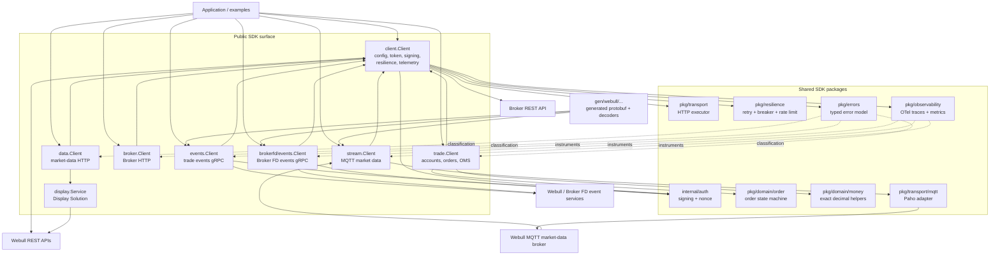

# Architecture

This document describes the architecture of `webullapi4go` from the GitNexus knowledge graph and the source paths represented by its symbols.

## Knowledge-graph basis

The initial `gitnexus://repo/webullapi4go/context` resource reported 405 files, 8,557 symbols, and 608 processes, with the index one commit behind `HEAD`. The graph was then rebuilt at commit `0e6f978` with `gitnexus analyze --index-only --force`.

The refreshed index contains:

| Metric | Value |
| --- | ---: |
| Files | 405 |
| Nodes | 8,436 |
| Relationships | 24,234 |
| Communities | 187 |
| Execution flows | 489 |
| Cross-community flows | 409 |
| Intra-community flows | 80 |
| Maximum recorded flow length | 10 steps |

The largest functional communities, aggregated by their heuristic labels, are:

| Functional area | Communities | Symbols | Maximum cohesion |
| --- | ---: | ---: | ---: |
| Client | 12 | 245 | 0.825 |
| Data | 14 | 223 | 1.000 |
| Trade | 26 | 219 | 0.920 |
| Brokerfd | 3 | 205 | 0.851 |
| Events | 21 | 157 | 1.000 |
| Stream | 14 | 144 | 0.951 |
| Broker | 7 | 84 | 0.960 |
| Breaker | 3 | 63 | 0.969 |
| Retry | 2 | 40 | 0.895 |
| Display | 4 | 36 | 0.909 |
| Auth | 5 | 30 | 1.000 |
| Order | 2 | 26 | 0.788 |
| Mqtt | 5 | 25 | 1.000 |
| Money | 3 | 14 | 1.000 |
| Errors | 2 | 11 | 0.706 |
| Observability | 2 | 9 | 0.889 |

The graph also contains smaller communities for generated protobuf (`V1`), the documentation generator, probes, examples, rate limiting, and transport. The architecture below uses the graph's cross-community relationships to show the important boundaries, then uses source inspection to clarify runtime behavior.

## Overview

`webullapi4go` is a Go SDK organized around one shared HTTP composition root and several typed service clients.

- `client.Client` is the public entry point. It resolves region/environment endpoints, owns the shared HTTP transport, manages the token cache, and applies request signing, resilience, typed errors, correlation IDs, and OpenTelemetry instrumentation (`client/client.go:27`, `client/client.go:62`).
- `data.Client`, `trade.Client`, and `broker.Client` are thin typed HTTP adapters. They construct requests and delegate all transport concerns to the core client (`data/client.go:48`, `trade/client.go:48`, `broker/client.go:25`).
- `stream.Client` owns the market-data MQTT connection and uses the core client for HTTP subscription control (`stream/client.go:52`, `stream/client.go:117`).
- `events.Client` and `brokerfd/events.Client` own gRPC event streams. They use the core client for credentials, endpoint configuration, and observability, but sign and send gRPC subscriptions independently (`events/client.go:43`, `brokerfd/events/events.go:43`).
- `pkg/domain/order` owns the concurrency-safe order lifecycle state machine, while `pkg/domain/money` preserves decimal precision for quantities, prices, and cash amounts (`pkg/domain/order/order.go:15`, `pkg/domain/money/money.go`).
- `pkg/errors` provides the stable error-code model used across HTTP, MQTT, and gRPC clients (`pkg/errors/errors.go:15`).
- `pkg/observability` provides no-op-by-default OpenTelemetry tracers, meters, propagation, and lazily created instruments (`pkg/observability/otel.go:15`).
- `gen/webull/...` contains generated protobuf contracts used by the streaming clients and is not hand-edited.

The SDK keeps service clients independent of ownership of the core client. A service client's `Close` method does not close the caller's `client.Client`; the caller owns the shared HTTP connection pool and closes it explicitly (`client/client.go:139`).

## Functional areas

### 1. Core client and request pipeline

The `client` package is the central kernel of the SDK.

- `New` applies options over `DefaultConfig`, resolves endpoints from region and environment, creates a tuned `http.Transport`, and constructs both the normal and optional Broker transports (`client/client.go:62`, `client/config.go:134`, `client/region.go:99`).
- `Do`, `DoBroker`, and `DoStream` share request construction and the common `runAttempt` pipeline (`client/request.go:116`, `client/request.go:147`, `client/stream.go:47`).
- `Do` buffers and decodes JSON responses and retries only idempotent methods by default. `DoBroker` uses the Broker endpoint with the same policy. `DoStream` returns an open response body and deliberately does not retry because the body is long-lived and cannot be safely replayed (`client/request.go:97`, `client/stream.go:27`).
- Every attempt establishes a correlation ID, starts an OpenTelemetry client span, logs start/finish events, applies the rate limiter and circuit breaker, invokes request hooks and interceptors, records breaker outcome, records latency metrics, and maps errors (`client/request.go:84`, `client/request.go:190`).
- The exact compact JSON bytes produced for a request are the bytes signed and transmitted. Signing adds Webull headers after the request is built; the access-token header is injected by a transport wrapper after signing (`client/request.go:393`, `client/token.go:304`).
- Non-2xx responses are classified by `errs.FromHTTPStatus`; JSON decoding failures become API errors and network failures become transport errors (`client/request.go:324`, `pkg/errors/errors.go:182`).

### 2. Authentication and signing

Authentication is stateful but client-scoped.

- `EnsureToken` reuses a valid cached token, otherwise calls `fetchToken` (`client/token.go:166`).
- `fetchToken` creates a token, stores immediately when it is `NORMAL`, rejects unexpected non-normal sandbox tokens, and delegates production verification to bounded polling (`client/token.go:175`).
- `pollToken` checks the token endpoint until `NORMAL`, `INVALID`, `EXPIRED`, timeout, or context cancellation. Defaults are a five-second interval and five-minute timeout (`client/token.go:39`, `client/token.go:192`).
- `tokenTransport` adds `x-access-token` for non-token endpoints and avoids adding a stale token to token lifecycle calls (`client/token.go:319`).
- `internal/auth` provides the canonical Webull signing headers and cryptographic nonce generation (`internal/auth/sign.go:291`, `internal/auth/sign.go:320`).

### 3. Market data and Display Solution

`data.Client` provides typed market-data HTTP endpoints, including instruments, quotes, snapshots, ticks, bars, options, fundamentals, futures data, screeners, watchlists, and news (`data/client.go:15`).

- All standard market-data methods delegate to `core.Do` through the package-local `do` helper (`data/client.go:100`).
- Numeric wire values remain strings in DTOs so JSON precision is not lost.
- `data.Client.DisplayService` lazily creates `display.Service` using the core client's app credentials and environment (`data/client.go:68`).
- `display.Service` has its own bearer-token flow and signing implementation for the Hosted Display Solution endpoints (`display/service.go:75`, `display/service.go:206`).

### 4. Trading and order management

`trade.Client` provides accounts, assets, orders, positions, options, combos, and multi-leg operations (`trade/client.go:15`).

- Endpoint methods are thin wrappers around `core.Do`; the shared HTTP behavior is not duplicated in the trading package (`trade/client.go:78`).
- `PlaceOrder` and `BatchPlaceOrder` prepare stable client order IDs, validate the request, enforce quantity/notional guardrails before any network call, and register successful results (`trade/orders.go:521`, `trade/orders.go:566`, `trade/oms.go:168`).
- The order registry is keyed by both account ID and client order ID, is protected by an `RWMutex`, and preserves the existing tracked object when a logical order is retried (`trade/client.go:55`, `trade/client.go:123`).
- `pkg/domain/order.Machine` synchronizes lifecycle transitions, prevents terminal-state regression, treats failed cancel/modify/reject events as non-mutating, and can reconcile an authoritative status snapshot (`pkg/domain/order/order.go:80`, `pkg/domain/order/order.go:136`).
- `ReconcileOrderStatus` and `ApplyOrderEvent` are the integration points for event-driven order tracking (`trade/oms.go:71`, `trade/oms.go:93`).

### 5. Broker HTTP API

`broker.Client` exposes the Broker API over the same core client (`broker/client.go:25`).

- Its package-local `do` helper delegates to `core.DoBroker`, preserving signing, token injection, rate limiting, circuit breaking, retries, telemetry, and typed error mapping (`broker/client.go:54`).
- Broker-specific types and endpoint files are kept under `broker/`; the Broker FD HTTP surface is under `brokerfd/`.
- The nested `broker` Go module has its own `go.mod` but is part of the same repository and depends on the root module through `replace`.

### 6. Market-data streaming

`stream.Client` combines HTTP subscription control with an MQTT push transport (`stream/client.go:52`).

- `New` resolves the MQTT or MQTT-over-WebSocket endpoint, creates a `pkg/transport/mqtt.Client`, and inherits the core OpenTelemetry configuration (`stream/client.go:117`).
- `Connect` establishes the MQTT connection and starts the optional health watchdog (`stream/client.go:196`).
- Active HTTP subscriptions are stored in `subscriptionRegistry`. After a reconnect, `resubscribe` reissues them under a mutex before connection callbacks run (`stream/client.go:741`, `stream/registry.go:108`).
- Paho callbacks enter the stream client through `pkg/transport/mqtt`. `handleMessage` identifies data topics, updates health, starts a consumer span, decodes the payload, and dispatches it (`stream/client.go:419`, `pkg/transport/mqtt/mqtt.go:285`).
- Quote, snapshot, and tick payloads are delivered either to registered handlers or to per-subscription channels. Channels support blocking, drop-oldest, and drop-sample policies, and close exactly once through a lifecycle guard (`stream/channels.go:97`, `stream/client.go:506`).
- The MQTT wrapper normalizes close/cancel behavior and classifies Webull connection-limit and refused-connection errors (`pkg/transport/mqtt/mqtt.go:42`, `pkg/transport/mqtt/mqtt.go:396`).

### 7. Trading and Broker FD event streams

`events.Client` and `brokerfd/events.Client` are parallel gRPC event clients with separate generated protobuf contracts.

- `events.New` creates a TLS or insecure gRPC channel and a generated `EventServiceClient` (`events/client.go:72`, `events/client.go:99`).
- `Run` starts a reconnecting loop. Each attempt waits for channel readiness, signs and marshals a subscribe request, adds gRPC metadata, opens the server stream, receives responses, and dispatches them (`events/client.go:197`, `events/client.go:217`, `events/client.go:393`).
- Retryable transport failures and clean stream ends use exponential backoff with jitter. Authentication, permission, account, configuration, and terminal server events stop the loop (`events/client.go:240`, `events/client.go:272`).
- `events.routeDataEvent` first emits the raw event, then decodes JSON order, position, or option payloads into typed callbacks; decode failures are reported without terminating the stream (`events/payload.go:223`).
- `brokerfd/events` follows the same lifecycle with the Broker FD protobuf service and Broker FD-specific endpoint/payload handling (`brokerfd/events/events.go:42`, `brokerfd/events/events.go:170`).
- Both event clients use `pkg/observability` for attempt spans, reconnect metrics, and correlation metadata (`events/observability.go`, `brokerfd/events/observability.go`).

### 8. Shared domain, errors, and resilience

- `pkg/domain/money` provides exact decimal-backed money and quantity helpers. It is used by trading guardrails, option validation, and DTO builders (`pkg/domain/money/money.go`).
- `pkg/domain/order` is independent of transport packages and provides the canonical lifecycle state/events (`pkg/domain/order/order.go:15`).
- `pkg/errors` maps HTTP statuses and transport failures to stable codes and preserves wrapped causes for `errors.Is`/`errors.As` (`pkg/errors/errors.go:32`).
- `pkg/resilience` contains retry, rate-limit, and circuit-breaker implementations. The root client configures these policies before interceptors and records breaker outcomes after each attempt (`pkg/resilience/retry/retry.go:143`, `pkg/resilience/breaker/breaker.go:231`).
- `pkg/observability` is API-only and defaults to no-op providers, so enabling tracing or metrics is opt-in (`pkg/observability/otel.go:70`).

### 9. Generated contracts, tools, and examples

- `gen/webull/...` contains generated protobuf messages, gRPC clients/servers, and market-data decoders. It is committed for consumers and regenerated from `proto/` rather than hand-edited.
- `tools/webull-docgen` generates the API reference and reconciliation documentation from official Webull indexes.
- `examples/` demonstrates composition of the core client with data, trading, streaming, events, Broker, and account-monitoring clients.
- `docs/` documents the public API, error model, streaming behavior, trading patterns, observability, and implementation status.

## Key execution flows

The following five flows were selected from the graph's process traces to cover authentication, synchronous HTTP, market-data streaming, event streaming, and order reconciliation. The graph process names are retained so the traces can be reproduced with GitNexus.

### 1. Token acquisition and injection

**Graph process:** `FetchToken → HTTPClient` — 7 steps
**Entry:** `Method:client/token.go:Client.fetchToken#2`

1. A service call reaches `client.Do`, which calls `ensureAutoToken` before constructing the signed request (`client/request.go:116`).
2. `EnsureToken` returns a valid cached token or calls `fetchToken` (`client/token.go:166`).
3. `fetchToken` calls `CreateToken`; sandbox `NORMAL` tokens are stored immediately (`client/token.go:175`).
4. Production `PENDING` tokens enter `pollToken`, which repeatedly calls `CheckToken` through the same HTTP pipeline (`client/token.go:192`).
5. `storeToken` caches the token and installs the one-shot token transport wrapper (`client/token.go:219`).
6. Later non-token requests receive `x-access-token` after signing, while token lifecycle endpoints are excluded (`client/token.go:325`).
7. The transport executes the request and the response is returned to the common HTTP path.

### 2. Buffered REST request

**Graph process:** `ExecuteBuffered → HTTPClient` — 6 steps
**Entry:** `Method:client/request.go:Client.executeBuffered#7`

1. A typed client such as `data.Client` or `trade.Client` builds a typed request and calls `core.Do` (`data/client.go:100`, `trade/client.go:84`).
2. `Do` normalizes the path/query, ensures a correlation ID, obtains a token, and serializes the body once (`client/request.go:116`).
3. `runWithRetry` selects retry behavior; default retries apply only to GET/HEAD (`client/request.go:133`, `client/request.go:177`).
4. `runAttempt` starts telemetry, applies the rate limiter and breaker, runs hooks/interceptors, and records the result (`client/request.go:193`).
5. `executeBuffered` builds a signed request through `pkg/transport`, executes it, classifies non-2xx responses, updates clock offset, and JSON-decodes the body (`client/request.go:324`).
6. The typed endpoint returns its DTO to the caller.

The Broker flow follows the same sequence through `DoBroker`; the only transport difference is the Broker endpoint (`client/request.go:143`).

### 3. MQTT market-data dispatch

**Graph process:** `HandleMessage → DispatchEntry` — 5 steps
**Entry:** `Method:stream/client.go:Client.handleMessage#1`

1. Paho receives a message and calls the MQTT wrapper's `handleMessage` (`pkg/transport/mqtt/mqtt.go:285`).
2. The wrapper forwards topic and payload to `stream.Client.handleMessage` (`stream/client.go:169`).
3. The stream client starts a consumer span, identifies the topic, updates data-message health, and decodes the payload (`stream/client.go:419`).
4. `dispatch` selects the quote, snapshot, tick, notice, or error route; typed protobuf decoders live under `gen/webull/marketdata/v1` (`stream/client.go:560`).
5. The channel registry applies the configured drop policy, updates drop metrics, and delivers to handlers or subscription channels (`stream/channels.go:351`).

On connection loss, the MQTT wrapper reports the state, the stream client enters reconnecting state, and `resubscribe` reissues the HTTP subscription registry under `resubMu` (`stream/client.go:741`).

### 4. Reconnecting gRPC event stream

**Graph process:** `RunReconnecting → NewSubscribeRequest` — 4 steps
**Entry:** `Method:events/client.go:Client.runReconnecting#1`

1. `Run` establishes a cancellable run context and selects either one attempt or `runReconnecting` (`events/client.go:197`).
2. `runOnce` waits for gRPC readiness, opens the stream, and loops over `Recv` (`events/client.go:217`).
3. `open` creates a fresh signed subscribe request and metadata for every connection attempt (`events/client.go:393`, `events/subscribe.go:58`).
4. `dispatch` and `routeDataEvent` emit raw or typed order/position/option payloads; retryable failures return to `runReconnecting`, while terminal failures call `fail` and stop (`events/client.go:240`, `events/payload.go:223`).

`brokerfd/events` has the same reconnect topology, with the Broker FD generated service and event payload types (`brokerfd/events/events.go:218`).

### 5. Order status reconciliation

**Graph process:** `ReconcileOrderStatus → IsTerminal` — 5 steps
**Entry:** `Method:trade/oms.go:Client.ReconcileOrderStatus#3`

1. A caller supplies a Webull status string, `OrderStatus`, or `order.State` (`trade/oms.go:93`).
2. `normalizeOrderStatus` trims and maps the value through `order.FromWebullStatus`; unknown values return a typed validation error (`trade/oms.go:203`, `pkg/domain/order/order.go:359`).
3. `reconcileOrderState` looks up the account/client-order pair in the trading client's registry (`trade/oms.go:116`, `trade/client.go:101`).
4. `order.Machine.ReconcileStatus` applies the smallest legal event path, treats stale non-terminal snapshots as no-ops, and never regresses a terminal state (`pkg/domain/order/order.go:136`).
5. `IsTerminal` identifies the immutable end states used by the machine and by order-action preflight checks (`pkg/domain/order/order.go:351`, `trade/order_actions.go:198`).

Order placement follows the complementary path: `PlaceOrder` validates and applies guardrails before `trade.do`, then registers the returned order in the account-scoped registry (`trade/orders.go:521`, `trade/oms.go:137`).

## Architecture diagram

## Dependency and lifecycle rules

- Construct one `client.Client` and pass it to the service clients that share credentials and endpoint configuration.
- Close the core client once at the application boundary. Service clients are intentionally non-owning wrappers.
- Close `stream.Client` to stop the MQTT connection, health watchdog, resubscription context, and subscription channels.
- Close `events.Client` or `brokerfd/events.Client` to cancel an active `Run` loop and close its gRPC connection.
- Use the account ID together with the client order ID when accessing the OMS registry; client order IDs are only unique within an account scope.
- Do not add global registries for client state. Token state, stream state, and OMS state belong to their owning client.
- Keep numeric market-data and trading values as strings or exact decimal-backed values at DTO boundaries.

## Graph coverage notes

The graph is useful for identifying boundaries and call paths, but it is not a complete control-flow proof:

- The analyzer reported that some candidate entry points were not ranked into the final flow set, so an absent process does not prove that a code path is unreachable.
- The Windows GitNexus FTS extension was unavailable during indexing; raw Cypher queries and symbol context were used instead of relying on keyword ranking.
- The five flows above are architectural selections chosen for cross-package coverage, not simply the five longest graph traces.
- Generated protobuf and tool/example clusters are included in the graph statistics but are kept separate from the runtime architecture in the diagram.
