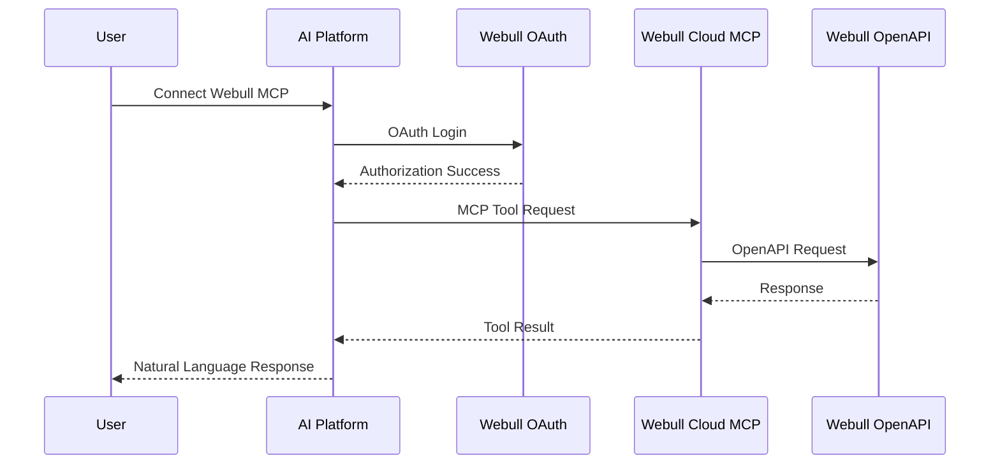
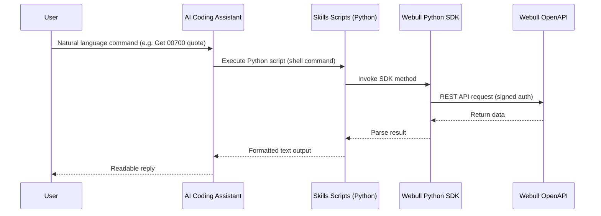
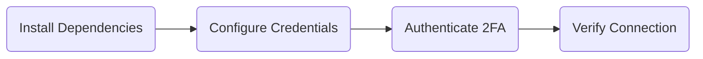
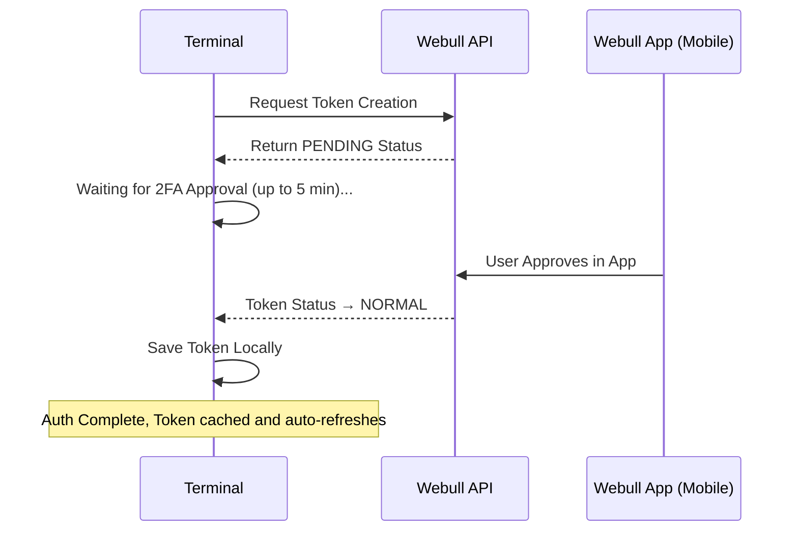

# Webull OpenAPI — Master Guides (verbatim)

> ⚠️ **Generated file — do not edit.** Regenerate with `python tools/webull-docgen/docgen.py <target>` (`reference`, `master`, `reconciliation` or `all`).

> Verbatim snapshot of Webull's published OpenAPI **guides**. No SDK-specific content. Prices/sizes are strings on the wire; see the endpoint fields in [Master Reference](master-reference.md).

| | |
|---|---|
| **Snapshot** | 2026-09-22 |
| **Sources** | [developer.webull.hk](https://developer.webull.hk/apis/llms.txt) and [developer.webull.com](https://developer.webull.com/apis/llms.txt) |
| **Contents** | Getting started, authentication, market data, trading, broker, connect, errors, FAQ, changelog, AI tools |
| **Refresh** | `python docgen.py master` (re-fetches the `.md` variant of each official page). |

[<- Webull API Reference](../webull-api.md)

## Getting Started, About and SDKs

### Getting Started

> Source: <https://developer.webull.hk/apis/docs/getting-started.md>

### Getting Started

This guide uses the Trading API as an example to help you get started quickly.

This page walks you through the complete path from zero to your first successful API call. Each step links to the relevant page for details — follow them in order and you'll be up and running quickly.

#### Step 1: Apply for API Access

Before you can use the Webull OpenAPI, you need to apply for access and get your credentials approved.

- Apply through the Webull website. See Trading API Application.

The review process typically takes 1–2 business days. You can proceed to Step 2 while waiting.

#### Step 2: Install the SDK

Install the official Webull SDK for your language. The SDK handles authentication, signature generation, and protocol details automatically.

| Language | Install Command |
|----------|----------------|
| Python | `pip3 install --upgrade webull-openapi-python-sdk` |
| Java | Add `webull-openapi-java-sdk` to your Maven dependencies |

For full installation details and environment setup, see SDKs and Tools.

#### Step 3: Get Your Credentials

Once your application is approved, generate your App Key and App Secret from the Webull website or Portal.

Want to start coding right away? Use the shared test accounts — no application needed for the sandbox environment.

#### Step 4: Make Your First API Call

With the SDK installed and credentials ready, you can make your first call. Here's a quick example using the sandbox environment:

<Tabs groupId="programming-language">

```python
from webull.core.client import ApiClient
from webull.trade.trade_client import TradeClient

api_client = ApiClient("<your_app_key>", "<your_app_secret>", "hk")
api_client.add_endpoint("hk", "api.sandbox.webull.hk")

trade_client = TradeClient(api_client)
res = trade_client.get_account_list()
print(res.json())
```

```java
import com.webull.openapi.core.http.HttpApiConfig;
import com.webull.openapi.trade.TradeClient;

HttpApiConfig config = HttpApiConfig.builder()
        .appKey("<your_app_key>")
        .appSecret("<your_app_secret>")
        .regionId("hk")
        .endpoint("api.sandbox.webull.hk")
        .build();

TradeClient client = new TradeClient(config);
System.out.println("Accounts: " + client.getAccountList());
```

If you see your account list returned, you're all set.

- Production: `api.webull.hk`
- Sandbox: `api.sandbox.webull.hk`

#### Step 5: Explore the APIs

Now that you're connected, dive into the API that fits your use case:

| API | Best For | Guide |
|-----|----------|-------|
| Trading API | Placing orders, managing positions and accounts | Trading API Getting Started |
| Market Data API | Real-time and historical market data | Market Data API Getting Started |

#### Learn More

- Authentication Overview — How request signing and token-based 2FA work
- SDKs and Tools — API environments, test accounts, and management tools
- Additional Resources — SDK source code, support channels, and learning materials

### About Webull

> Source: <https://developer.webull.hk/apis/docs/about.md>

### About Webull

Webull is a technology-driven financial services company focused on providing accessible, professional, and intelligent investing experiences. By combining deep expertise in internet technology with financial services, Webull delivers a seamless self-directed investment platform with advanced tools for individuals and institutions alike.

#### Regulatory Background

Webull Securities Limited ("Webull") is a licensed corporation regulated by the Securities and Futures Commission of Hong Kong (SFC), holding the following licenses:

- Type 1 — Dealing in Securities
- Type 2 — Dealing in Futures Contracts
- Type 4 — Advising on Securities

Central Entity Number: BNG700

#### Our Philosophy

Every investor deserves professional-grade tools and fair access to the market. We are committed to removing technical barriers so you can focus on what truly matters — making smarter investment decisions.

Through technology, we provide you with real-time market insights, flexible trading capabilities, and reliable infrastructure. Whether you trade manually or run automated strategies, you get a smooth and efficient experience.

### About Webull OpenAPI

> Source: <https://developer.webull.hk/apis/docs/about-open-api.md>

### About Webull OpenAPI

#### Overview

Webull OpenAPI is designed to provide convenient, fast, and secure quantitative trading services. It helps investors implement flexible and diverse trading or market data strategies through programmatic access to Hong Kong, US, and China Mainland markets.

#### Interface Protocols

| Protocol | Description |
|----------|-------------|
| HTTP | Trading operations, account management, and historical/snapshot market data queries |
| MQTT | Real-time market data streaming via WebSocket/TCP |
| gRPC | Real-time event push notifications (e.g., order status changes) |

#### Supported Markets and Products

| Market | Trading Products | Market Data Coverage |
|--------|-----------------|---------------------|
| Hong Kong | Stocks, ETFs, Warrants, CBBCs | HK Stocks (HKEX) |
| United States | Stocks, Options (excluding Index Options) | US Stocks (NASDAQ Basic, NASDAQ TotalView), US Options (OPRA), Overnight Session, US Futures (CME, CBOT, COMEX, NYMEX) |
| China Mainland | A-Shares (via Stock Connect) | A-Shares |

#### Authentication

Webull OpenAPI uses a dual-layer security mechanism:

- **Signature** — Every API request includes an HMAC-SHA1 signature computed from your App Key and App Secret. The SDK handles this automatically.
- **Token** — A reusable access token verified via the Webull App for trading and account operations.

All API requests must be made over HTTPS. For details, see Authentication Overview.

#### Official SDKs

To simplify integration, Webull provides official SDKs with built-in authentication and protocol handling:

| Language | Requirement |
|----------|-------------|
| Python | Version 3.8–3.13 |
| Java | JDK 8+ (Maven) |

For installation instructions and code examples, see SDKs and Tools.

#### AI-Assisted Development

Our documentation is published in machine-readable formats, making it easy to use with AI coding assistants like Cursor, Kiro, and other LLM-powered tools. Feed the Webull API reference directly into your AI workflow to generate integration code, debug issues, and explore endpoints faster. Learn more →

### SDKs and Tools

> Source: <https://developer.webull.hk/apis/docs/sdk.md>

### SDKs and Tools

Webull provides official SDKs to help you integrate with the OpenAPI platform. The SDKs wrap the REST and streaming APIs so you can focus on building your application instead of handling low-level details.

Here's what the SDKs handle for you:

- **Authentication** — Automatic signature generation and token management
- **Trading** — Place, modify, and cancel orders across stocks, ETFs, options, warrants, and CBBCs
- **Market Data** — Fetch historical data via HTTP and subscribe to real-time streams via MQTT
- **Order Events** — Subscribe to real-time order status updates via gRPC

#### Official SDKs

<Tabs groupId="programming-language">

**Requirements:** Python 3.8 – 3.14

```bash
pip3 install --upgrade webull-openapi-python-sdk
```

Source code: [webull-openapi-python-sdk](https://github.com/webull-inc/webull-openapi-python-sdk)

**Requirements:** JDK 8+

```xml
<dependency>
    <groupId>com.webull.openapi</groupId>
    <artifactId>webull-openapi-java-sdk</artifactId>
    <version>1.0.3</version> <!-- Check https://central.sonatype.com/artifact/com.webull.openapi/webull-openapi-java-sdk for the latest version -->
</dependency>
```

Source code: [webull-openapi-java-sdk](https://github.com/webull-inc/webull-openapi-java-sdk)

#### API Environments

Webull provides two environments. Use the sandbox environment for development and integration testing, then switch to production when you're ready to go live.

##### Production

| API | Service | Host |
| --- | --- | --- |
| Trading API | HTTP API | `api.webull.hk` |
| Trading API | Trading Events (gRPC) | `events-api.webull.hk` |
| Market Data API | HTTP API (Server-to-Server) | `api.webull.hk` |
| Market Data API | HTTP API (Client-to-Server) | `quotes-hk.webullsolutions.com` |
| Market Data API | Streaming (Server-to-Server) | `data-api.webull.hk` |
| Market Data API | Streaming (Client-to-Server) | `quotes-stream-hk.webullsolutions.com` |
| Broker API | HTTP API | `broker-api.webull.hk` |
| Broker API | Event Push | `broker-api-event-push.webull.hk` |

##### Sandbox

| API | Service | Host |
| --- | --- | --- |
| Trading API | HTTP API | `api.sandbox.webull.hk` |
| Trading API | Trading Events (gRPC) | `events-api.sandbox.webull.hk` |
| Market Data API | HTTP API (Server-to-Server) | `api.sandbox.webull.hk` |
| Market Data API | Streaming (Server-to-Server) | `data-api.sandbox.webull.hk` |
| Broker API | HTTP API | `broker-api.sandbox.webull.hk` |
| Broker API | Event Push | `broker-api-event-push.sandbox.webull.hk` |

To switch environments, simply change the endpoint when initializing the SDK client. No other code changes are needed.

#### Test Accounts

Use these shared credentials to start coding immediately — no application required for the sandbox environment.

| No. | Account ID | App Key | App Secret |
|-----|------------|---------|------------|
| 1 | V4H6R3L4VRI33UQ4TGR2NM1VI9 | 4b2b7acd2bf0d30d8aea173fceefa238 | 840b4353a6a31ce3ab91e2f99a510272 |
| 2 | OGG4RRLC6EDE98HI920KRBVSKB | 42bd186fb65ea76de309d69cf12f024e | 29feb64b59d6b1b6b2d2aa8cea8a1b8d |
| 3 | 2DHSQ9B1DMPBFPMPFU2R5SDPB8 | 64fc722617af8b5ebb746f50a910e91f | a268416fc681d438533f9e9316bab576 |

These are shared public accounts. Orders and positions may be changed by other users at any time. To avoid this, you can create your own dedicated sandbox account through the Sandbox environment application process. Note that market data access is limited to the symbol AAPL (including real-time streaming) for all sandbox accounts.

#### Verify Your Setup

After installing the SDK, run this quick check to confirm everything is working:

<Tabs groupId="programming-language">

```python
import json
from webull.core.client import ApiClient
from webull.trade.trade_client import TradeClient

api_client = ApiClient("<your_app_key>", "<your_app_secret>", "hk")
api_client.add_endpoint("hk", "api.sandbox.webull.hk")

trade_client = TradeClient(api_client)
res = trade_client.account_v2.get_account_list()
if res.status_code == 200:
    print("Success!", json.dumps(res.json(), indent=2))
else:
    print("Error:", res.status_code, res.text)
```

```java
import com.webull.openapi.core.http.HttpApiConfig;
import com.webull.openapi.trade.TradeClientV2;

public class VerifySetup {
    public static void main(String[] args) {
        HttpApiConfig config = HttpApiConfig.builder()
                .appKey("<your_app_key>")
                .appSecret("<your_app_secret>")
                .regionId("hk")
                .endpoint("api.sandbox.webull.hk")
                .build();

        TradeClientV2 client = new TradeClientV2(config);
        System.out.println("Account list: " + client.getAccountList());
    }
}
```

If you see your account list returned, you're all set.

#### Management Tools

Webull provides web-based tools for managing your API credentials and accounts:

| Tool | For | Description |
|------|-----|-------------|
| [Webull Official Website](https://www.webull.hk) | Individual clients | Manage API keys, view account information, and access trading services |
| [Institutional Portal](https://corporate.webull.hk/center) | Institutional clients | Manage account funds, positions, and orders via secure login |

#### What's Next

- Getting Started — Make your first API call in 5 steps
- Authentication Overview — How request signing and token-based 2FA work
- Additional Resources — Support channels, SDK source code, and learning materials

### Additional Resources

> Source: <https://developer.webull.hk/apis/docs/resources.md>

### Additional Resources

#### Learning

| Resource | Description |
|----------|-------------|
| [Webull Learn](https://www.webull.hk/en/learn) | Market updates, developer tools and tips, and educational materials to help you develop with Webull. |

#### SDK Source Code

| SDK | GitHub | Package Registry |
|-----|--------|-----------------|
| Python | [webull-inc/webull-openapi-python-sdk](https://github.com/webull-inc/webull-openapi-python-sdk) | [PyPI](https://pypi.org/project/webull-python-sdk-core/) |
| Java | [webull-inc/webull-openapi-java-sdk](https://github.com/webull-inc/webull-openapi-java-sdk) | [Maven Central](https://central.sonatype.com/artifact/com.webull.openapi/webull-openapi-java-sdk-parent) |

#### Support

| Resource | Description |
|----------|-------------|
| [Help Center](https://www.webull.hk/en/help) | FAQs and contact options for getting in touch with our team. |
| API Support Email | webull-api-support@webull.com |
| Official WhatsApp Group |  |

#### Legal

| Resource | Description |
|----------|-------------|
| [Disclosure Library](https://www.webull.hk/en/about/disclosure) | Regulatory disclosures and policies. |

## Authentication

### Authentication Overview

> Source: <https://developer.webull.hk/apis/docs/authentication/overview.md>

### Authentication Overview

Webull OpenAPI uses a signature-based authentication mechanism to ensure the security of every API call. This page explains the authentication model and how the components work together.

#### How It Works

Every API request to Webull must include two things:

1. **Signature** — A cryptographic signature (e.g. HMAC-SHA1) computed from the request content and your App Secret. This proves the request is authentic and hasn't been tampered with.
2. **Token** — In accordance with Hong Kong security and compliance requirements, OpenAPI also requires Token authentication. A reusable access token verified via the Webull App is required for trading and account operations.

All API requests must be made over HTTPS. Calls made over HTTP will fail. Unauthenticated requests will also fail.

#### Authentication Flow

| Step | Action | Details |
|------|--------|---------|
| 1 | Obtain API credentials | Apply for API access and generate your App Key and App Secret |
| 2 | Sign each request | Compute a cryptographic signature from the request content using your App Secret. The SDK handles this automatically. |
| 3 | Create a Token | The SDK initiates Token creation automatically; you only need to complete verification in the Webull App |
| 4 | Include credentials in headers | Add `x-app-key`, `x-signature`, and `x-access-token` to every request |

#### Required Request Headers

| Header | Required | Description |
|--------|----------|-------------|
| `x-app-key` | Yes | A unique identifier issued to a developer for accessing the API |
| `x-timestamp` | Yes | Request timestamp in ISO 8601 format: `YYYY-MM-DDThh:mm:ssZ` (UTC only) |
| `x-signature` | Yes | Cryptographic signature verifying the authenticity and integrity of the request |
| `x-signature-algorithm` | Yes | Signature algorithm (e.g. `HMAC-SHA1`) |
| `x-signature-version` | Yes | Signature algorithm version (e.g. `1.0`) |
| `x-signature-nonce` | Yes | Unique random string, regenerated for each request |
| `x-version` | Yes | Interface version (accepts `v3`) |

The `app_secret` is used solely on the client side for signature generation. It is **not** included as an HTTP request header.

The Webull SDK handles both signature generation and Token creation/verification automatically. You only need to configure your App Key and App Secret — the SDK takes care of the rest, including the 2FA flow.

#### Managing Your Credentials

You can view and manage your App Key and App Secret on the [Webull Official Website](https://www.webull.hk) under **OpenAPI Management > App Management**.

Your App Key and App Secret contain important access permissions. **Never** expose them in public places such as GitHub repositories, client-side code, or forums.

#### Next Steps

- Trading API Application — How to apply for Trading API access and generate credentials
- Broker API Application — How to apply for Broker API access
- Signature — Detailed signature generation algorithm and examples
- Token — Token creation, verification, and lifecycle management

### Signature

> Source: <https://developer.webull.hk/apis/docs/authentication/signature.md>

### Signature

Every API request to Webull must include a cryptographic signature in the request header. The signature is computed from the request content and your App Secret, ensuring the integrity and authenticity of each request.

```
x-signature: <signature_value>
```

The Webull SDK handles signature generation automatically. If you're using the SDK, you can skip this page — it's here for those implementing signature logic manually.

#### Required Request Headers

Every API request must include the following headers:

| Header | Required | Description |
|--------|----------|-------------|
| `x-app-key` | Yes | A unique identifier issued to a developer for accessing the API |
| `x-timestamp` | Yes | Request timestamp in ISO 8601 format: `YYYY-MM-DDThh:mm:ssZ` (UTC only) |
| `x-signature` | Yes | The computed signature value (output of the algorithm described below) |
| `x-signature-algorithm` | Yes | Signature algorithm (e.g. `HMAC-SHA1`) |
| `x-signature-version` | Yes | Signature algorithm version (e.g. `1.0`) |
| `x-signature-nonce` | Yes | Unique random string, regenerated for each request |
| `x-version` | Yes | Interface version (accepts `v3`) |

The `app_secret` is a unique key issued to developers. It is **not** included in any HTTP request header — it is used solely on the client side for signature generation. See Step 2: Construct the Key for details.

#### What Gets Signed

The signature is computed from four parts of the HTTP request:

1. Request path
2. Query parameters
3. Request body
4. Signing headers — the following headers participate in signature computation:
- `x-app-key`
- `x-signature-algorithm`
- `x-signature-version`
- `x-signature-nonce`
- `x-timestamp`
- `host`

`x-signature` and `x-version` do **not** participate in signing. `x-signature` carries the output of the signature itself; `x-version` is a required request header but is excluded from the signature computation.

- The content being signed does **not** require [URL Encoding](https://en.wikipedia.org/wiki/Percent-encoding) at this stage.
- For POST requests, `Content-Type` must be `application/json`.

#### Signature Algorithm

##### Step 1: Construct the Signature String

1. Merge all query parameters and the signing headers (listed in What Gets Signed) into a single list.
2. Sort all parameter names in ascending alphabetical order.
3. Join them as `name1=value1&name2=value2&...` → this is **`str1`**.
4. If the request has a body, compute its MD5 hash and convert to uppercase: `toUpper(MD5(body))` → this is **`str2`**.
5. Concatenate: **`str3`** = `path` + `&` + `str1` + `&` + `str2`
- If the body is empty: **`str3`** = `path` + `&` + `str1`
6. URL-encode `str3` → this is **`encoded_string`**.

- There must be **no** extra spaces between body parameter keys and values.
- If the body is empty, omit `str2` entirely.

##### Step 2: Construct the Key

Append `&` to the end of your App Secret:

```
app_secret = "<your_app_secret>&"
```

##### Step 3: Generate the Signature

```
signature = base64(HMAC-SHA1(app_secret, encoded_string))
```

#### Worked Example

Below is a complete example showing each step of the signature generation process.

##### Request Details

**Path:** `/trade/place_order`

**Query Parameters:**

| Name | Value |
|------|-------|
| a1 | webull |
| a2 | 123 |
| a3 | xxx |
| q1 | yyy |

**Request Headers:**

| Name | Value |
|------|-------|
| x-app-key | 776da210ab4a452795d74e726ebd74b6 |
| x-timestamp | 2022-01-04T03:55:31Z |
| x-signature-version | 1.0 |
| x-signature-algorithm | HMAC-SHA1 |
| x-signature-nonce | 48ef5afed43d4d91ae514aaeafbc29ba |
| host | api.webull.com |

**Body:**
```json
{"k1":123,"k2":"this is the api request body","k3":true,"k4":{"foo":[1,2]}}
```

**App Secret:** `0f50a2e853334a9aae1a783bee120c1f`

##### Step 1: Construct the Signature String

1. Merge query parameters and signing headers into a single list, then sort all parameter names in ascending alphabetical order:

   ```
   a1=webull, a2=123, a3=xxx,
   host=api.webull.com,
   q1=yyy,
   x-app-key=776da210ab4a452795d74e726ebd74b6,
   x-signature-algorithm=HMAC-SHA1,
   x-signature-nonce=48ef5afed43d4d91ae514aaeafbc29ba,
   x-signature-version=1.0,
   x-timestamp=2022-01-04T03:55:31Z
   ```

2. Join them as key=value pairs with `&` → **str1**:

   ```
   a1=webull&a2=123&a3=xxx&host=api.webull.com&q1=yyy&x-app-key=776da210ab4a452795d74e726ebd74b6&x-signature-algorithm=HMAC-SHA1&x-signature-nonce=48ef5afed43d4d91ae514aaeafbc29ba&x-signature-version=1.0&x-timestamp=2022-01-04T03:55:31Z
   ```

3. Compute MD5 of the body and convert to uppercase → **str2**:

   ```
   E296C96787E1A309691CEF3692F5EEDD
   ```

4. Concatenate path + `&` + str1 + `&` + str2 → **str3**:

   ```
   /trade/place_order&a1=webull&a2=123&a3=xxx&host=api.webull.com&q1=yyy&x-app-key=776da210ab4a452795d74e726ebd74b6&x-signature-algorithm=HMAC-SHA1&x-signature-nonce=48ef5afed43d4d91ae514aaeafbc29ba&x-signature-version=1.0&x-timestamp=2022-01-04T03:55:31Z&E296C96787E1A309691CEF3692F5EEDD
   ```

5. URL-encode str3 → **encoded_string**:

   ```
   %2Ftrade%2Fplace_order%26a1%3Dwebull%26a2%3D123%26a3%3Dxxx%26host%3Dapi.webull.com%26q1%3Dyyy%26x-app-key%3D776da210ab4a452795d74e726ebd74b6%26x-signature-algorithm%3DHMAC-SHA1%26x-signature-nonce%3D48ef5afed43d4d91ae514aaeafbc29ba%26x-signature-version%3D1.0%26x-timestamp%3D2022-01-04T03%3A55%3A31Z%26E296C96787E1A309691CEF3692F5EEDD
   ```

6. When path is empty (e.g., gRPC streaming subscriptions):
   ```
   str3 = name1=value1=name2=value2=... + & + str2
   If the body is empty: str3 = name1=value1=name2=value2=...
   Note: When there is no path, the sorted key=value pairs are joined with = instead of &.
   ```

The worked example merges algorithm steps 1–3 into a single step for readability. The logic is identical to the 6-step algorithm above.

##### Step 2: Construct the Key

```
app_secret = "0f50a2e853334a9aae1a783bee120c1f&"
```

##### Step 3: Generate the Signature

```
signature = base64(HMAC-SHA1(app_secret, encoded_string))
```

**Result:** `kvlS6opdZDhEBo5jq40nHYXaLvM=`

Use the values above to test your signature code. If your output matches `kvlS6opdZDhEBo5jq40nHYXaLvM=`, your implementation is correct.

#### Code Examples

The following examples demonstrate how to sign and call the **Account List** API (`GET /trading/accounts/list`) without using the Webull SDK.

<Tabs groupId="programming-language">

```python
import hashlib
import hmac
import base64
import json
import uuid
import urllib.parse
from datetime import datetime, timezone

import requests

# Replace with your credentials
APP_KEY = "<your_app_key>"
APP_SECRET = "<your_app_secret>"
HOST = "<api_endpoint>"  # Your API host, varies by environment
BASE_URL = f"https://{HOST}"

def generate_signature(path, query_params, body_string, app_key, app_secret, host, timestamp, nonce):
    """
    Generate the request signature following the 3-step algorithm.
    """
    # Signing headers (x-signature and x-version are NOT included)
    signing_headers = {
        "x-app-key": app_key,
        "x-timestamp": timestamp,
        "x-signature-algorithm": "HMAC-SHA1",
        "x-signature-version": "1.0",
        "x-signature-nonce": nonce,
        "host": host,
    }

    # Step 1: Construct the Signature String
    # 1. Merge query params + signing headers
    all_params = {}
    all_params.update(query_params)
    all_params.update(signing_headers)

    # 2-3. Sort by key, join as key=value pairs → str1
    str1 = "&".join(f"{k}={all_params[k]}" for k in sorted(all_params.keys()))

    # 4. If body exists, compute MD5 (uppercase hex) → str2
    if body_string:
        str2 = hashlib.md5(body_string.encode("utf-8")).hexdigest().upper()
        str3 = f"{path}&{str1}&{str2}"
    else:
        str3 = f"{path}&{str1}"

    # 6. URL-encode str3
    encoded_string = urllib.parse.quote(str3, safe="")

    # Step 2: Construct the Key
    signing_key = f"{app_secret}&"

    # Step 3: Generate the Signature
    signature = base64.b64encode(
        hmac.new(signing_key.encode("utf-8"), encoded_string.encode("utf-8"), hashlib.sha1).digest()
    ).decode("utf-8")

    return signature

def call_api(method, path, query_params=None, body=None):
    """
    Sign and send an API request.
    """
    query_params = query_params or {}
    timestamp = datetime.now(timezone.utc).strftime("%Y-%m-%dT%H:%M:%SZ")
    nonce = uuid.uuid4().hex

    # Serialize body as compact JSON (no spaces) — the exact same string
    # must be used for both MD5 computation and the HTTP request body.
    body_string = json.dumps(body, separators=(",", ":")) if body else None

    signature = generate_signature(
        path, query_params, body_string,
        APP_KEY, APP_SECRET, HOST, timestamp, nonce,
    )

    headers = {
        "x-app-key": APP_KEY,
        "x-timestamp": timestamp,
        "x-signature": signature,
        "x-signature-algorithm": "HMAC-SHA1",
        "x-signature-version": "1.0",
        "x-signature-nonce": nonce,
        "x-version": "v3",
    }

    url = f"{BASE_URL}{path}"

    if method.upper() == "GET":
        resp = requests.get(url, headers=headers, params=query_params)
    else:
        headers["Content-Type"] = "application/json"
        # Pass body_string as data= (not json=) to avoid re-serialization
        resp = requests.post(url, headers=headers, data=body_string)

    return resp

# --- Call Account List ---
resp = call_api("GET", "/trading/accounts/list")
print(f"Status: {resp.status_code}")
if resp.status_code == 200:
    for account in resp.json():
        print(f"  Account ID: {account['account_id']}, Type: {account['account_type']}")
else:
    print(f"Error: {resp.text}")
```

```java
import javax.crypto.Mac;
import javax.crypto.spec.SecretKeySpec;
import java.io.BufferedReader;
import java.io.InputStreamReader;
import java.net.HttpURLConnection;
import java.net.URL;
import java.net.URLEncoder;
import java.nio.charset.StandardCharsets;
import java.security.MessageDigest;
import java.time.Instant;
import java.time.ZoneOffset;
import java.time.format.DateTimeFormatter;
import java.util.*;

public class AccountListExample {

    // Replace with your credentials
    static final String APP_KEY = "<your_app_key>";
    static final String APP_SECRET = "<your_app_secret>";
    static final String HOST = "<api_endpoint>"; // Your API host, varies by environment

    public static void main(String[] args) throws Exception {
        String path = "/trading/accounts/list";
        String timestamp = DateTimeFormatter.ofPattern("yyyy-MM-dd'T'HH:mm:ss'Z'")
                .withZone(ZoneOffset.UTC)
                .format(Instant.now());
        String nonce = UUID.randomUUID().toString().replace("-", "");

        String signature = generateSignature(
                path, Collections.emptyMap(), null,
                APP_KEY, APP_SECRET, HOST, timestamp, nonce
        );

        // Build request
        URL url = new URL("https://" + HOST + path);
        HttpURLConnection conn = (HttpURLConnection) url.openConnection();
        conn.setRequestMethod("GET");
        conn.setRequestProperty("x-app-key", APP_KEY);
        conn.setRequestProperty("x-timestamp", timestamp);
        conn.setRequestProperty("x-signature", signature);
        conn.setRequestProperty("x-signature-algorithm", "HMAC-SHA1");
        conn.setRequestProperty("x-signature-version", "1.0");
        conn.setRequestProperty("x-signature-nonce", nonce);
        conn.setRequestProperty("x-version", "v3");

        // Read response
        int status = conn.getResponseCode();
        BufferedReader reader = new BufferedReader(new InputStreamReader(
                status == 200 ? conn.getInputStream() : conn.getErrorStream()));
        StringBuilder response = new StringBuilder();
        String line;
        while ((line = reader.readLine()) != null) {
            response.append(line);
        }
        reader.close();

        System.out.println("Status: " + status);
        System.out.println("Response: " + response);
    }

    /**
     * Generate the request signature following the 3-step algorithm.
     */
    public static String generateSignature(
            String path, Map<String, String> queryParams, String bodyString,
            String appKey, String appSecret, String host,
            String timestamp, String nonce) throws Exception {

        // Signing headers (x-signature and x-version are NOT included)
        Map<String, String> allParams = new TreeMap<>(); // TreeMap sorts by key
        allParams.putAll(queryParams);
        allParams.put("x-app-key", appKey);
        allParams.put("x-timestamp", timestamp);
        allParams.put("x-signature-algorithm", "HMAC-SHA1");
        allParams.put("x-signature-version", "1.0");
        allParams.put("x-signature-nonce", nonce);
        allParams.put("host", host);

        // Step 1: Construct the Signature String
        StringJoiner joiner = new StringJoiner("&");
        for (Map.Entry<String, String> entry : allParams.entrySet()) {
            joiner.add(entry.getKey() + "=" + entry.getValue());
        }
        String str1 = joiner.toString();

        String str3;
        if (bodyString != null && !bodyString.isEmpty()) {
            MessageDigest md = MessageDigest.getInstance("MD5");
            byte[] digest = md.digest(bodyString.getBytes(StandardCharsets.UTF_8));
            String str2 = bytesToHex(digest).toUpperCase();
            str3 = path + "&" + str1 + "&" + str2;
        } else {
            str3 = path + "&" + str1;
        }

        String encodedString = URLEncoder.encode(str3, StandardCharsets.UTF_8);

        // Step 2: Construct the Key
        String signingKey = appSecret + "&";

        // Step 3: Generate the Signature
        Mac mac = Mac.getInstance("HmacSHA1");
        mac.init(new SecretKeySpec(signingKey.getBytes(StandardCharsets.UTF_8), "HmacSHA1"));
        byte[] rawSignature = mac.doFinal(encodedString.getBytes(StandardCharsets.UTF_8));

        return Base64.getEncoder().encodeToString(rawSignature);
    }

    private static String bytesToHex(byte[] bytes) {
        StringBuilder sb = new StringBuilder();
        for (byte b : bytes) {
            sb.append(String.format("%02x", b));
        }
        return sb.toString();
    }
}
```

#### Edge Cases

##### Duplicate Parameter Names

If a request contains multiple parameters with the same name, sort all values in ascending order and join them with `&`, then use the combined value in `str1`:

```
# URL: /path?name1=value1&name1=value2&name1=value3
# After sorting values in ascending order:
name1 = value1&value2&value3

# This combined value participates in str1 as:
# name1=value1&value2&value3
```

In other words, the duplicate keys are merged into a single `name1=...` entry in the sorted parameter list, with all values joined by `&`.

##### JSON Body Serialization

When computing the MD5 hash of the request body, ensure the JSON string has no extra spaces between keys and values (use compact serialization like `separators=(',', ':')` in Python or equivalent in your language).

Additionally, the JSON body used for MD5 computation must be exactly the same string sent in the HTTP request body. If you use `json=body` in Python's `requests.post()`, the library serializes the body internally and may produce a different string than what you computed the MD5 from. Always serialize the body yourself (e.g., `json.dumps(body, separators=(',', ':'))`) and pass it as `data=body_string` with `Content-Type: application/json`.

##### Language-Specific HTML Escaping

Some languages automatically escape special characters in JSON output. You must reverse these escapes before computing the body MD5. For example:

Go — `json.Marshal` escapes `<`, `>`, and `&` by default (`escapeHtml = true`):

```go
func unescapeJSON(data []byte) []byte {
    data = bytes.Replace(data, []byte("\\u0026"), []byte("&"), -1)
    data = bytes.Replace(data, []byte("\\u003c"), []byte("<"), -1)
    data = bytes.Replace(data, []byte("\\u003e"), []byte(">"), -1)
    return data
}
```

If your language or framework has similar behavior, ensure the raw JSON (without HTML escaping) is used for signature computation.

### Token

> Source: <https://developer.webull.hk/apis/docs/authentication/token.md>

### Token

To comply with Hong Kong regulatory standards and protect account security, a Token is required for all API authentication. The Token serves as an additional layer of security beyond the request signature.

If you're using the Webull SDK, you only need to complete Step 2: Verify in the Webull App. The SDK handles everything else automatically.

#### Token Lifecycle

#### Step 1: Create a Token

Call the Create Token API to generate a new Token. The response returns a Token with status `PENDING`, and an SMS verification code is sent to the phone number bound to your account.

If you're using the SDK, this step happens automatically when you make your first API call. Your program will loop and wait for verification:

#### Step 2: Verify in the Webull App

Open the Webull App and enter the SMS verification code to activate the Token. Once verified, the Token status changes to `NORMAL`.

Make sure your Webull App is updated to the latest version.

The verification prompt appears automatically if the app is running with push notifications enabled. If it doesn't appear, navigate manually:

1. Go to **Menu → Messages → OpenAPI Notifications** and tap the latest verification message.
2. Tap **Check Now** to begin verification.
3. Enter the SMS verification code and tap **Confirm**.

  

  

  

If verification is not completed within 5 minutes, the Token will expire. You'll need to create a new Token and start the process again.

#### Step 3: Check Token Status

Use the Check Token API to verify your Token's current status:

| Status | Description |
|--------|-------------|
| `PENDING` | Newly created, awaiting verification |
| `NORMAL` | Active and valid for API calls |
| `INVALID` | No API calls made for 15 consecutive days, or Token does not exist |
| `EXPIRED` | Verification was not completed within 5 minutes |

Tokens created in the sandbox environment are set to `NORMAL` by default — no verification is needed.

#### Step 4: Store and Reuse the Token

A valid Token can be reused across multiple API calls. To avoid creating a new Token every time, store it securely and reuse it until it becomes invalid or expired.

#### Step 5: Include the Token in Requests

Add the `x-access-token` header to your API requests with an active Token:

```python
headers = {
    'x-app-key': '<your_app_key>',
    'x-timestamp': '2025-11-13T01:37:20Z',
    'x-signature-version': '1.0',
    'x-signature-algorithm': 'HMAC-SHA1',
    'x-signature-nonce': '<unique_nonce>',
    'x-version': 'v3',
    'x-signature': '<computed_signature>',
    'x-access-token': '<your_active_token>',
}
```

The `app_secret` is used only for computing the signature on the client side. It is **not** included as a request header. See Signature for details.

### Client Token (Display Solution)

> Source: <https://developer.webull.com/apis/docs/authentication/client-token.md>

### Client Token Authentication

Client token authentication enables your end-users to securely access WEBULL services through your web and mobile applications. This authentication model supports direct client-to-WEBULL communication while maintaining robust security controls.

Because market data rules prohibit proxying, all Institution customers accessing market data via web or mobile apps must integrate directly with the WEBULL market data backend.

#### Authentication Architecture

The client authentication system operates through a two-stage token lifecycle management:

1. **Token Issuance** - Secure credential generation for client applications
2. **Token Refresh** - Backend-mediated token renewal with signature verification

##### Integration Prerequisites

Your institution's backend service must possess valid API credentials (Access Key/Secret Key pair) issued by WEBULL. These credentials are required for **both** initial token generation and subsequent token refresh operations.

Access Key and Secret Key pairs are issued during the institution onboarding process. For credential acquisition details, refer to API Access Application.

---

#### Stage 1: Token Issuance Flow

Initial token generation establishes a secure session for your application users:

**Authentication Sequence:**

1. Your application initiates a token generation request
2. Your **institution backend** constructs a signed API request to WEBULL's token generation endpoint, including:
   - Customer identifier
   - Request signature (generated using your Secret Key following the signature specification)
3. WEBULL's **authentication service** validates the signature and issues a credential pair:
   - **Access Token** - Short-lived token for API authorization
   - **Refresh Token** - Long-lived token for token renewal


When creating a new token pair for an existing customer, any previously issued tokens for that customer are **immediately invalidated**. Ensure your application is prepared to handle this transition seamlessly.

**Token Management:**

- Implement secure token storage mechanisms appropriate to your architecture
- Never expose your Secret Key outside your backend infrastructure
- Monitor token usage patterns for security anomalies

---

#### Stage 2: Token Refresh Flow

When the access token approaches expiration, your system must obtain a new token pair through WEBULL's refresh endpoint.

##### Refresh Authentication Requirements

All token refresh operations require AK/SK signature verification:

**Refresh Sequence:**

1. Your **institution backend** constructs a signed refresh request to WEBULL's token refresh endpoint, including:
   - The refresh token
   - Request signature (generated using your Secret Key following the signature specification)
2. WEBULL's **authentication service** validates both the refresh token and the request signature, then issues a new credential pair


After successfully refreshing tokens, transition to the new token pair **as soon as possible**. While the old access token may remain valid for a brief grace period, delaying the switch may result in authentication failures.

**Architectural Benefits:**

- **Enhanced Security** - Secret Key never leaves your backend infrastructure
- **Centralized Control** - Full audit trail and revocation capabilities
- **Fraud Prevention** - Signature validation prevents unauthorized token refresh attempts

WEBULL's token refresh endpoint requires AK/SK signature authentication. Your institution's backend must sign all refresh requests - the specific implementation of when and how refresh is triggered is flexible based on your architecture.

---

#### Security Considerations

**Credential Protection:**

- **Never** embed your Secret Key in client-side code
- Implement secure storage for refresh tokens based on your architecture
- Use HTTPS for all communication between your components and WEBULL services

**Token Lifecycle Management:**

- Implement token refresh logic before access token expiration (recommended: when 80% of TTL elapsed)
- Monitor for unusual token refresh patterns (frequency, geographic distribution)
- Implement rate limiting on token refresh operations

**Request Signing:**

- All token operations (generation and refresh) require request signatures following the signature specification
- Your backend acts as the cryptographic authority for all token operations

### Trading API Application

> Source: <https://developer.webull.hk/apis/docs/authentication/TradingAPIApplication.md>

### Trading API Application
The Trading API is a direct trading interface designated for natural persons. Based on the user's operational identity, the application process is divided into two distinct modes:

**Retail Individual Mode**

Applicable to direct account holders. Should you require the use of Trading API to trade accounts registered under your own name, please initiate the application independently.

**Institutional Trader Mode**

Applicable to institutional traders. Should you require the use of Trading API to operate authorized institutional proprietary accounts, please contact the institutional administrator (Admin) to complete the authorization application.

#### Retail Individual Mode Application Process

<Tabs groupId="environment">

1. Open [Webull Hong Kong official website](https://www.webull.hk/). Click the login button in the upper right corner to log in as a user (if you don't have a Webull user number, please click the login button next to register first).
2. You can click [Developer Management Center] on the avatar in the upper right corner to jump to the Developer Management Center.

If you don't have an account, "Open an Account Now" button will appear. Click to "Open an Account Now" and follow the instructions to submit the account opening information. You need to complete the account opening before you can apply for the API.

3. After opening an account, click [OpenAPI Management] -> [My Application] to apply for API.

After the API application, Webull needs to review the application. It is estimated that the process will take `1 to 2` working days at the earliest. 

After the application is completed, an email will be sent to the email address you filled in when opening an account. You can also view it in [OpenAPI Management] -> [My Application] on the [Webull Hong Kong official website-openapi](https://www.webull.hk/open-api), as shown below:

##### Obtain API Key Application
1. After the API application is approved, you can start registering the application in [OpenAPI Management] -> [API Keys Application Mgnt].Enter your application name and click the box " I have read and accept the agreement" to register the application.

2. After the registration is complete, you need to click [Generate Key] to generate the key.

The following is an example after the key is generated, including the `App Key`, `App Secret`.

3.  you can click [Reset Key] to reset the App keys. Upon reset, the new key takes effect immediately, and the old key will be invalidated immediately.

1. Open [Webull Hong Kong official website](https://www.webull.hk/). Click the login button in the upper right corner to log in as a user (if you don't have a Webull user number, please click the login button next to register first).
2. You can click [Developer Management Center] on the avatar in the upper right corner to jump to the Developer Management Center.

If you don't have an account, "Open an Account Now" button will appear. Click to "Open an Account Now" and follow the instructions to submit the account opening information. You need to complete the account opening before you can apply for the API.

3. After opening an account, click [OpenAPI Management] -> [My Application]. You will see the [Using OpenAPI service in Sandbox trading] button.

4. Click the button to go to the Sandbox Trading page, then navigate to [OpenAPI Management] -> [My Application] to apply for the Sandbox Trading API.


The Sandbox Trading API application is approved automatically and typically completes within a few minutes

##### Obtain API Key Application (Sandbox Environment)
1. After the Sandbox Trading API application is approved, you can start registering the application in [OpenAPI Management] -> [API Keys Application Mgnt]. Enter your application name and click the box "I have read and accept the agreement" to register the application.


2. After the registration is complete, you need to click [Generate Key] to generate the key.

The following is an example after the key is generated, including the `App Key`, `App Secret`.

3. You can click [Reset Key] to reset the App keys. Upon reset, the new key takes effect immediately, and the old key will be invalidated immediately.


#### Institutional Trader Mode Application Process

For administrators, you need to complete the Open API Services application, then grant Open API Access to users within your organization, allowing them to create their own app keys and app secret (AK/SK) and  manage accounts through API.

For non-administrator users, you must first contact an administrator to enable Open API Access, then go to the official website's Developer Tools Center to create api keys application and, following the page instructions, create your personal Open API Keys application in the Developer Center.

##### Apply for OpenAPI

<Tabs groupId="environment">

1. Open the [Webull Portal Prod](https://corporate.webull.hk/center/). Log in using your Webull registered account. (If you do not have a Webull account yet, please click the Register button to sign up first.)
   
2. After logging in, the My Account >> Asset Information page is shown below:
   
   If you have not opened an account, click the [Open Account] button and follow the instructions to submit your account opening information. You will need to wait until the account opening is completed before you can apply for the API.
   
3. Once your account is opened, click [openAPI Mgmt] -> [My Application] to apply for the API.
   

   After submitting your API application, it will be reviewed by Webull operations staff. The review is expected to take 1 to 2 business days at the fastest.

   Once your application is approved, an email will be sent to the email address you provided during account registration. You can also view the status under [openAPI Mgmt] -> [My Application] in the [Webull Portal](https://corporate.webull.hk/center/), as shown below:
   

1. Open the [Webull Portal Sandbox](https://passport.sandbox.webull.hk/auth/simple/login/inst?source=cloud-seo-direct-home&hl=en&redirect_uri=https%3A%2F%2Fcorporate.sandbox.webull.hk%2Fcenter%2F). Log in using your Webull registered account. (If you do not have a Webull account yet, please click the Register button to sign up first.)
   
2. After logging in, the My Account >> Asset Information page is shown below:
   
   If you have not opened an account, click the [Open Account] button and follow the instructions to submit your account opening information. You will need to wait until the account opening is completed before you can apply for the API.
   

   Select the institution's licensing status — recommend "Yes" for this option.
   For sandbox account opening, follow the above recommendation; for production, fill in per actual circumstances.

   Choosing "Yes" reduces sandbox account opening data entry and speeds up the process. Sandbox data does not sync to production — the two environments are fully isolated.

3. Once your account is opened, click [openAPI Mgmt] -> [My Application] to apply for the API.
   

   After submitting your API application, it will be reviewed by Webull operations staff. The review is expected to take 1 to 2 business days at the fastest.

   Once your application is approved, an email will be sent to the email address you provided during account registration. You can also view the status under [openAPI Mgmt] -> [My Application] in the [Webull Portal Sandbox](https://corporate.sandbox.webull.hk/en/center/), as shown below:
   

##### Authorize Traders for Open API Access

1. The admin can go to [User Management] to grant Open API Access to users in your organization. Once authorized, users can generate their own API keys and perform operations with them.
   
   

Authorize with caution—authorized users can access all accounts in the portal via their keys. Support for aligning key permissions with user permissions is coming soon.

##### Obtain API Key
As an Authorized Open API Trader，below is an example after key generation, which includes your Permissions, and the IP whitelist you have set.
1. After you receive an invitation from the institution administrator, you can start registering your application under [openAPI Mgmt] -> [My OpenAPI].
   
   If you do not have OpenAPI access rights, the [My OpenAPI] page will display as follows:
   

   You can contact the institution administrator to grant access rights to OpenAPI.

2. Enter your application name and check "I have read and accept the API Agreement and Webull Securities (Hong Kong) Disclaimer" to register your application.
   
   

3. After registration is complete, click [Generate Key] to create your app key. During the key generation process, you will need to complete email verification and trading password verification.
   
   
4. When you need to reset your App Secret, you can click [Reset Key] to reset your App Secret.Upon reset, the new key takes effect immediately, while the old key will expire after 10 days. Should you need the old key to expire immediately, you may delete the key application.

API Key Security Management Responsibilities

Key Security Management Responsibilities: All lifecycle operations of API keys, including creation, naming, rotation, and deletion, are independently managed by authorized users in the Developer Center. Authorized users are fully responsible for key storage security, access control, and usage compliance.

Important: AK/SK (App Key/App Secret) are only displayed once upon generation. Please store them securely. If lost, you must delete the old key application in the Developer Center and regenerate a new one.

### Broker API Application

> Source: <https://developer.webull.hk/apis/docs/authentication/BrokerAPIapplication.md>

### Broker API Application

The Broker API is available to institutional clients, enabling you to quickly and securely integrate Webull's brokerage capabilities into your own platform to create a one-stop financial services touchpoint. Webull will provide dedicated integration support, assign a dedicated contact person, and coordinate business, technical, and compliance resources throughout the entire process.

For inquiries or to submit an application, please email: inst.support@webull.hk

#### Pre-Application Preparation

Before submitting a formal Broker API application, applying institutions must complete the following preparatory steps:

1. Requirements Communication & Assessment
Communicate with our staff regarding business scope, expected integration scenarios, and permission boundaries. Obtain the required materials checklist and technical integration guidelines.

2. Institutional Qualification Review
Complete the necessary data entry and compliance review on the Webull Institutional Services Platform.

3. Environment Testing
Complete technical integration and core functionality verification in the UAT or Sandbox environment.

#### Formal Application Process

Submit Application Materials: Applying institutions must contact our staff in writing or via email at inst.support@webull.hk, providing the following information:

| Information Category | Details |
|--------------|--------------|
| Business Integration Model | Describe the expected system integration architecture and connection approach |
| Use Case Scenarios | Explain specific business use cases and purposes |
| API Interface Requirements | List the specific API endpoints and functional scope required |
| IP Whitelist (Optional) | Provide a list of server IP addresses to be bound |
| API User Information | Provide the registered account email of the API user: 1. Must be a valid login account under the applicant's name 2. API access permissions will strictly match the user's account permissions in the current portal 3. To avoid disruptions due to personnel changes, consider registering a dedicated institutional user account to hold the Broker API keys |

#### Backend Review & User Authorization

1. Authorization Processing
Upon receiving complete application materials, our staff will complete the Broker API application process and user authorization operations on your behalf in the backend system.

2. Viewing Authorized Users
Applicants can view authorized user information in the Webull Institutional Portal by navigating to:
**「OpenAPI Mgnt」** > **「Open API Application」** > **「Broker API」**


#### Obtaining API Keys

1. Check Authorization Status
If you have been authorized by your institution to use the Broker API, you can check your status in the Institutional Portal at:
**「OpenAPI Mgnt」** > **「My OpenAPI Access」**

2. Register API Key Application
Authorized users must log in to the Developer Management Center on the official website and navigate to:
**「API Keys Application Management」** > **「Broker API」**
Here you can view the authorized company name and authorization status. Click **「Manage」** to enter the key application registration page.


3. Generate One-Time Authentication Keys
After registration is complete, click [Generate Key] to create your keys. During the key generation process, you will need to complete email verification code and trading password verification. Below is an example of generated keys, including `App Key` and `App Secret`.

4. Key Reset
If needed, click [Reset Key] to reset your `App Secret`. After reset, the new key takes effect immediately, and the old key will expire after 10 days. If you need the old key to expire immediately, you can delete the key application.

>**Key Security Management Responsibility**: All lifecycle operations of keys—including creation, naming, rotation, and deletion—are independently managed by authorized users in the Developer Center. Authorized users are fully responsible for the storage security, access control, and usage compliance of keys. AK/SK (Access Key/Secret Key) are displayed only once upon generation. Please save them securely. If lost, they must be regenerated in the Developer Center.

#### Permission Details
- **Account Permissions**: The account and operation permissions accessible by the API key remain consistent with the user's authorization in the Portal.

- **Endpoint Permissions**: The callable API endpoint scope of the API Key remains consistent with the endpoint permissions configured during Broker API application.

If you need to adjust API usage authorization or endpoint permissions, you must contact our staff to proceed. Staff will update the configuration in the backend, and changes will take effect immediately after the operation and be synchronized to all active keys.

## Market Data API

### Market Data API Overview

> Source: <https://developer.webull.hk/apis/docs/market-data-api/overview.md>

### Market Data API Overview

The Market Data API provides access to real-time and historical market data for Hong Kong stocks, US stocks, and China A-shares. It supports two access patterns:

- **Data API** — HTTP-based requests for historical and snapshot data. Ideal for backtesting, analysis, and on-demand queries. See Data API.
- **Data Streaming API** — Real-time data push via MQTT protocol over WebSocket/TCP. Ideal for live trading strategies and real-time monitoring. See Data Streaming API.

The Webull SDK simplifies integration by handling authentication and protocol details. See SDKs and Tools for installation.

#### Supported Markets and Products

| Market | Product |
|--------|---------|
| Hong Kong | Stocks, ETFs |
| US | Stocks, ETFs |
| US | Options |
| US | Futures (CBOT, CME, COMEX, NYMEX) |
| US | Overnight Session |
| US | Order Flow (Footprint, TPO) |
| China Mainland | A-Shares (Stock Connect) |

#### Available Endpoints

##### Market Data

| Endpoint | Protocol | Description |
|----------|----------|-------------|
| Snapshot | HTTP | Real-time market snapshot with latest price, price change, volume, turnover rate, etc. Supports pre-market, after-hours, and overnight data |
| Quotes Depth | HTTP | Latest bid/ask data at specified depth, including price, quantity, and order details |
| Tick | HTTP | Tick-by-tick trade records including time, price, volume, and direction. Sorted latest first |
| Historical Bars (Single Symbol) | HTTP | OHLCV candlestick data at various granularities (M1, M5, D, etc.). Daily and above: forward-adjusted; minute bars: unadjusted |
| Historical Bars (Batch) | HTTP | Batch query for multiple symbols. Same granularity and adjustment rules as single symbol |
| Footprint | HTTP | Query the most recent N footprint records based on stock symbol, and category, time granularity. |

##### Instruments

| Endpoint | Protocol | Description |
|----------|----------|-------------|
| Get Instruments | HTTP | Get security information for one or more instruments |

##### Real-Time Streaming

| Endpoint | Protocol | Description |
|----------|----------|-------------|
| Subscribe | HTTP | Subscribe to real-time market data push via MQTT |
| Unsubscribe | HTTP | Unsubscribe from real-time market data push |

#### Market Data Permissions

| Market | Category | How to Access |
|--------|----------|---------------|
| US Market | Stocks, ETFs | Subscribe Nasdaq Basic (free) or Nasdaq Totalview for 50-level depth |
| US Market | Options | Subscribe OPRA Real-Time for options last sale and quotation |
| US Market | Futures | Subscribe CBOT / CME / COMEX / NYMEX individually or CME Group bundle |
| US Market | Overnight Session | Subscribe Overnight Consolidated Level 2 for real-time 50-level depth |
| US Market | Order Flow | Subscribe Order Flow for Footprint and Time Price Opportunity indicators |
| Hong Kong Market | Stocks, ETFs | LV1 data is free. For LV2 data, purchase HKEX Level 2 (Global Edition) on the [Webull website](https://www.webullapp.hk/center/mall/) |
| China Mainland | A-Shares (Stock Connect) | LV1 data is free (15-minute delay outside Mainland China; not available in Mainland China) |

Market data subscriptions purchased through the Webull mobile app or desktop platform (QT) are independent of OpenAPI. You need a separate subscription specifically enabled for OpenAPI usage. Only one device may access LV1/LV2 data at any one time. For details on how to subscribe, see Subscribe Advanced Quotes.

### Market Data API Getting Started

> Source: <https://developer.webull.hk/apis/docs/market-data-api/getting-started.md>

### Getting Started

A quick guide to get you from zero to your first market data request. We'll install the SDK, set up authentication, and run two examples: fetching historical bars and subscribing to real-time quotes.

#### Prerequisites

- Python 3.8–3.13 or Java JDK 8+
- App Key and App Secret. See Trading API Application or use the shared test accounts.

Accessing market data (both historical and real-time) requires an active OpenAPI market data subscription. If you receive a 403 error when running the examples below, you likely need to subscribe first. See Subscribe Advanced Quotes for details.

Currently, test accounts only have access to market data APIs and real-time streaming for the symbol **AAPL**.

#### Step 1: Install the SDK

<Tabs groupId="programming-language">

```bash
pip3 install --upgrade webull-openapi-python-sdk
```

```xml
<dependency>
    <groupId>com.webull.openapi</groupId>
    <artifactId>webull-openapi-java-sdk</artifactId>
    <version>1.0.3</version>
</dependency>
```

#### Step 2: Fetch Historical Data

This example retrieves 1-minute candlestick bars for AAPL:

```python
from webull.data.common.category import Category
from webull.data.common.timespan import Timespan
from webull.core.client import ApiClient
from webull.data.data_client import DataClient

api_client = ApiClient("<your_app_key>", "<your_app_secret>", "hk")
api_client.add_endpoint("hk", "<api_endpoint>")

data_client = DataClient(api_client)

# Single symbol
res = data_client.market_data.get_history_bar("AAPL", Category.US_STOCK.name, Timespan.M1.name)
if res.status_code == 200:
    print("History bar:", res.json())

# Batch query (multiple symbols)
res = data_client.market_data.get_batch_history_bar(
    ["AAPL", "TSLA"], Category.US_STOCK.name, Timespan.M1.name, 1
)
if res.status_code == 200:
    print("Batch history bar:", res.json())
```

- Production: `api.webull.hk`
- Sandbox: `api.sandbox.webull.hk`

#### Step 3: Subscribe to Real-Time Quotes

This example connects to the MQTT streaming service and subscribes to real-time quote, snapshot, and tick data for AAPL:

```python
from webull.data.common.category import Category
from webull.data.common.subscribe_type import SubscribeType
from webull.data.data_streaming_client import DataStreamingClient

data_streaming_client = DataStreamingClient(
    "<your_app_key>",
    "<your_app_secret>",
    "hk",
    "demo_session_1",
    http_host="<api_endpoint>",
    mqtt_host="<data_api_endpoint>",
)

def on_connect(client, api_client, session_id):
    print("Connected:", client.get_session_id())
    client.subscribe(
        ["AAPL"],
        Category.US_STOCK.name,
        [SubscribeType.QUOTE.name, SubscribeType.SNAPSHOT.name, SubscribeType.TICK.name],
    )

def on_message(client, topic, quotes):
    print("Topic:", topic, "Data:", quotes)

def on_subscribe(client, api_client, session_id):
    print("Subscribed:", client.get_session_id())

data_streaming_client.on_connect_success = on_connect
data_streaming_client.on_quotes_message = on_message
data_streaming_client.on_subscribe_success = on_subscribe
data_streaming_client.connect_and_loop_forever()
```

- Production MQTT: `data-api.webull.hk`
- Sandbox MQTT: `data-api.sandbox.webull.hk`

If you prefer not to use the SDK for streaming, see Data Streaming API for the raw MQTT integration guide.

#### What's Next

- Data API — HTTP endpoints for historical and snapshot data
- Data Streaming API — MQTT protocol details for real-time streaming
- Market Data API Overview — Full list of available endpoints and rate limits

### Data API

> Source: <https://developer.webull.hk/apis/docs/market-data-api/data-api.md>

### Data API

The Data API uses the HTTP protocol for on-demand market data queries. Use it for historical data retrieval, snapshot lookups, and backtesting. For the full list of available endpoints, see Market Data API Overview.

For real-time streaming data via MQTT, see Data Streaming API.

#### Base URLs

| Environment | URL |
|-------------|-----|
| Production | `https://api.webull.hk` |
| Sandbox | `https://api.sandbox.webull.hk` |

#### Request Format

All Data API requests are standard HTTP GET or POST calls. Every request must include the authentication headers described in Authentication Overview.

Example request:

```
GET /openapi/market-data/stock/snapshot?symbols=AAPL&category=US_STOCK&extend_hour_required=false&overnight_required=false
x-app-key: <your_app_key>
x-app-secret: <your_app_secret>
x-timestamp: 2025-03-19T10:00:00Z
x-signature-algorithm: HMAC-SHA1
x-signature-version: 1.0
x-signature-nonce: <unique_nonce>
x-version: v2
x-access-token: <your_access_token>
x-signature: <computed_signature>
```

#### Response Format

All responses are returned as JSON. A successful response returns HTTP 200 with the data payload directly:

```json
[
  {
    "symbol": "AAPL",
    "instrument_id": "913256135",
    "price": "185.50",
    "open": "184.00",
    "high": "186.20",
    "low": "183.80",
    "volume": "52340000",
    "change": "1.50",
    "change_ratio": "0.0082",
    "pre_close": "184.00",
    "last_trade_time": 1710849600000
  }
]
```

Timestamps in responses are Unix timestamps in milliseconds. Prices and numeric values are returned as strings to preserve precision.

#### Asset Categories

When calling Data API endpoints, you need to specify the asset category:

| Category Value | Description |
|----------------|-------------|
| `US_STOCK` | US Stocks |
| `HK_STOCK` | Hong Kong Stocks |
| `CN_STOCK` | China A-Shares (Stock Connect) |

#### Rate Limits

| Limit | Value |
|-------|-------|
| Market Data API | 600 requests per minute |

If you exceed the rate limit, the server will return an error.

### Data Streaming API

> Source: <https://developer.webull.hk/apis/docs/market-data-api/data-streaming-api.md>

### Data Streaming API

The Data Streaming API pushes real-time market data using the [MQTT](https://mqtt.org/) protocol ([v3.1.1](http://docs.oasis-open.org/mqtt/mqtt/v3.1.1/os/mqtt-v3.1.1-os.html)) over TCP/IP or WebSocket. Use it to receive live quotes, snapshots, and tick data as they happen.

For on-demand HTTP queries, see Data API.

The Webull SDK handles MQTT connection, authentication, and message parsing automatically. See the real-time streaming example in Getting Started. The steps below are for manual integration without the SDK.

#### Supported Data

| Market | Categories |
|--------|------------|
| Hong Kong | Stocks, ETFs |
| United States | Stocks, ETFs |
| China Mainland | A-Shares (Stock Connect) |

| Data Type | Description |
|-----------|-------------|
| QUOTE | Real-time order book |
| SNAPSHOT | Market snapshot |
| TICK | Tick-by-tick transaction details |

#### Step 1: Establish an MQTT Connection

##### Connection Endpoints

| Environment | Protocol | Endpoint |
|-------------|----------|----------|
| Production | TCP/IP | `data-api.webull.hk:1883` |
| Production | WebSocket | `wss://data-api.webull.hk:8883/mqtt` |
| Sandbox | TCP/IP | `data-api.sandbox.webull.hk:1883` |
| Sandbox | WebSocket | `wss://data-api.sandbox.webull.hk:8883/mqtt` |

##### MQTT Client Libraries

- [Python](https://github.com/eclipse/paho.mqtt.python)
- [Java](https://github.com/eclipse-paho/paho.mqtt.java)
- [JavaScript](http://github.com/eclipse/paho.mqtt.javascript)
- [Golang](https://github.com/eclipse-paho/paho.mqtt.golang)
- [More languages](https://mqtt.org/software/)

##### CONNECT Packet Fields

| Field | Value |
|-------|-------|
| ClientId | A unique `session_id` you create (also used for subscribe/unsubscribe calls) |
| User Name | Your `App Key` |
| Password | Any value |

- Do not reuse the same `session_id` across multiple connections under one App Key. A new connection with the same `session_id` will disconnect the previous one.
- Each App Key supports a maximum of 5 concurrent connections. Exceeding this returns error code `105`.
- After disconnecting, the server retains connection state for about 1 minute. If you've reached 5 connections, wait 1 minute before reconnecting.
- The server pushes messages at a maximum rate of 3 times per second per connection.

##### Connection Error Codes

| Code | Description |
|------|-------------|
| 0 | Connection accepted |
| 1 | Unacceptable protocol version |
| 2 | Invalid ClientId |
| 3 | App Key is empty |
| 7 | Connection lost |
| 16 | Heartbeat timeout |
| 100 | Unknown error |
| 101 | Internal error |
| 102 | Connection already authenticated |
| 103 | Authentication failed |
| 104 | Invalid App Key |
| 105 | Exceeds connection limit |

#### Step 2: Subscribe to Market Data

After establishing the MQTT connection, use the HTTP API to manage subscriptions:

- Subscribe — Start receiving real-time data for specified symbols
- Unsubscribe — Stop receiving data for specified symbols

If the connection is dropped due to network issues, previous subscriptions are not automatically restored. You must re-subscribe after reconnecting.

#### Step 3: Parse Incoming Messages

Each message pushed from the server contains:

- **Topic** — Identifies the data type
- **Payload** — The actual data, serialized using [Protocol Buffers](https://protobuf.dev/) or JSON

##### Topic-to-Payload Mapping

| Data Type | Topic | Payload Format | Description |
|-----------|-------|----------------|-------------|
| QUOTE | `quote` | Protobuf | Real-time order book |
| SNAPSHOT | `snapshot` | Protobuf | Market snapshot |
| TICK | `tick` | Protobuf | Tick-by-tick details |
| NOTICE | `notice` | JSON | Server notifications |
| ECHO | `echo` | Null | Online check (heartbeat) |

#### Protobuf Message Definitions

##### Basic (shared by all types)

```protobuf
message Basic {
    string symbol = 1;
    string instrument_id = 2;
    string timestamp = 3;
}
```

##### Quote (Real-time Order Book)

```protobuf
message Quote {
    Basic basic = 1;
    repeated AskBid asks = 2;
    repeated AskBid bids = 3;
}

message AskBid {
    string price = 1;
    string size = 2;
    repeated Order order = 3;
    repeated Broker broker = 4;
}

message Order {
    string mpid = 1;
    string size = 2;
}

message Broker {
    string bid = 1;
    string name = 2;
}
```

##### Snapshot (Market Snapshot)

```protobuf
message Snapshot {
    Basic basic = 1;
    string trade_time = 2;
    string price = 3;
    string open = 4;
    string high = 5;
    string low = 6;
    string pre_close = 7;
    string volume = 8;
    string change = 9;
    string change_ratio = 10;
    string ext_trade_time = 11;
    string ext_price = 12;
    string ext_high = 13;
    string ext_low = 14;
    string ext_volume = 15;
    string ext_change = 16;
    string ext_change_ratio = 17;
    string ovn_trade_time = 18;
    string ovn_price = 19;
    string ovn_high = 20;
    string ovn_low = 21;
    string ovn_volume = 22;
    string ovn_change = 23;
    string ovn_change_ratio = 24;
}
```

##### Tick (Tick-by-Tick Detail)

```protobuf
message Tick {
    Basic basic = 1;
    string time = 2;
    string price = 3;
    string volume = 4;
    string side = 5;
}
```

##### Notification (JSON)

```json
{
  "type": "status",
  "rtt": 100,
  "drop": 0,
  "sent": 0
}
```

#### What's Next

Once your MQTT connection is live and subscriptions are active, you'll receive real-time market data as it happens. For a complete working example using the SDK, check the Market Data API Getting Started guide.

If you run into issues with connections or data delivery, see Additional Resources for support channels.

### Subscribe Advanced Quotes

> Source: <https://developer.webull.hk/apis/docs/market-data-api/subscribe-quotes.md>

### Subscribe Advanced Quotes

Webull offers an OpenAPI Advanced Market Data Subscription Service that provides access to tick-by-tick trades, order book depth, order queues, time-and-sales details, and other advanced market data.

Advanced quotes subscriptions purchased through the Webull mobile app or desktop platform (QT) do not apply to OpenAPI. You need a separate subscription specifically for OpenAPI usage. Only one device may access LV1/LV2 data at any one time.

#### Subscribe Advanced Quotes

1. Open and log in to the [Webull Technology Official Website](https://www.webullapp.hk/quote).

2. Click **Advanced Quotes** from the avatar menu in the upper-right corner to navigate to the Advanced Quotes Center.

3. In the Advanced Quotes Center, select **OpenAPI Advanced Quotes** to view and subscribe to the corresponding data service.


After subscribing, you can start using the advanced market data endpoints through the Data API or Data Streaming API.

### Hosted Display Solution

> Source: <https://developer.webull.com/apis/docs/market-data-api/hosted-display-solution.md>

### Hosted Display Solution

#### 1. Overview

A Hosted Display Solution is a professional framework that allows a Distributor to make Exchange Information or Derived Data available to an application branded or co-branded with a third-party entity for use by external subscribers.

In this model, the Distributor maintains strict control over the data, entitlements, and display of the product. The Distributor acts as the Vendor of Record (VoR), fulfilling all reporting obligations to various entities and exchanges (e.g., Nasdaq, Kalshi).

##### Deployment Forms

| Form             | Description |
|-----------------|-------------|
| **Widget / Iframe** | A subset of a website or platform (e.g., a stock ticker applet) |
| **White Label**     | A full platform hosted or maintained by the Distributor on behalf of the third party |

#### 2. 4-Step Validation Process

To ensure full compliance with exchange regulations, all implementations must undergo a mandatory validation process before production access is granted:

1. **Architecture Deliberation**  
   Present a comprehensive flow diagram delineating the proposed setup and integration architecture.

2. **QA / POC Verification**  
   Provide access to the relevant application or submit high-quality screenshots/video recordings for reference.

3. **Production Audit**  
   Submit verification accounts and all associated URLs (Web/Mobile) for a thorough examination in alignment with regulatory requirements.

4. **Post-Launch Audit**  
   The Distributor reserves the right to audit the applications post-launch to ensure continued adherence to standards.

#### 3. Technical Integration: Client-to-Server (C2S)

The solution utilizes a mandatory Client-to-Server (C2S) Token Authentication model to ensure data security and entitlement integrity.

##### Authentication Flow

| Step                  | Description |
|-----------------------|-------------|
| **Server Access Token** | The partner’s backend server requests a token from the Distributor’s backend using secure API credentials |
| **User Authentication** | The end-user authenticates with the partner’s application |
| **Client Access Token** | The partner’s backend requests a specific token for that user |
| **Data Streaming**      | The client application (Frontend/App) uses the Client Access Token to establish a direct connection to the Distributor’s Market Data backend via WebSocket or REST |


#### 4. Branding & Co-Branding Guidelines

Attribution is a mandatory requirement to ensure transparency for the end-user.

##### Attribution Requirements

- **Mandatory Text**  
  All pages displaying market data must feature the statement:  

Market Data Provided by [Distributor Name]

#### 5. Entitlements & Reporting

Access to real-time data is strictly regulated based on user classification and legal agreements.

- **Subscriber Agreements**  
The most updated exchange end-user agreements must be implemented within the application. Users must sign these electronically before accessing data.
- **User Bifurcation**  
Application logic must distinguish between Professional and Non-Professional users to ensure correct fee application.
- **Reporting Obligations**  
All Hosted Solution recipients must be reported in the Distributor’s Detailed Report. Failure to report recipients may result in liability for providing an "Unauthorized Data Feed."

### Market Data API FAQ

> Source: <https://developer.webull.hk/apis/docs/market-data-api/faq.md>

### Market Data API FAQ

##### 1. Why am I receiving an HTTP 403 error (Forbidden)?

A 403 error is returned when:
- The request is missing authentication headers
- The authentication credentials are invalid
- Your account does not have sufficient permissions for the requested data

Make sure your request includes all required headers. See Authentication Overview for details.

##### 2. Do I need to handle signatures when using the Webull SDK?

No. The SDK handles signature generation automatically. You only need to provide your App Key and App Secret when initializing the client.

##### 3. How do I get market data permissions? Are subscriptions from the Webull App valid?

Subscriptions purchased through the Webull mobile app or desktop platform (QT) are independent of OpenAPI. You need a separate subscription specifically enabled for OpenAPI usage. See Subscribe Advanced Quotes for a step-by-step guide.

##### 4. What is the rate limit for Market Data API?

The Data API (HTTP) has a rate limit of 600 requests per minute. The Data Streaming API (MQTT) does not have a rate limit for subscribe/unsubscribe operations. See Market Data API Overview for more details.

##### 5. Why was my MQTT connection disconnected?

Common causes:
- You used the same `session_id` for multiple connections — the new connection replaces the previous one
- You exceeded the maximum of 5 concurrent connections per App Key (error code `105`)
- Heartbeat timeout — the server didn't receive a response in time

See Data Streaming API for connection rules and error codes.

##### 6. Why am I not receiving data after reconnecting?

MQTT subscriptions are not automatically restored after a disconnection. You must call the Subscribe API again after reconnecting to resume data streaming.

##### 7. Why are MQTT messages in binary format?

Streaming payloads are serialized using [Protocol Buffers](https://protobuf.dev/), not JSON. You need to parse them using the proto definitions provided in the Data Streaming API documentation. The only exception is the `notice` topic, which uses JSON.

##### 8. Can I access LV1/LV2 data from multiple devices at the same time?

No. Only one device may access Level 1 and Level 2 market data at any given time per subscription.

## Trading API

### Trading API Overview

> Source: <https://developer.webull.hk/apis/docs/trade-api/overview.md>

### Trading API Overview

The Trading API lets you manage accounts, place and manage orders, and receive real-time order status updates — all programmatically. It supports US stocks, ETFs, and options, Hong Kong stocks and ETFs, and China Mainland A-shares via Stock Connect.

The Webull SDK simplifies integration by handling authentication and protocol details. See SDKs and Tools for installation.

#### Supported Markets

| Market | Region | Supported Instruments |
|--------|--------|-----------------------|
| US Market | United States | Stocks, ETFs, Options |
| HK Market | Hong Kong | Stocks, ETFs |
| A-Share (Stock Connect) | China Mainland | Stock Connect eligible stocks |

A-Share trading is disabled by default. Contact Webull to enable Stock Connect permissions.

#### Feature Matrix

✓ = Supported, — = Not supported / Not applicable

| Feature | US Stocks | US Options | HK Stocks | A-Share |
|---------|:---------:|:----------:|:---------:|:-------:|
| **Order Types** | | | | |
| Limit Order (`LIMIT`) | ✓ | ✓ | — | ✓ |
| Market Order (`MARKET`) | ✓ | — | ✓ | — |
| Enhanced Limit Order (`ENHANCED_LIMIT`) | — | — | ✓ | — |
| Stop Loss (`STOP_LOSS`) | ✓ | ✓ | ✓ | — |
| Stop Loss Limit (`STOP_LOSS_LIMIT`) | ✓ | ✓ | ✓ | — |
| Trailing Stop Loss (`TRAILING_STOP_LOSS`) | — | — | ✓ | — |
| Trailing Stop Loss Limit (`TRAILING_STOP_LOSS_LIMIT`) | — | — | ✓ | — |
| Touch Market (`TOUCH_MKT`) | — | — | ✓ | — |
| Touch Limit (`TOUCH_LMT`) | — | — | ✓ | — |
| At-Auction (`AT_AUCTION`) | — | — | ✓ | — |
| At-Auction Limit (`AT_AUCTION_LIMIT`) | — | — | ✓ | — |
| Market on Open (`MARKET_ON_OPEN`) | ✓ | — | — | — |
| Market on Close (`MARKET_ON_CLOSE`) | ✓ | — | — | — |
| **Time in Force** | | | | |
| Day (`DAY`) | ✓ | ✓ | ✓ | ✓ |
| Good Till Cancelled (`GTC`) | ✓ | ✓ | ✓ | — |
| Good Till Date (`GTD`) | ✓ | — | — | — |
| **Trading Sessions** | | | | |
| Regular Hours (`CORE`) | ✓ | ✓ | ✓ | ✓ |
| Extended Hours (`ALL`) | ✓ | — | — | — |
| Night Session (`NIGHT`) | ✓ | — | — | — |
| Overnight (`ALL_DAY`) | ✓ | — | — | — |
| **Other Features** | | | | |
| Fractional Shares (by amount) | ✓ | — | — | — |
| Short Selling | ✓ | — | — | — |
| BCAN Party ID Required | — | — | ✓ | — |

HK stock orders require BCAN party identifiers (`no_party_ids`) for regulatory compliance.

#### API Reference

##### Account

| Endpoint | Rate Limit | Description |
|----------|------------|-------------|
| Account List | 60/60s | Retrieve all accounts under your credentials |
| Account Balance | 60/60s | Query balance, buying power, and cash details |
| Account Positions | 60/60s | Retrieve current holdings and positions |

##### Orders

| Endpoint | Rate Limit | Description |
|----------|------------|-------------|
| Preview Order | 40/10s | Estimate costs before placing an order |
| Place Order | 15 req/s (US), 1 req/s (HK/A-share) | Submit orders |
| Replace Order | 15 req/s (US), 1 req/s (HK/A-share) | Modify an existing open order |
| Cancel Order | 15 req/s (US), 1 req/s (HK/A-share) | Cancel a pending or open order |
| Order History | 40/2s | Query historical order records |
| Open Orders | 40/2s | Retrieve current open orders |
| Order Detail | 40/2s | Get detailed info for a specific order |

##### Real-Time Events

| Endpoint | Protocol | Description |
|----------|----------|-------------|
| Trade Event Subscription | gRPC | Subscribe to live order status changes (filled, cancelled, failed, etc.) |

#### What's Next
- Trading API Getting Started — Make your first trade
- Accounts — Query balances and positions
- Stock Trading — Stock and ETF order management
- Options — Options trading

### Trading API Getting Started

> Source: <https://developer.webull.hk/apis/docs/trade-api/getting-started.md>

### Trading API Getting Started

This guide walks you through making your first trade using the Webull SDK. By the end, you'll have queried your account list, checked balances, and placed an order.

#### Prerequisites

- Webull SDK installed (SDKs and Tools)
- App Key and App Secret (Trading API Application)
- A valid access token with `NORMAL` status (Token)

#### Step 1: Retrieve Your Account List

Before placing any orders, you need your Account ID.

<Tabs groupId="programming-language">

```python
from webull.core.client import ApiClient
from webull.trade.trade_client import TradeClient

api_client = ApiClient("<your_app_key>", "<your_app_secret>", "hk")
api_client.add_endpoint("hk", "<api_endpoint>")

trade_client = TradeClient(api_client)
res = trade_client.get_account_list()
if res.status_code == 200:
    print("Accounts:", res.json())
```

```java
import com.webull.openapi.core.http.HttpApiConfig;
import com.webull.openapi.trade.TradeClient;

HttpApiConfig config = HttpApiConfig.builder()
        .appKey("<your_app_key>")
        .appSecret("<your_app_secret>")
        .regionId("hk")
        .endpoint("<api_endpoint>")
        .build();

TradeClient client = new TradeClient(config);
System.out.println("Accounts: " + client.getAccountList());
```

Save the `account_id` from the response — you'll need it for all subsequent calls.

- Trading API PROD: `api.webull.hk`
- Broker API PROD: `broker-api-event-push.webull.hk`
- Sandbox: `api.sandbox.webull.hk`

#### Step 2: Query Account Balance

<Tabs groupId="programming-language">

```python
account_id = "<your_account_id>"
res = trade_client.get_account_balance(account_id=account_id)
if res.status_code == 200:
    print("Balance:", res.json())
```

```java
String accountId = "<your_account_id>";
Object balance = client.getAccountBalance(accountId);
System.out.println("Balance: " + balance);
```

#### Step 3: Place a Stock Order

Place a simple limit order to buy 100 shares:

<Tabs groupId="programming-language">

```python
order_params = {
    "account_id": "<your_account_id>",
    "instrument_id": "<instrument_id>",
    "side": "BUY",
    "order_type": "LIMIT",
    "quantity": "100",
    "price": "150.00",
    "time_in_force": "DAY"
}

res = trade_client.place_order(**order_params)
if res.status_code == 200:
    print("Order placed:", res.json())
```

```java
Object order = client.placeOrder(
        "<your_account_id>",
        "<instrument_id>",
        "BUY",
        "LIMIT",
        "100",
        "150.00",
        "DAY"
);
System.out.println("Order placed: " + order);
```

#### Step 4: Subscribe to Order Status Updates

Monitor order status changes in real time via gRPC streaming:

<Tabs groupId="programming-language">

```python
from webull.trade.events.types import ORDER_STATUS_CHANGED, EVENT_TYPE_ORDER
from webull.trade.trade_events_client import TradeEventsClient

def on_event(event_type, subscribe_type, payload, raw_message):
    if EVENT_TYPE_ORDER == event_type and ORDER_STATUS_CHANGED == subscribe_type:
        print("Order update:", payload)

events_client = TradeEventsClient("<your_app_key>", "<your_app_secret>", "hk")
events_client.on_events_message = on_event
events_client.do_subscribe(["<your_account_id>"])
```

```java
import com.webull.openapi.trade.events.subscribe.*;
import com.webull.openapi.trade.events.subscribe.message.*;

ITradeEventClient eventClient = ITradeEventClient.builder()
        .appKey("<your_app_key>")
        .appSecret("<your_app_secret>")
        .regionId("hk")
        .onMessage(response -> {
            System.out.println("Order update: " + response.getPayload());
        })
        .build();

SubscribeRequest request = new SubscribeRequest("<your_account_id>");
ISubscription subscription = eventClient.subscribe(request);
subscription.blockingAwait();
```

- Production gRPC: `events-api.webull.hk`
- Sandbox gRPC: `events-api.sandbox.webull.hk`

#### What's Next

- Accounts — Query balances and positions
- Stock Trading — Stock and ETF order management
- Options — Options trading
- Trading API FAQ — Common questions and troubleshooting

### Accounts

> Source: <https://developer.webull.hk/apis/docs/trade-api/account.md>

### Accounts

The Account API lets you retrieve your account list, query balances, and check current positions. These are typically the first calls you make before placing any orders.

#### Available Endpoints

| Endpoint | Description |
|----------|-------------|
| Account List | Retrieve all accounts under your credentials |
| Account Balance | Query balance, buying power, and cash details for a specific account |
| Account Positions | Retrieve current holdings and positions for a specific account |

#### Typical Workflow

1. Call **Account List** to get your `account_id`
2. Use the `account_id` to query **Balance** or **Positions**
3. Based on balance and positions, decide on your trading strategy

The Account List response includes all accounts associated with your credentials. Stock and options accounts may have separate Account IDs.

#### Code Examples

##### Get Account List

<Tabs groupId="programming-language">

```python
from webull.core.client import ApiClient
from webull.trade.trade_client import TradeClient

api_client = ApiClient("<your_app_key>", "<your_app_secret>", "hk")
api_client.add_endpoint("hk", "<api_endpoint>")

trade_client = TradeClient(api_client)
res = trade_client.get_account_list()
if res.status_code == 200:
    accounts = res.json()
    for account in accounts:
        print(f"Account ID: {account['account_id']}, Type: {account['account_type']}")
```

```java
import com.webull.openapi.core.http.HttpApiConfig;
import com.webull.openapi.trade.TradeClient;

HttpApiConfig config = HttpApiConfig.builder()
        .appKey("<your_app_key>")
        .appSecret("<your_app_secret>")
        .regionId("hk")
        .endpoint("<api_endpoint>")
        .build();

TradeClient client = new TradeClient(config);
var accounts = client.getAccountList();
System.out.println("Accounts: " + accounts);
```

##### Query Account Balance

<Tabs groupId="programming-language">

```python
account_id = "<your_account_id>"
res = trade_client.get_account_balance(account_id=account_id)
if res.status_code == 200:
    print("Balance:", res.json())
```

```java
String accountId = "<your_account_id>";
var balance = client.getAccountBalance(accountId);
System.out.println("Balance: " + balance);
```

##### Query Account Positions

<Tabs groupId="programming-language">

```python
res = trade_client.get_account_positions(account_id=account_id)
if res.status_code == 200:
    print("Positions:", res.json())
```

```java
var positions = client.getAccountPositions(accountId);
System.out.println("Positions: " + positions);
```

#### What's Next

- Stock Trading — Stock and ETF order management
- Options — Options trading

### Stock Trading

> Source: <https://developer.webull.hk/apis/docs/trade-api/stock.md>

### Stock Trading

The Stock Orders API supports placing, modifying, and cancelling orders for stocks and ETFs across US, HK, and A-share markets. The unified order interface handles market-specific rules automatically based on the `market` parameter you specify.

For options trading, see the dedicated Options page. For the full list of supported order types and features by market, see the Feature Matrix in the Trading API Overview.

#### Order Lifecycle

Every order follows this lifecycle:

1. **Preview** — Estimate costs and fees before committing
2. **Place** — Submit the order
3. **Replace** — Modify price or quantity while the order is open
4. **Cancel** — Cancel a pending order
5. **Query** — Check order status, history, or details at any time

#### Key Parameters

| Parameter | Required | Description |
|-----------|----------|-------------|
| `account_id` | Yes | Trading account identifier |
| `client_order_id` | Yes | Unique client-defined order ID (max 32 chars, must be unique per account) |
| `combo_type` | Yes | `NORMAL` for standard single orders |
| `symbol` | Yes | Trading symbol (e.g., `AAPL`, `00700`, `600519`) |
| `instrument_type` | Yes | `EQUITY` for stock orders |
| `market` | Yes | `US`, `HK`, or `CN` |
| `order_type` | Yes | Order type — varies by market (see below) |
| `side` | Yes | `BUY`, `SELL`, or `SHORT` |
| `quantity` | Yes | Number of shares |
| `entrust_type` | Yes | `QTY` (by quantity) or `AMOUNT` (by cash amount, US fractional shares only) |
| `time_in_force` | Yes | `DAY`, `GTC`, or `GTD` (US only) |
| `limit_price` | Conditional | Required for `LIMIT`, `STOP_LOSS_LIMIT`, `ENHANCED_LIMIT`, `AT_AUCTION_LIMIT` |
| `stop_price` | Conditional | Required for `STOP_LOSS`, `STOP_LOSS_LIMIT` |
| `support_trading_session` | US only | `CORE`, `ALL`, `NIGHT`, or `ALL_DAY` |
| `no_party_ids` | HK only | BCAN party identifiers for regulatory compliance |

#### Supported Order Types by Market

| Market | Order Types |
|--------|-------------|
| US | `LIMIT`, `MARKET`, `STOP_LOSS`, `STOP_LOSS_LIMIT`, `MARKET_ON_OPEN`, `MARKET_ON_CLOSE` |
| HK | `ENHANCED_LIMIT`, `AT_AUCTION`, `AT_AUCTION_LIMIT` |
| CN (A-Share) | `LIMIT` |

#### Request Examples — US Stock

<Tabs groupId="us-order-type">

Buy 10 shares of AAPL at a limit price of $180, valid for the current trading day during regular hours.

```json
{
  "account_id": "<your_account_id>",
  "new_orders": [
    {
      "client_order_id": "<unique_id>",
      "combo_type": "NORMAL",
      "symbol": "AAPL",
      "instrument_type": "EQUITY",
      "market": "US",
      "order_type": "LIMIT",
      "limit_price": "180.00",
      "quantity": "10",
      "side": "BUY",
      "time_in_force": "DAY",
      "support_trading_session": "CORE",
      "entrust_type": "QTY"
    }
  ]
}
```

Buy 5 shares of TSLA at market price, valid for the current trading day.

```json
{
  "account_id": "<your_account_id>",
  "new_orders": [
    {
      "client_order_id": "<unique_id>",
      "combo_type": "NORMAL",
      "symbol": "TSLA",
      "instrument_type": "EQUITY",
      "market": "US",
      "order_type": "MARKET",
      "quantity": "5",
      "side": "BUY",
      "time_in_force": "DAY",
      "support_trading_session": "CORE",
      "entrust_type": "QTY"
    }
  ]
}
```

Sell 20 shares of NVDA when the price drops to $100 (triggers a market order).

```json
{
  "account_id": "<your_account_id>",
  "new_orders": [
    {
      "client_order_id": "<unique_id>",
      "combo_type": "NORMAL",
      "symbol": "NVDA",
      "instrument_type": "EQUITY",
      "market": "US",
      "order_type": "STOP_LOSS",
      "stop_price": "100.00",
      "quantity": "20",
      "side": "SELL",
      "time_in_force": "GTC",
      "support_trading_session": "CORE",
      "entrust_type": "QTY"
    }
  ]
}
```

Sell 10 shares of AMZN when the price drops to $180 (stop price), then place a limit order at $178.

```json
{
  "account_id": "<your_account_id>",
  "new_orders": [
    {
      "client_order_id": "<unique_id>",
      "combo_type": "NORMAL",
      "symbol": "AMZN",
      "instrument_type": "EQUITY",
      "market": "US",
      "order_type": "STOP_LOSS_LIMIT",
      "stop_price": "180.00",
      "limit_price": "178.00",
      "quantity": "10",
      "side": "SELL",
      "time_in_force": "GTC",
      "support_trading_session": "CORE",
      "entrust_type": "QTY"
    }
  ]
}
```

Buy 50 shares of MSFT at the opening price.

```json
{
  "account_id": "<your_account_id>",
  "new_orders": [
    {
      "client_order_id": "<unique_id>",
      "combo_type": "NORMAL",
      "symbol": "MSFT",
      "instrument_type": "EQUITY",
      "market": "US",
      "order_type": "MARKET_ON_OPEN",
      "quantity": "50",
      "side": "BUY",
      "time_in_force": "DAY",
      "support_trading_session": "CORE",
      "entrust_type": "QTY"
    }
  ]
}
```

Sell 30 shares of GOOG at the closing price.

```json
{
  "account_id": "<your_account_id>",
  "new_orders": [
    {
      "client_order_id": "<unique_id>",
      "combo_type": "NORMAL",
      "symbol": "GOOG",
      "instrument_type": "EQUITY",
      "market": "US",
      "order_type": "MARKET_ON_CLOSE",
      "quantity": "30",
      "side": "SELL",
      "time_in_force": "DAY",
      "support_trading_session": "CORE",
      "entrust_type": "QTY"
    }
  ]
}
```

Buy $500 worth of AAPL (fractional share order by amount).

```json
{
  "account_id": "<your_account_id>",
  "new_orders": [
    {
      "client_order_id": "<unique_id>",
      "combo_type": "NORMAL",
      "symbol": "AAPL",
      "instrument_type": "EQUITY",
      "market": "US",
      "order_type": "MARKET",
      "total_cash_amount": "500.00",
      "side": "BUY",
      "time_in_force": "DAY",
      "support_trading_session": "CORE",
      "entrust_type": "AMOUNT"
    }
  ]
}
```

Buy 10 shares of AAPL with a limit order, valid across all trading sessions including pre-market and after-hours.

```json
{
  "account_id": "<your_account_id>",
  "new_orders": [
    {
      "client_order_id": "<unique_id>",
      "combo_type": "NORMAL",
      "symbol": "AAPL",
      "instrument_type": "EQUITY",
      "market": "US",
      "order_type": "LIMIT",
      "limit_price": "178.00",
      "quantity": "10",
      "side": "BUY",
      "time_in_force": "DAY",
      "support_trading_session": "ALL",
      "entrust_type": "QTY"
    }
  ]
}
```

#### Request Examples — HK Stock

HK stocks are traded in board lots. The lot size varies by stock (e.g., Tencent 00700 = 100 shares, HSBC 00005 = 400 shares, AIA 01299 = 200 shares). Orders must be placed in multiples of the board lot. You can query the lot size via the instrument data API.

<Tabs groupId="hk-order-type">

Buy 100 shares of Tencent (00700) with an enhanced limit order. HK orders require BCAN party identifiers.

```json
{
  "account_id": "<your_account_id>",
  "new_orders": [
    {
      "client_order_id": "<unique_id>",
      "combo_type": "NORMAL",
      "symbol": "00700",
      "instrument_type": "EQUITY",
      "market": "HK",
      "order_type": "ENHANCED_LIMIT",
      "limit_price": "380.00",
      "quantity": "100",
      "side": "BUY",
      "time_in_force": "DAY",
      "entrust_type": "QTY",
      "no_party_ids": [
        {
          "party_id": "ABC123.2568",
          "party_id_source": "D",
          "party_role": "3"
        }
      ]
    }
  ]
}
```

Buy 200 shares of HSBC (00005) at the auction price. At-auction orders do not require a limit price.

```json
{
  "account_id": "<your_account_id>",
  "new_orders": [
    {
      "client_order_id": "<unique_id>",
      "combo_type": "NORMAL",
      "symbol": "00005",
      "instrument_type": "EQUITY",
      "market": "HK",
      "order_type": "AT_AUCTION",
      "quantity": "200",
      "side": "BUY",
      "time_in_force": "DAY",
      "entrust_type": "QTY",
      "no_party_ids": [
        {
          "party_id": "ABC123.2568",
          "party_id_source": "D",
          "party_role": "3"
        }
      ]
    }
  ]
}
```

Buy 500 shares of AIA (01299) at auction with a limit price of HK$60.00.

```json
{
  "account_id": "<your_account_id>",
  "new_orders": [
    {
      "client_order_id": "<unique_id>",
      "combo_type": "NORMAL",
      "symbol": "01299",
      "instrument_type": "EQUITY",
      "market": "HK",
      "order_type": "AT_AUCTION_LIMIT",
      "limit_price": "60.00",
      "quantity": "500",
      "side": "BUY",
      "time_in_force": "DAY",
      "entrust_type": "QTY",
      "no_party_ids": [
        {
          "party_id": "ABC123.2568",
          "party_id_source": "D",
          "party_role": "3"
        }
      ]
    }
  ]
}
```

#### Request Examples — A-Share (China Connect)

A-share trading via Stock Connect only supports `LIMIT` orders.

```json
{
  "account_id": "<your_account_id>",
  "new_orders": [
    {
      "client_order_id": "<unique_id>",
      "combo_type": "NORMAL",
      "symbol": "600519",
      "instrument_type": "EQUITY",
      "market": "CN",
      "order_type": "LIMIT",
      "limit_price": "1800.00",
      "quantity": "100",
      "side": "BUY",
      "time_in_force": "DAY",
      "entrust_type": "QTY"
    }
  ]
}
```

A-share trading is disabled by default. Contact Webull support to enable it for your account.

A-share prices are subject to daily limit-up / limit-down rules (typically ±10%, or ±20% for ChiNext / STAR Market stocks). Orders with a `limit_price` outside the allowed range will be rejected. Check the current price range before placing orders.

#### Combo Orders (US Only)

In addition to standard single orders (`combo_type: NORMAL`), the API supports combination order types for more advanced execution strategies. Combo orders let you link multiple legs together so they execute as a coordinated group.

Combo orders are currently available for US stock orders only.

##### Take Profit / Stop Loss

Attach a take-profit and/or stop-loss leg to a master order. The master order executes first; the TP/SL legs activate once the master is filled.

| `combo_type` | Supported Order Types | Leg Count | Description |
|---|---|---|---|
| `MASTER` | `MARKET`, `LIMIT` | 1 | Master order |
| `STOP_PROFIT` | `LIMIT` | 0–1 | Take-profit leg |
| `STOP_LOSS` | `STOP_LOSS` | 0–1 | Stop-loss leg |

##### OTO (One Triggers Other)

A master order that, once filled, automatically triggers one or more dependent orders.

| `combo_type` | Supported Order Types | Leg Count | Description |
|---|---|---|---|
| `MASTER` | `MARKET`, `LIMIT`, `STOP_LOSS`, `STOP_LOSS_LIMIT`, `TOUCH_LMT`, `TOUCH_MKT`, `TRAILING_STOP_LOSS`, `TRAILING_STOP_LOSS_LIMIT` | 1 | Master order |
| `OTO` | `MARKET`, `LIMIT`, `STOP_LOSS`, `STOP_LOSS_LIMIT` | 1–6 | Triggered order(s) |

##### OCO (One Cancels Other)

A group of orders where filling any one leg automatically cancels the remaining legs.

| `combo_type` | Supported Order Types | Leg Count | Description |
|---|---|---|---|
| `OCO` | `LIMIT`, `STOP_LOSS`, `STOP_LOSS_LIMIT` | 2–6 | OCO legs |

##### OTOCO (One Triggers OCO)

A master order that, once filled, triggers an OCO group.

| `combo_type` | Supported Order Types | Leg Count | Description |
|---|---|---|---|
| `MASTER` | `MARKET`, `LIMIT`, `STOP_LOSS`, `STOP_LOSS_LIMIT`, `TOUCH_LMT`, `TOUCH_MKT`, `TRAILING_STOP_LOSS`, `TRAILING_STOP_LOSS_LIMIT` | 1 | Master order |
| `OTOCO` | `LIMIT`, `STOP_LOSS`, `STOP_LOSS_LIMIT` | 1–6 | OCO legs triggered by master |

##### Combo Order Examples

<Tabs groupId="combo-order-type">

Buy 1 share of AAPL at $176, with a stop-loss triggered at $169 (using bid price) and a take-profit limit at $279.

```json
{
  "account_id": "<your_account_id>",
  "client_combo_order_id": "<unique_combo_id>",
  "new_orders": [
    {
      "client_order_id": "<unique_id_master>",
      "combo_type": "MASTER",
      "symbol": "AAPL",
      "instrument_type": "EQUITY",
      "market": "US",
      "order_type": "LIMIT",
      "limit_price": "176.00",
      "quantity": "1",
      "side": "BUY",
      "time_in_force": "DAY",
      "support_trading_session": "ALL",
      "entrust_type": "QTY"
    },
    {
      "client_order_id": "<unique_id_sl>",
      "combo_type": "STOP_LOSS",
      "symbol": "AAPL",
      "instrument_type": "EQUITY",
      "market": "US",
      "order_type": "STOP_LOSS",
      "stop_price": "169.00",
      "trigger_price_type": "PRICE_BID",
      "quantity": "1",
      "side": "SELL",
      "time_in_force": "DAY",
      "support_trading_session": "ALL",
      "entrust_type": "QTY"
    },
    {
      "client_order_id": "<unique_id_tp>",
      "combo_type": "STOP_PROFIT",
      "symbol": "AAPL",
      "instrument_type": "EQUITY",
      "market": "US",
      "order_type": "LIMIT",
      "limit_price": "279.00",
      "quantity": "1",
      "side": "SELL",
      "time_in_force": "DAY",
      "support_trading_session": "ALL",
      "entrust_type": "QTY"
    }
  ]
}
```

Buy 1 share of AAPL at $176 (master), then automatically place two limit sell orders at $199 and $279 once the master is filled.

```json
{
  "account_id": "<your_account_id>",
  "client_combo_order_id": "<unique_combo_id>",
  "new_orders": [
    {
      "client_order_id": "<unique_id_master>",
      "combo_type": "MASTER",
      "symbol": "AAPL",
      "instrument_type": "EQUITY",
      "market": "US",
      "order_type": "LIMIT",
      "limit_price": "176.00",
      "quantity": "1",
      "side": "BUY",
      "time_in_force": "DAY",
      "support_trading_session": "ALL",
      "entrust_type": "QTY"
    },
    {
      "client_order_id": "<unique_id_oto_1>",
      "combo_type": "OTO",
      "symbol": "AAPL",
      "instrument_type": "EQUITY",
      "market": "US",
      "order_type": "LIMIT",
      "limit_price": "199.00",
      "quantity": "1",
      "side": "SELL",
      "time_in_force": "DAY",
      "support_trading_session": "ALL",
      "entrust_type": "QTY"
    },
    {
      "client_order_id": "<unique_id_oto_2>",
      "combo_type": "OTO",
      "symbol": "AAPL",
      "instrument_type": "EQUITY",
      "market": "US",
      "order_type": "LIMIT",
      "limit_price": "279.00",
      "quantity": "1",
      "side": "SELL",
      "time_in_force": "DAY",
      "support_trading_session": "ALL",
      "entrust_type": "QTY"
    }
  ]
}
```

Place three OCO legs on AAPL: a limit buy at $176, a limit sell at $199, and a limit sell at $279. When any one leg fills, the others are automatically cancelled.

```json
{
  "account_id": "<your_account_id>",
  "client_combo_order_id": "<unique_combo_id>",
  "new_orders": [
    {
      "client_order_id": "<unique_id_oco_1>",
      "combo_type": "OCO",
      "symbol": "AAPL",
      "instrument_type": "EQUITY",
      "market": "US",
      "order_type": "LIMIT",
      "limit_price": "176.00",
      "quantity": "1",
      "side": "BUY",
      "time_in_force": "DAY",
      "support_trading_session": "ALL",
      "entrust_type": "QTY"
    },
    {
      "client_order_id": "<unique_id_oco_2>",
      "combo_type": "OCO",
      "symbol": "AAPL",
      "instrument_type": "EQUITY",
      "market": "US",
      "order_type": "LIMIT",
      "limit_price": "199.00",
      "quantity": "1",
      "side": "SELL",
      "time_in_force": "DAY",
      "support_trading_session": "ALL",
      "entrust_type": "QTY"
    },
    {
      "client_order_id": "<unique_id_oco_3>",
      "combo_type": "OCO",
      "symbol": "AAPL",
      "instrument_type": "EQUITY",
      "market": "US",
      "order_type": "LIMIT",
      "limit_price": "279.00",
      "quantity": "1",
      "side": "SELL",
      "time_in_force": "DAY",
      "support_trading_session": "ALL",
      "entrust_type": "QTY"
    }
  ]
}
```

Buy 1 share of AAPL at $176 (master). Once filled, trigger an OCO group: a limit sell at $199 and a limit sell at $279 — whichever fills first cancels the other.

```json
{
  "account_id": "<your_account_id>",
  "client_combo_order_id": "<unique_combo_id>",
  "new_orders": [
    {
      "client_order_id": "<unique_id_master>",
      "combo_type": "MASTER",
      "symbol": "AAPL",
      "instrument_type": "EQUITY",
      "market": "US",
      "order_type": "LIMIT",
      "limit_price": "176.00",
      "quantity": "1",
      "side": "BUY",
      "time_in_force": "DAY",
      "support_trading_session": "ALL",
      "entrust_type": "QTY"
    },
    {
      "client_order_id": "<unique_id_otoco_1>",
      "combo_type": "OTOCO",
      "symbol": "AAPL",
      "instrument_type": "EQUITY",
      "market": "US",
      "order_type": "LIMIT",
      "limit_price": "199.00",
      "quantity": "1",
      "side": "SELL",
      "time_in_force": "DAY",
      "support_trading_session": "ALL",
      "entrust_type": "QTY"
    },
    {
      "client_order_id": "<unique_id_otoco_2>",
      "combo_type": "OTOCO",
      "symbol": "AAPL",
      "instrument_type": "EQUITY",
      "market": "US",
      "order_type": "LIMIT",
      "limit_price": "279.00",
      "quantity": "1",
      "side": "SELL",
      "time_in_force": "DAY",
      "support_trading_session": "ALL",
      "entrust_type": "QTY"
    }
  ]
}
```

#### What's Next

- Options — Options trading
- Trading API Overview — Full feature matrix by market
- Accounts — Query balances and positions
- Trading API FAQ — Common questions and troubleshooting

### Options Trading

> Source: <https://developer.webull.hk/apis/docs/trade-api/options.md>

### Options Trading

The Options API lets you trade options through the same unified order endpoints as stocks. Options are differentiated by setting `instrument_type: OPTION` and providing the `legs` array with option-specific parameters.

#### Supported Order Types

Options support a subset of order types:

| Order Type | Description |
|------------|-------------|
| `LIMIT` | Execute at the specified price or better |
| `STOP_LOSS` | Trigger a market order when the stop price is reached |
| `STOP_LOSS_LIMIT` | Trigger a limit order when the stop price is reached |

`MARKET` order type is not supported for options. Only `BUY` and `SELL` sides are supported (no `SHORT`).

Options sell-side orders (`SELL`) only support `DAY` as `time_in_force`. `GTC` is only available for buy-side orders.

##### Time in Force

| Value | Description |
|-------|-------------|
| `DAY` | Valid for the current trading day only |
| `GTC` | Good till cancelled |

#### Key Parameters

| Parameter | Required | Description |
|-----------|----------|-------------|
| `option_strategy` | Yes | `SINGLE` for single-leg orders |
| `legs` | Yes | Array of leg definitions |
| `legs[].symbol` | Yes | Underlying symbol (e.g., `AAPL`) |
| `legs[].strike_price` | Yes | Strike price of the option |
| `legs[].option_expire_date` | Yes | Expiration date in `YYYY-MM-DD` format |
| `legs[].instrument_type` | Yes | `OPTION` |
| `legs[].option_type` | Yes | `CALL` or `PUT` |
| `legs[].market` | Yes | `US` |
| `legs[].side` | Yes | `BUY` or `SELL` |
| `legs[].quantity` | Yes | Number of contracts |

#### API Endpoints

Options use the same endpoints as stock orders. See API Endpoints for the full list.

#### Request Examples

<Tabs groupId="option-order-type">

Buy 1 AAPL call option at a limit price of $11.25, strike price $220, expiring 2025-11-19.

```json
{
  "account_id": "<your_account_id>",
  "new_orders": [
    {
      "client_order_id": "<unique_id>",
      "combo_type": "NORMAL",
      "order_type": "LIMIT",
      "limit_price": "11.25",
      "quantity": "1",
      "option_strategy": "SINGLE",
      "side": "BUY",
      "time_in_force": "DAY",
      "entrust_type": "QTY",
      "instrument_type": "OPTION",
      "market": "US",
      "symbol": "AAPL",
      "legs": [
        {
          "side": "BUY",
          "quantity": "1",
          "symbol": "AAPL",
          "strike_price": "220.00",
          "option_expire_date": "2025-11-19",
          "instrument_type": "OPTION",
          "option_type": "CALL",
          "market": "US"
        }
      ]
    }
  ]
}
```

Buy 2 TSLA put options at a limit price of $8.50, strike price $250, expiring 2025-12-19.

```json
{
  "account_id": "<your_account_id>",
  "new_orders": [
    {
      "client_order_id": "<unique_id>",
      "combo_type": "NORMAL",
      "order_type": "LIMIT",
      "limit_price": "8.50",
      "quantity": "2",
      "option_strategy": "SINGLE",
      "side": "BUY",
      "time_in_force": "DAY",
      "entrust_type": "QTY",
      "instrument_type": "OPTION",
      "market": "US",
      "symbol": "TSLA",
      "legs": [
        {
          "side": "BUY",
          "quantity": "2",
          "symbol": "TSLA",
          "strike_price": "250.00",
          "option_expire_date": "2025-12-19",
          "instrument_type": "OPTION",
          "option_type": "PUT",
          "market": "US"
        }
      ]
    }
  ]
}
```

Sell 1 AAPL call option (covered call) at a limit price of $5.00, strike price $230, expiring 2025-11-19.

```json
{
  "account_id": "<your_account_id>",
  "new_orders": [
    {
      "client_order_id": "<unique_id>",
      "combo_type": "NORMAL",
      "order_type": "LIMIT",
      "limit_price": "5.00",
      "quantity": "1",
      "option_strategy": "SINGLE",
      "side": "SELL",
      "time_in_force": "DAY",
      "entrust_type": "QTY",
      "instrument_type": "OPTION",
      "market": "US",
      "symbol": "AAPL",
      "legs": [
        {
          "side": "SELL",
          "quantity": "1",
          "symbol": "AAPL",
          "strike_price": "230.00",
          "option_expire_date": "2025-11-19",
          "instrument_type": "OPTION",
          "option_type": "CALL",
          "market": "US"
        }
      ]
    }
  ]
}
```

Sell 1 NVDA put option (cash-secured put) at a limit price of $6.00, strike price $100, expiring 2025-12-19.

```json
{
  "account_id": "<your_account_id>",
  "new_orders": [
    {
      "client_order_id": "<unique_id>",
      "combo_type": "NORMAL",
      "order_type": "LIMIT",
      "limit_price": "6.00",
      "quantity": "1",
      "option_strategy": "SINGLE",
      "side": "SELL",
      "time_in_force": "DAY",
      "entrust_type": "QTY",
      "instrument_type": "OPTION",
      "market": "US",
      "symbol": "NVDA",
      "legs": [
        {
          "side": "SELL",
          "quantity": "1",
          "symbol": "NVDA",
          "strike_price": "100.00",
          "option_expire_date": "2025-12-19",
          "instrument_type": "OPTION",
          "option_type": "PUT",
          "market": "US"
        }
      ]
    }
  ]
}
```

Sell 1 AAPL call option when the option price drops to $3.00 (triggers a market order). Useful for protecting an existing long option position.

```json
{
  "account_id": "<your_account_id>",
  "new_orders": [
    {
      "client_order_id": "<unique_id>",
      "combo_type": "NORMAL",
      "order_type": "STOP_LOSS",
      "stop_price": "3.00",
      "quantity": "1",
      "option_strategy": "SINGLE",
      "side": "SELL",
      "time_in_force": "DAY",
      "entrust_type": "QTY",
      "instrument_type": "OPTION",
      "market": "US",
      "symbol": "AAPL",
      "legs": [
        {
          "side": "SELL",
          "quantity": "1",
          "symbol": "AAPL",
          "strike_price": "220.00",
          "option_expire_date": "2025-11-19",
          "instrument_type": "OPTION",
          "option_type": "CALL",
          "market": "US"
        }
      ]
    }
  ]
}
```

Sell 1 TSLA put option when the price drops to $4.00 (stop price), then place a limit order at $3.80.

```json
{
  "account_id": "<your_account_id>",
  "new_orders": [
    {
      "client_order_id": "<unique_id>",
      "combo_type": "NORMAL",
      "order_type": "STOP_LOSS_LIMIT",
      "stop_price": "4.00",
      "limit_price": "3.80",
      "quantity": "1",
      "option_strategy": "SINGLE",
      "side": "SELL",
      "time_in_force": "DAY",
      "entrust_type": "QTY",
      "instrument_type": "OPTION",
      "market": "US",
      "symbol": "TSLA",
      "legs": [
        {
          "side": "SELL",
          "quantity": "1",
          "symbol": "TSLA",
          "strike_price": "250.00",
          "option_expire_date": "2025-12-19",
          "instrument_type": "OPTION",
          "option_type": "PUT",
          "market": "US"
        }
      ]
    }
  ]
}
```

#### What's Next

- Stock Trading — Stock and ETF order management
- Trading API Overview — Full feature matrix by market
- Accounts — Query balances and positions
- Trading API FAQ — Common questions and troubleshooting

### Futures Trading

> Source: <https://developer.webull.hk/apis/docs/trade-api/futures.md>

### Futures Trading

The Futures API lets you trade futures contracts on both US and HK exchanges, covering indices, interest rates, currencies, agriculture, metals, energies, and crypto.

#### Prerequisites

- A futures-enabled account (enable via the Webull App if not already activated)
- Sufficient margin in your account

#### Supported Markets

| Market | Category Value | Exchanges |
|--------|---------------|-----------|
| US Futures | `US_FUTURES` | CME, CBOT, NYMEX, COMEX, CBOE |
| HK Futures | `HK_FUTURES` | HKEX |

All futures endpoints accept a `category` parameter to specify the market. Use `US_FUTURES` for US-listed contracts and `HK_FUTURES` for HKEX-listed contracts.

#### Contract Codes

Futures contracts use a standardized naming convention: **product code + month letter + year digit**.

For example:
- `ESZ5` = E-mini S&P 500, December 2025 (US)
- `HSIZ5` = Hang Seng Index, December 2025 (HK)

| Jan | Feb | Mar | Apr | May | Jun | Jul | Aug | Sep | Oct | Nov | Dec |
|-----|-----|-----|-----|-----|-----|-----|-----|-----|-----|-----|-----|
| F   | G   | H   | J   | K   | M   | N   | Q   | U   | V   | X   | Z   |

##### Discovering Contracts

Use the following endpoints to retrieve available products and contracts:

| Endpoint | Description |
|----------|-------------|
| Futures Products | List all futures product codes and names |
| Futures Products Class | List all futures product classification groups |
| Futures Instrument List | Query instrument details by symbol(s) or product code |
| Futures Instrument By Code | Query tradable contracts by product code and contract type |

Each instrument response includes key contract details such as `contract_month`, `settlement_date`, `size` (multiplier), `min_tick`, `first_notice_date`, `last_trading_date`, `settlement` method (Cash or Physical), and `contract_type` (MONTHLY or MAIN).

#### Supported Order Types

| Order Type | Description |
|------------|-------------|
| `MARKET` | Execute immediately at the best available price |
| `LIMIT` | Execute at the specified price or better |
| `STOP_LOSS` | Trigger a market order when the stop price is reached |
| `STOP_LOSS_LIMIT` | Trigger a limit order when the stop price is reached |

##### Time in Force

| Value | Description |
|-------|-------------|
| `DAY` | Valid for the current trading session only |
| `GTC` | Good till cancelled |

Combo orders (OTO, OTOCO, OCO) are not supported for futures trading at this time.

#### Trading Hours

Futures markets operate on extended schedules that vary by exchange and product:

- **US Futures** — Open virtually 24 hours a day, 6 days a week (Sunday evening to Friday afternoon ET). Each product has its own specific trading hours and maintenance windows.
- **HK Futures** — HKEX derivatives trade during the day session (9:15 AM – 12:00 PM, 1:00 PM – 4:30 PM HKT) and the after-hours session (5:15 PM – 3:00 AM HKT next day). Exact hours vary by product.

Check the exchange specifications for the exact schedule of the contract you're trading.

#### Margin

| Margin Type | Description |
|-------------|-------------|
| Initial Margin | Cash required to open a position (typically 3–12% of contract value) |
| Maintenance Margin | Minimum equity required to keep a position open |

If your equity falls below the maintenance margin, you will receive a margin call. You must deposit funds to restore the initial margin level, or your position may be liquidated.

#### Settlement & Expiry

- Most traders close positions before expiration to avoid physical delivery
- Physical delivery is **not permitted** through Webull — you must close or roll your position before expiration
- If a position is not closed by expiration, Webull will attempt to liquidate the position on your behalf. Failure to close before expiration may result in forced liquidation or additional fees

Webull does not support physical delivery of the underlying commodity. Always close or roll your futures positions before the contract expiration date to avoid forced liquidation.

#### Request Examples

<Tabs groupId="futures-market">

Buy 1 E-mini S&P 500 December 2025 contract at a limit price of 4500.

```json
{
  "account_id": "<your_account_id>",
  "new_orders": [
    {
      "combo_type": "NORMAL",
      "client_order_id": "<unique_id>",
      "symbol": "ESZ5",
      "instrument_type": "FUTURES",
      "market": "US",
      "order_type": "LIMIT",
      "limit_price": "4500",
      "quantity": "1",
      "side": "BUY",
      "time_in_force": "DAY",
      "entrust_type": "QTY"
    }
  ]
}
```

Buy 1 Hang Seng Index December 2025 contract at a limit price of 20000.

```json
{
  "account_id": "<your_account_id>",
  "new_orders": [
    {
      "combo_type": "NORMAL",
      "client_order_id": "<unique_id>",
      "symbol": "HSIZ5",
      "instrument_type": "FUTURES",
      "market": "HK",
      "order_type": "LIMIT",
      "limit_price": "20000",
      "quantity": "1",
      "side": "BUY",
      "time_in_force": "DAY",
      "entrust_type": "QTY"
    }
  ]
}
```

#### Futures Market Data

Futures market data is available for both US and HK contracts via the Market Data API. The following endpoints support the `HK_FUTURES` category:

| Endpoint | Description |
|----------|-------------|
| Tick | Tick-by-tick trade data (price, volume, direction) |
| Snapshot | Real-time snapshot including price, change, volume, open interest, bid/ask |
| Footprint | Aggressive buy/sell volume breakdown by price level |
| Depth of Book | Level-2 bid/ask order book (up to 10 levels) |
| Historical Bars | OHLCV candlestick bars at various time granularities |

Access to futures market data via OpenAPI requires a paid subscription. For details on how to subscribe, see Subscribe Advanced Quotes.

#### Fees

For the current fee schedule, see [Webull HK Pricing](https://www.webull.hk/en/pricing).

#### What's Next

- Stock Trading — Stock and ETF order management
- Options — Options trading
- Trading API Overview — Full feature matrix

### Crypto Trading

> Source: <https://developer.webull.com/apis/docs/trade-api/crypto.md>

### Crypto Trading

The Crypto API lets you trade 70+ crypto assets via the Webull OpenAPI. Crypto trading is available 24/7.

#### Prerequisites

- A crypto account opened through the Webull App

##### How to Open a Crypto Account

1. Download the [Webull App](https://www.webull.com/trading-platforms/mobile-app)
2. Log in and navigate to **Menu → More**
3. Tap **Crypto** in the trading tab
4. Tap **Open Account** and follow the instructions

<div style={{display:'flex', gap:'12px', justifyContent:'center'}}>
  
  
  
</div>

#### Supported Order Types

| Order Type | Description |
|------------|-------------|
| `MARKET` | Execute immediately at the best available price |
| `LIMIT` | Execute at the specified price or better |
| `STOP_LOSS_LIMIT` | Trigger a limit order when the stop price is reached |

##### Time in Force

| Value | Description |
|-------|-------------|
| `DAY` | Valid for the current day |
| `GTC` | Good till cancelled |
| `IOC` | Immediate or cancel — fill what's available, cancel the rest |

#### Trading Hours

Crypto trading is available **24/7**. Orders can be executed at any time.

#### Trading Limits

**For customers outside of New York, Guam, and the Northern Mariana Islands:**

| Rule | Limit |
|------|-------|
| Maximum per trade | $100,000 |
| Maximum total pending buy orders | $200,000 |
| Minimum order amount | $2.00 |
| Smallest tradable amount | 0.00000001 |

**For customers in New York, Guam, and the Northern Mariana Islands:**

| Rule | Limit |
|------|-------|
| Maximum per trade | $100,000 |
| Maximum total pending buy orders | $200,000 |
| Minimum order amount | $1.00 |
| Smallest tradable amount | 0.00000001 |

When selling crypto, your remaining position must not fall below $2 after the order is placed.

#### Supported Coins

Webull supports over 70 crypto assets. To retrieve all available trading pairs, use the Crypto Instruments endpoint.

#### Request Example

```json
{
  "account_id": "<your_account_id>",
  "new_orders": [
    {
      "combo_type": "NORMAL",
      "client_order_id": "<unique_id>",
      "symbol": "BTCUSD",
      "instrument_type": "CRYPTO",
      "market": "US",
      "order_type": "LIMIT",
      "limit_price": "80000",
      "quantity": "0.003",
      "side": "BUY",
      "time_in_force": "DAY",
      "entrust_type": "QTY"
    }
  ]
}
```

#### Crypto Market Data

Crypto market data is available for free via the Market Data API — no additional subscription required. See the Crypto Data endpoints for snapshots and historical bars.

#### Fees

For the current fee schedule, see [Webull Pricing](https://www.webull.com/pricing#top).

#### What's Next

- Event Contracts — Binary outcome event trading
- Orders — Stock and options order management
- Futures — Futures contract trading

### Event Contract Trading

> Source: <https://developer.webull.com/apis/docs/trade-api/event-contract.md>

### Event Contract Trading

Event contracts are binary outcome contracts that let you trade on the outcome of real-world events — from economic indicators and politics to sports and weather.

#### Key Concepts

| Term | Description |
|------|-------------|
| **Category** | Broad classification grouping related series (e.g., Economics, Sports) |
| **Series** | A collection of related events within a category |
| **Event** | A collection of markets — the basic unit you interact with |
| **Market** | A specific binary outcome within an event (e.g., "Will the Fed cut rates 3 times?") with yes/no positions, prices, and settlement rules |

#### Supported Categories

Economics, Financials, Politics, Entertainment, Science & Technology, Climate and Weather, Transportation, Crypto, Sports.

#### Prerequisites

1. Open an Event trading account via the Webull App
2. Sign the required trading agreements or disclosures (can be done in-app, or via the signing URL returned in the API error response)
3. Certain categories (e.g., Sports) require signing an additional agreement

#### Supported Order Types

| Order Type | Time in Force |
|------------|---------------|
| `LIMIT` | `DAY` |

Only `LIMIT` orders with `DAY` time-in-force are supported for event contracts. `MARKET`, `GTC`, and other order types will be rejected.

#### Trading Hours

Trading hours vary by contract type:

| Contract Type | Hours |
|---------------|-------|
| Crypto Event Contracts | Monday – Friday, 8:00 AM – 6:00 PM ET |
| Index Event Contracts | Monday – Friday, 8:00 AM – 4:00 PM ET |
| Economic Event Contracts | Monday – Friday, 8:00 AM – 11:00 PM ET |
| Sports Event Contracts (Cleared Swaps) | 24/7 (excluding maintenance windows) |

Crypto Event Contracts may also trade outside their standard hours. Trading hours are subject to change as new contracts are introduced.

#### Trading Rules

- Event contracts are **not leveraged** — buying "Yes" at $0.50 costs exactly $0.50 (plus fees)
- Not subject to Pattern Day Trader (PDT) rules
- Only **buy to open** and **sell to close** are allowed (selling to open is not permitted)
- You may buy the "No" position, which functions similarly to a put option
- Maximum quantity per order: **50,000 contracts**

#### Request Example

Buy 5 "Yes" contracts at $0.10 per share on "Will the Fed cut rates 3 times?":

```json
{
  "account_id": "<your_account_id>",
  "new_orders": [
    {
      "combo_type": "NORMAL",
      "client_order_id": "<unique_id>",
      "symbol": "KXRATECUTCOUNT-26DEC31-T3",
      "instrument_type": "EVENT",
      "market": "US",
      "order_type": "LIMIT",
      "limit_price": "0.10",
      "quantity": "5",
      "side": "BUY",
      "time_in_force": "DAY",
      "entrust_type": "QTY",
      "event_outcome": "yes"
    }
  ]
}
```

| Field | Description |
|-------|-------------|
| `symbol` | The event market symbol (e.g., `KXRATECUTCOUNT-26DEC31-T3`). Use the Event Contract Instruments endpoint to look up available symbols. |
| `instrument_type` | Must be `EVENT` |
| `event_outcome` | Required. `yes` or `no` — specifies which side of the binary outcome you are trading |
| `order_type` | Must be `LIMIT` |
| `time_in_force` | Must be `DAY` |
| `entrust_type` | Must be `QTY` (amount-based orders are not supported) |
| `limit_price` | Price per contract, between $0.01 and $0.99 |

Use the discovery endpoints to find tradable event contracts:
1. Get Event Contract Categories — Browse available categories
2. Get Event Contract Series — List series within a category
3. Get Event Contract Instruments — Get tradable markets with symbols, conditions, and status

#### Settlement & Expiry

When a market is resolved:
- Holders of **winning** shares receive **$1.00 per share**
- **Losing** shares become worthless
- Trading of shares is no longer possible

You can monitor settlements by subscribing to position events via the Trade Event Subscription.

#### Event Market Data

Event market data is available via the Event Contract Series and Event Contract Instruments endpoints.

#### Fees

A $0.01 exchange fee and a $0.01 firm fee are charged per contract on both opening and closing trades. For details, see [Webull Pricing](https://www.webull.com/pricing#top).

#### What's Next

- Orders — Stock and ETF order management
- Futures — Futures contract trading
- Crypto — Crypto spot trading

### Trading API FAQ

> Source: <https://developer.webull.hk/apis/docs/trade-api/faq.md>

### Trading API FAQ

##### 1. Why am I receiving an HTTP 403 error (Forbidden)?

A 403 error is returned when:
- The request is missing authentication headers
- The authentication credentials are invalid
- Your account does not have sufficient permissions

Make sure your request includes all required headers. See Authentication Overview for details.

##### 2. Do I need to handle signatures when using the Webull SDK?

No. The SDK handles signature generation automatically. You only need to provide your App Key and App Secret when initializing the client.

##### 3. How long does API application approval take?

The review and approval process typically takes 1–2 business days. You can install the SDK and explore the sandbox environment while waiting. See Getting Started for details.

##### 4. What order types are supported?

Supported order types vary by market. US stocks support Market, Limit, Stop Loss, Stop Loss Limit, Market on Open/Close. HK stocks support Enhanced Limit, At-Auction, At-Auction Limit, Stop Loss, Stop Loss Limit, Trailing Stop Loss, Trailing Stop Loss Limit, Touch Market, and Touch Limit. A-shares support Limit orders only.

For the full order type comparison by market, see Trading API Overview — Feature Matrix.

##### 5. Why was my order rejected?

Common reasons:
- Insufficient buying power or margin
- The market is closed for the asset you're trading
- Invalid order parameters (e.g., price outside allowed range, unsupported order type)
- Token not in `NORMAL` status

Check the error message in the API response for specific details.

##### 6. Can I modify a partially filled order?

Yes. Use the Order Replace endpoint to change the price or quantity. Only the unfilled portion is affected. If the order has been fully filled or cancelled, the replace request will be rejected.

##### 7. How do I receive real-time order status updates?

Use the Trade Event Subscription via gRPC streaming. It pushes updates for fills, cancellations, modifications, and failures in real time. See Getting Started for a code example.

##### 8. Are there different rate limits for different markets?

Yes. HK and A-share order operations have stricter rate limits:

| Operation | US Market | HK / A-Share Market |
|-----------|-----------|---------------------|
| Place / Replace / Cancel | 15 req/s | 1 req/s |

##### 9. What are the special requirements for A-share trading?

- Only Stock Connect eligible stocks can be traded
- T+1 settlement — shares purchased today cannot be sold until the next trading day
- No short selling
- Trading hours follow China Mainland sessions (09:30–11:30, 13:00–15:00 CST)

##### 10. How do I test trading without real money?

Use the sandbox environment (`api.sandbox.webull.hk`). Orders are simulated and do not execute on real markets. Tokens are set to `NORMAL` by default — no 2FA needed. See SDKs and Tools for test account credentials.

##### 11. Are there any fees for using the Trading API?

There are no additional charges for trading via the OpenAPI. Trading fees are the same as those in the Webull App. Use the Order Preview endpoint to estimate fees before placing.

## Broker API

### About Broker API

> Source: <https://developer.webull.hk/apis/docs/broker-api/about-broker-api.md>

---
id: about-broker-api
---

### About Broker API

This documentation introduces our **Broker API**, built to help developers and businesses create tailored trading platforms and full brokerage services for their users. 

If you're mainly interested in building personal trading bots, automated strategies or algorithmic tools, please check out our separate Trading API documentation instead.

Webull's Broker API enables you to offer a complete brokerage experience — covering everything from user onboarding and account opening, through funding & withdrawals, to live trading and portfolio management. This reference contains all the endpoints, flows, and best practices needed to integrate and operate your platform.

#### Broker API Use Cases

The Broker API is flexible and supports multiple business models and integration patterns. Here are some of the most common ways companies are using it (this list is not exhaustive — contact our business team if your idea falls outside these categories):

- Fully-disclosed broker-dealer model (Coming Soon)
- Omnibus with Virtual Account model

The exact API capabilities you will use heavily depend on your chosen model. For example:
- In fully-disclosed models, you would use the account opening, funding, and KYC-related endpoints extensively.
- In Omnibus with Virtual Account models, you would focus on virtual account setup, instant funding, and virtual account position and balance tracking endpoints.

#### Account Model Comparison

| Function | Fully Disclosed | Omnibus with Virtual Account |
|----------|----------------|------------------------------|
| Client Data | Individual client data is disclosed to Webull as the clearing broker. | Only the omnibus account is fully visible. Webull has partial visibility into virtual accounts including transactions, positions, and cash, enabling faster processing such as corporate actions. |
| Account Structure | Individual accounts per customer, opened and maintained at Webull. | Single omnibus account with virtual sub-accounts created via API to track end-customers. |
| Order Placement | Placed at the individual customer level. | Placed at the virtual account level and observable at the omnibus level. |
| Position Management | Individual customer positions managed by Webull. | Virtual account level positions and aggregate omnibus level positions. |
| Corporate Actions | Processed by Webull for each individual account. | Processed by Webull at both the omnibus and virtual account levels. |
| Reconciliation | Straightforward. Individual account level data available. | Simplified. Virtual account level data available for easy verification. |
| Buying Power Control | Individual account level. | Supports both omnibus account level |
| Scalability | High. Each new client adds a new account. | High. Add thousands of virtual accounts via API without increased operational overhead. |
| Operational Burden | Low. Webull handles back-office, custody, and record-keeping. | Low to Medium. Webull's API automates much of the sub-accounting process, significantly reducing manual effort. |

### Broker API Getting Started

> Source: <https://developer.webull.hk/apis/docs/broker-api/getting-started.md>

### Omnibus with Virtual Account
#### Business Introduction
##### What is Omnibus with Virtual Account Model?
Omnibus with Virtual Account Model is a new technology solution that Webull provides to our broker clients, utilizing the structure of an omnibus account & its underlying virtual accounts to enable internal sub-accounting capability. The omnibus account will be the legally opened brokerage account by broker clients on Webull platform. In addition, broker clients will be able to set up virtual accounts under omnibus account to track end-customers' positions, balances, and enable further features provided by Webull. The virtual accounts are sub-ledger units created within omnibus account and serve as a technology solution for operational & reporting purposes.

| Module | OMNI Model                                                               | OMNI with VA Model                                                                                                           |
|------|--------------------------------------------------------------------------|------------------------------------------------------------------------------------------------------------------------------|
| **Trading Products** | • Equity (US Stock, HK Stock)<br/>• Only single-leg option (Coming Soon) | • Equity (US Stock, HK Stock, CN Stock)<br/>• Single-leg & Multi-leg options (Coming Soon)<br/>(both stock hedge & option hedge) |
| **Account Setup** | Need separate accounts for Long/Short positions respectively             | A single account can trade both Long & Short positions                                                                       |
| **Trading Permission** | Only Omni account level                                                  | Separate control of Virtual account & Omni account level                                                                     |
| **Buying Power Control** | Only Omni account level                                                  | Support Virtual account level real-time BP / Available to withdraw control (if funding transaction is provided by clients)   |
| **Corporate Events Processing** | Only Omni account level                                                  | Process on Virtual account level                                                                                             |
| **NQI Tax Withholding** | Not Supported                                                            | Support based on W8 information collected on Virtual account level                                                           |
| **Customized Commission (VA Level)** | Not Supported                                                            | Support customized commission setup on Virtual account level                                                                 |
| **System Requirement** | Client needs to have CA / Option lottery module in their own system      | • Virtual account level SOD file<br/>• Virtual account level trade execution<br/>• Virtual account level EE / DNE request    |
| **Remark** | \*\* Related features are not available to clients yet. Will be coming soon. | \*\* Related features are not available to clients yet. Will be coming soon.                                                 |

##### What is the account structure & relationship in the Omnibus with Virtual Account Model?
1. Omnibus Account: Omnibus account is treated as legal brokerage account opened by broker clients in Webull platform. All virtual accounts' activities will roll up to omnibus account.

2. Virtual Account: Virtual account is sub-ledger unit created within omnibus account, which helps broker clients to track end-customers' positions & balances. Virtual account is technology solution to enhance service provides to broker clients, instead of legal brokerage account opened by broker clients. Each Omnibus account will have its own unique default virtual account (S0) for booking adjustment purposes.


#### Account Onboarding & Setup
##### What is the account opening process for Omnibus with Virtual Account Model?
Broker clients need to open omnibus account in Webull Institution Portal first and contact our client relationship manager to select the clearing model as Omnibus with Virtual Account Model. Webull system will automatically initiate a default virtual account (S0) when the omnibus account is opened successfully. Clients will be able to set up virtual accounts under the omnibus account (with clearing model: Omnibus with Virtual Account Model) via the Open API service going forward.

When setting up virtual account via API, clients can configure virtual accounts' trading permission, customized commission rate, and W8 tax information per request, which can enable additional features provided by Webull.

\*\*<u>Due to compliance requirements of China Connect, our broker clients will be required to pass through additional information to enable trading permission of Chinese stocks for virtual accounts.</u>


##### How does account restriction work under Omnibus with Virtual Account Model?
Webull primarily enforces account restrictions at the omnibus account level based on internal compliance and risk rules. All associated virtual accounts automatically inherit these omnibus-level restrictions.

In addition, broker clients can configure trading permissions at the virtual account level for different trading products (like: US stock, CN stock, HK stock, etc.) when creating virtual accounts via Webull’s Open API service. Webull applies virtual account–level permission checks on top of omnibus-level validation, providing an additional layer of control over end-customer trading access.

Broker clients can also modify and update virtual account trading permissions at any time through the Open API, enabling flexible, real-time management of end-customer access across products.

#### Funding & Currency Exchange
##### How does funding work under Omnibus with Virtual Account Model?
The actual funding settlement (applies to currency exchange service as well) will be processed at the omnibus account level instead of virtual account level, and Webull system supports two different funding methods:
1. The actual funding settlement (applies to currency exchange service as well) will be processed at the omnibus account level instead of virtual account level, and Webull system supports two different funding methods:
2. Post-Trade Settlement: Broker clients can trade up to a pre-configured credit limit without pre-funding. At the end-of-day, broker clients will be required to settle with Webull based on final debit balance of omnibus accounts.

\*\*<u>Please contact our client relationship manager for credit limit setup & further details.</u>

At the same time, we provide "Instant Funding" feature of virtual accounts to manage virtual account level's cash balance. Broker clients will be able to initiate "Instant Funding" via our Open API service to mimic the funding activities and capture the latest cash balance of end-customer in Webull system.

##### What is the workflow for currency exchange?
Our platform supports two different methods of currency exchange, which work for Omnibus account level and Virtual account level respectively:

1. Currency Exchange of Omnibus Account: Webull will provide standard currency exchange service to our broker clients to fulfill needs to exchange funds between different currencies. Broker clients will need to provide base currency along with the base amount they would like to exchange and target currency. Our currency exchange service will be based on real-time exchange rates to process fund exchange & settle in Omnibus account.

2. Currency Exchange of Virtual Account: Broker clients can utilize the service "Instant Currency Exchange" we provided to process currency exchange for end-users. This feature is not based on real-time exchange rates and is not the standard currency exchange service. Broker clients will be required to provide virtual account number of end-customers, base currency along with base currency amount that will be processed, target currency along with target currency amount that will be received. Webull platform will process cash journal between default virtual account (S0) and virtual account of end-user based on the inquiry received by broker clients.


#### Trading Workflow
##### How does trade workflow looks like?
Broker clients will be able to place orders via our Open API services or FIX message. Clients will be required to send a virtual account number when submitting an order to Webull system. Otherwise, the order will be rejected.

During the trade workflow, Webull system will validate buying power of omnibus account which takes holding assets and balance into consideration along with pre-configured credit limit. In addition to buying power control of omnibus account, Webull system can offer virtual account buying power control service if broker clients sync funding activities of end-customers with Webull system (via "Instant Funding" feature provided). If this feature is enabled, Webull will help broker clients to calculate end-customer's buying power, and orders will need to pass both of omnibus account & virtual account's buying power control in order to get execution.

\*\* <u>Please contact our client relationship manager to enable virtual account level's buying power control feature.</u>

#### Clearing & Custody
##### How does corporate action work?
For mandatory corporate actions events (includes: Stock Splits, Dividends, CUSIP/Symbol Change, etc.), Webull system will automatically handle those at both of omnibus account level & virtual account level simultaneously to keep consistency.

For voluntary corporate action events (includes: Tender Offer, Right Offer, Warrant Exercise, etc.), Webull system currently does not support fully-automate process and needs to be processed manually based on demand. Please contact our client relationship manager for further details if you have any questions or concerns.

[//]: # ()
[//]: # (### How does option exercise & assignment work?)

[//]: # (All option exercises & assignments will be handled at both of omnibus account level & virtual account level simultaneously. Similar procedure to corporate action.)

##### How do Option Exercise and Assignment Processes work?
All option exercises & assignments will be handled at both of omnibus account level & virtual account level simultaneously. Similar procedure to corporate action. 

**Early Exercise Requests**<br/>
Early exercise instructions may be submitted within the designated window from 12:00 AM to 4:30 PM (EST). 

**Do Not Exercise (DNE) and Contrary Exercise Requests**<br/>
DNE and Contrary Exercise instructions are accepted only on the option’s expiration date. The submission window for these requests is between 4:00 PM and 4:30 PM (EST).

##### How does Webull handle interest calculation under this model?
* Margin Interest:<br/>
Margin interest is calculated at the omnibus account level, based on the aggregate financing balance maintained with Webull.

  This approach enables operational efficiency at the clearing level while providing brokers with the flexibility to manage client-level allocations independently.

  Broker clients may allocate and charge margin interest to their underlying end customers by utilizing Webull’s fund journal functionality, which allows for seamless transfer and deduction of funds at the virtual account level.

* Stock Borrow Interest:<br/>
Stock borrow costs, including Hard-to-Borrow (HTB) interest, are managed at the virtual account level.

  Interest is calculated based on each account’s short positions and is automatically deducted directly from the respective virtual account.

##### Who should handle end-customers' tax reporting?
Broker clients need to handle end-customers' tax reporting and Webull only generates tax reporting for omnibus account level.

[//]: # ()
[//]: # (### What is the process to configure W8 information for end-customers?)

[//]: # (Once broker clients obtain Qualified Intermediary &#40;QI&#41; certification, they can open multiple omnibus master accounts to support different tax treaty rates without requiring end-customer W-8 documentation during virtual account setup via Open API service. The withholding tax rate configured at the omnibus master account level will automatically apply to all associated virtual accounts.)

[//]: # ()
[//]: # ()
[//]: # (For Non-Qualified Intermediary &#40;NQI&#41; broker clients, end-customer W-8 information must be collected during virtual account setup to support tax treaty processing by Webull. If the end-customer’s W-8 information does not align with the tax treaty rate configured for the corresponding omnibus master account, the virtual account's US stock trading permission will be restricted.)

[//]: # ()
[//]: # ()
[//]: # (Special treatment for tax reporting / tax withholding for U.S. Market.)

[//]: # ()
[//]: # ()
[//]: # (To support U.S. withholding and tax reporting on U.S.-source FDAP income &#40;e.g., dividends&#41;, the non-U.S. partner broker will generally provide Form W-8IMY identifying its intermediary status &#40;QI or NQI&#41;, together with the required withholding statement and any underlying beneficial owner documentation as applicable.)

##### Who should handle end-customers' trade confirmation & monthly statement?
Broker clients are responsible for providing official trade confirmation/monthly statement to end-customers. In contrast, Webull is responsible for generating official trade confirmation/monthly statement for omnibus account level.

##### Key Daily Tasks Timeline
<table>
  <tbody>
    <tr>
      <th>Task</th>
      <th>Market</th>
      <th width="32%">Timeline (Based on HKT)</th>
      <th>Notes</th>
    </tr>
    <tr>
      <td rowspan="3">SOD Files (Start-of-day)</td>
      <td>US</td>
      <td>Around T+1 14:00 PM</td>
      <td>
        WB_001 will be provided around 14:00 PM for one day after settlement day.<br/>
        WB_590 will be provided around 14:30 PM for one day after settlement day.<br/>
        WB_3004 will be provided around 11:00 AM for one day after settlement day.
      </td>
    </tr>
    <tr>
      <td>HK</td>
      <td>Around T+1 2:00 AM</td>
      <td>
        WB_3001 &amp; WB_3008 will be provided around 11:00 PM for each calendar day.
      </td>
    </tr>
    <tr>
      <td>CN</td>
      <td>Around T+1 2:00 AM</td>
      <td></td>
    </tr>
    <tr>
      <td rowspan="3">Corporate Action Processing</td>
      <td>US</td>
      <td>14:00 PM – 18:00 PM</td>
      <td rowspan="3">
        Corporate action event processing relies on reconciliation tasks within Webull HK system.
      </td>
    </tr>
    <tr>
      <td>HK</td>
      <td>09:00 AM – 12:00 PM</td>
    </tr>
    <tr>
      <td>CN</td>
      <td>09:00 AM – 12:00 PM</td>
    </tr>
    <tr>
      <td rowspan="1">Option Exercise</td>
      <td>US</td>
      <td><ul>
    <li>
      Early Exercise<br/>
      12:00 PM – 4:30 AM
    </li>
    <li>
      Do Not Exercise<br/>
      4:00 AM – 4:30 AM
    </li>
    <li>
      Contrary Exercise<br/>
      14:00 PM – 16:00 PM
    </li>
  </ul></td>
      <td rowspan="1">
        Only support submission for expiring option contracts.
      </td>
    </tr>
    <tr>
      <td>Trade Confirmation</td>
      <td>All</td>
      <td>14:00 PM – 16:00 PM</td>
      <td>
        Daily Trade Confirmation will capture all markets’ positions &amp; balance together
        and be generated based on Hong Kong local time.
      </td>
    </tr>
  </tbody>
</table>

### Event Contract Guidance

> Source: <https://developer.webull.com/apis/docs/broker-api/event-contract-guidance.md>

### Event Contract Integration Guidance

This guide provides comprehensive documentation for integrating Event Contracts into your platform via the Webull Broker API.

#### Overview of Event Contracts

Event Contracts are a unique type of financial derivative that allows traders to speculate on the binary outcome of specific real-world events (e.g., "Will the Fed raise rates in July?"). Webull provides FDIBs (Fully Disclosed Introducing Broker) the capability to integrate these innovative products into their own branded platforms.

#### Core Product Mechanics

##### Core terminology used in event trading

The following should hold true for events that make up a series:

- Category: A category is a broader classification that groups related series together.
- Series: A series is a collection of related events. 
- Event: An event is a collection of markets and the basic unit that members should interact with on Kalshi.
- Market: A market represents a specific binary outcome within an event that users can trade on (e.g., “Will candidate X win?”). Markets have yes/no positions, current prices, volume, and settlement rules.

Webull can provide several categories for event trading that include but are not limited to: Economics, Financials, Sports, Crypto, Politics and more.

Each contract is structured around a clearly defined, verifiable event:

- **Binary Outcome**: A contract has only two possible settlement outcomes: "Yes" (the event occurs) or "No" (the event does not occur), corresponding to a settlement price of $1.00 or $0.00, respectively.

- **Expiration & Settlement**: Upon official determination of the event outcome, the contract settles automatically. Clients holding positions in the correct direction receive the corresponding payout.

#### Key Features

- **API-Driven Trading**: All contract discovery, order management, and settlement are executed via the standard Broker API, ensuring a consistent experience across equities, options, event trading, and beyond.

- **Defined Risk Profile**: The client's maximum potential profit and loss are established at the time of trade execution.

- **Broad Topic Coverage**: Event Contracts can be made available across a wide-range of categories.

- **Enhanced Client Engagement**: Provides clients with a direct tool to express views on future outcomes, effectively increasing platform activity and retention.

#### Trading and Order Management
Event Contract trading features a streamlined process with straightforward order types.

##### Market Hours

- **Trading Hours**: Contracts are typically open for trading continuously until the official outcome-determining process for the underlying event begins. Trading hours vary by contract type. Hourly event contracts are generally available from 8 AM to 4 PM EST, while Fed rate event contracts typically trade from 8 AM to 11 PM EST. Hours may be updated as new contracts are introduced. Cryptocurrency event contracts are not subject to these typical trading hours and may trade outside the windows listed above. Note: Webull may adjust the trading hours for specific Contracts without notification.

- **Settlement Period**: When an event enters its official counting or announcement phase, trading is halted, and the contract enters the settlement process. New orders cannot be placed, and existing orders cannot be modified during this period.

#### Order Management

- **Placing Orders**: Orders are submitted via the API. Currently, limit orders with a "day" time-in-force are supported.

- **Order Status**: The order status flow (e.g., `Pending`, `Submitted`, `filled`) clearly outlining the lifecycle and status of the order.

- **Order Cancellations**: Orders that are not yet filled can be canceled up until the contract's trading cutoff time.

##### Order Size and Pricing
- **Contract Multiplier**: Each contract represents one minimum trading unit. Clients can buy or sell multiple contracts.Note: For some high-volume markets, contract quantities can be fractional (down to 0.01 contracts), as a result, whole-number orders may receive fractional fills.

- **Order Size**:
  -  Maximum Order Amounts: $50,000
  -  Maximum Order Quantity: 500,000 Contracts

- **Price Range**: Contract prices trade strictly between $0.01 and $0.99, reflecting the market's assessed probability of the event occurring.Note: For some markets,prices can have sub-cent precision (down to $0.0001).

#### Event Contracts API Reference
Event Contracts are introduced as a new asset class, with API endpoint designs maintaining high consistency with the existing Broker API.

##### Market Data APIs
###### Market Data APIs
**List Available Event Contracts**

List Event Series: Retrieve multiple series using specified filters. A series represents a template for recurring events that follow the same format and rules (e.g., “Monthly Jobs Report” ). This endpoint allows you to browse and discover available series templates by category.

List Event Instruments: Retrieve profile information for event contract markets based on the series symbol.

##### Trading APIs
Event Contracts utilize the same core order  management endpoints as equities, ensuring API uniformity.

Create an Order

Replace an Order

Cancel an Order

Get Order History

##### Trade Events

Subscribe to the gRPC  stream to receive real-time order status updates (e.g., fills). for detail, please refer the Event Contract Events

#### Settlement, Custody & Compliance
##### Settlement Process
1. **Trading Halt**: Trading ceases at the pre-defined "stop_trading_time".
2. **Outcome Determination**: The Exchange determines the outcome based on the contract's pre-defined, authoritative source (e.g., government agency announcement, exchange data).
3. **Automatic Settlement**: The system automatically settles all open positions at $1.00 (Yes) or $0.00 (No). Settlement proceeds are immediately credited to the client's available balance.
4. **Record Generation**: Following settlement, corresponding records are made available via SOD file.

##### Compliance & Disclosures

- **Customer Agreements**: It is recommended to include specific risk disclosures for Event Contract trading in your customer agreements.

- **Suitability**: While no special accreditation is required, clients should be informed that this is a high-risk investment where they can lose their entire principal.

--- 

**Risk Disclosures**:

Trading Event Contracts is highly speculative, and clients can lose their entire investment. These contracts expire worthless after the event outcome is determined, and market liquidity may vary. Investors should thoroughly understand the product mechanics and invest cautiously according to their financial situation and risk tolerance.

The content of this guide is for informational purposes only and is subject to change. Financial services are provided by Webull Futures LLC and other relevant licensed entities. This does not constitute an offer or solicitation in any jurisdiction where it is unauthorized.

## Connect API

### About Connect API

> Source: <https://developer.webull.com/apis/docs/connect-api/about-connect-api.md>

### About Connect API

The Webull Connect API enables third-party platforms to integrate with Webull brokerage accounts using the OAuth 2.0 protocol. Through the Connect API, partners can build applications that allow their users to securely access Webull trading services — including account management, order placement, and position queries — directly from their own platforms.

#### Who Is It For?

If you are a third-party financial trading platform (e.g., TradingView or SnapTrade) and you want your customers to manage their Webull accounts directly on your platform, then the Connect API is the right choice.

#### How It Works

The Connect API uses OAuth 2.0 for authentication. The integration flow is:

1. Your user clicks "Connect Webull" in your application
2. They are redirected to Webull's login page to authorize access
3. Webull redirects back to your application with an authorization code
4. Your server exchanges the code for an access token
5. Use the access token to call Trading API endpoints on behalf of the user

#### OAuth 2.0 and Trading API

The Connect API integration consists of two parts:

1. **OAuth 2.0 Authentication** — Complete user authorization to obtain an access token. This allows Webull customers to securely grant your platform access to their accounts. See the OAuth Security Authentication Module for details.

2. **Trading API** — Once authenticated, use the access token to perform operations such as querying account balances, checking positions, and placing orders. See the Trading API Module for details.

The Connect API and Trading API share identical functionality across the Account, Assets, and Orders modules. The only difference is the base URL — Connect API requests go through the OAuth endpoint instead of the standard API endpoint.

#### Supported Features

Supported instruments include US stocks, options, futures, crypto, and event contracts.

| Module | Description |
|--------|-------------|
| Authorization | OAuth 2.0 authentication and user authorization |
| Account | Query account list and information |
| Assets | Query account balance and positions |
| Orders | Retrieve tradable securities, preview, place, modify, and cancel orders |

#### Service Endpoints

| Environment | Service | Hostname | Path |
|-------------|---------|----------|------|
| Sandbox | Authorization Login Redirect (H5) | `passport.webull.com` | `/oauth2/sandbox/authenticate/login` |
| Sandbox | Authorization, Account, Trading API | `oauth-open-api.sandbox.webull.com` | — |
| Production | Authorization Login Redirect (H5) | `passport.webull.com` | `/oauth2/authenticate/login` |
| Production | Authorization, Account, Trading API | `us-oauth-open-api.webull.com` | — |

The Authorization Login Redirect (H5) shares the same hostname across environments and uses the path to distinguish Sandbox from Production. The API endpoints are separated by hostname and do not require path-based routing.

#### Getting Started

##### Step 1: Submit Your Application

Submit your application through the [Application Form](https://www.webull.com/connect-api/info). You'll need to provide:
- Your company name
- Redirect URL for OAuth callbacks

Once submitted, our business team will reach out to you.

##### Step 2: Receive Your Integration Details

After your application is approved, we'll send you the integration details, including your Client ID and Client Secret.

##### Step 3: Complete Sandbox Testing

Integrate with the sandbox environment and validate your OAuth flow and trading operations.

##### Step 4: Go Live

Once sandbox testing is approved, switch to the production service endpoints to go live.

For detailed instructions on implementing the OAuth 2.0 flow, see the OAuth Integration Guide.

#### Rate Limits

We implement rate limits to ensure that the API remains responsive for all clients. The configuration of these rate limits is designed to provide sufficient capacity while preventing abnormal usage.

Rate limits are applied at the individual user level for authorized logins.

The frequency of all API requests for a single user must be less than 90 requests per minute.

#### Contact Us

For registration, technical questions, or integration support, reach out to the Webull API team:
- connect.api@webull-us.com

### OAuth Authentication

> Source: <https://developer.webull.com/apis/docs/connect-api/authentication.md>

---
title: OAuth Integration Guide
---

### OAuth Integration Guide

Webull API uses the OAuth 2.0 protocol for authentication. OAuth 2.0 is a widely adopted authorization framework that enables third-party platforms to integrate with Webull's OAuth endpoint securely.

#### Roles

| Role | Description | Example |
|------|-------------|---------|
| Service Provider | The platform that uses OAuth 2.0 to grant third-party applications limited access to user accounts. | Webull |
| User | An individual with an active account at the service provider. | A Webull account holder. |
| Third-party Platform | An application that accesses the service provider's resources via OAuth 2.0 with the user's authorization. | Your application. |

#### Authorization and Token Flow

The following diagram illustrates the OAuth 2.0 authorization flow:


[//]: # (sequenceDiagram)

[//]: # (participant TP as Third-party Platform)

[//]: # (participant U as User &#40;Browser&#41;)

[//]: # (participant W as Webull)

[//]: # ()
[//]: # (    TP->>U: Redirect to Webull &#40;OAuth Authorization&#41;)

[//]: # (    U->>W: Login & Authorize)

[//]: # (    W-->>U: Authorization Code)

[//]: # (    U-->>TP: Callback with Code)

[//]: # (    TP->>W: Exchange Code for Token)

[//]: # (    W-->>TP: Access Token + Refresh Token)

[//]: # (    TP->>W: API Request &#40;with Access Token&#41;)

[//]: # (    W-->>TP: API Response)

##### Step 1: Submit Your Application

Submit your application through the [Application Form](https://www.webull.com/connect-api/info). Please provide the following information:

- Company name
- Redirect URL (the callback endpoint to which Webull redirects the user after authorization)

Once submitted, our business team will reach out to you. For any questions, contact connect.api@webull-us.com.

##### Step 2: Receive Application Credentials

After successful registration, Webull will issue the following credentials:

| Parameter | Description |
|-----------|-------------|
| `client_id` | Your application's unique identifier. |
| `client_secret` | A secret key used for server-to-server authentication. |
| `scope` | The authorized scope of access for your application. |
| `app_key` | Used for request signing. |
| `app_secret` | Used for request signing. |

You must securely store the `client_secret` and `app_secret`. Never expose them to end users or third parties. If a compromise or potential exposure is detected, contact us immediately to rotate your credentials.

##### Step 3: Obtain an Authorization Code

Use the Get An Authorization Code API to initiate the authorization flow.

- The user is redirected to Webull's authorization page in the browser.
- After the user grants permission, Webull redirects back to your registered callback URL with an authorization code.
- The authorization code expires after **60 seconds** and can only be used once.

##### Step 4: Create an Access Token

Use the Create Access Token API to exchange the authorization code for an access token.

- The access token is required for all subsequent API requests.
- Access tokens expire every **30 minutes** (the exact expiration time is included in the API response).

##### Step 5: Refresh the Access Token

Use the Refresh Access Token API with a valid refresh token.

- A new access token and refresh token will be issued upon each refresh.
- Refresh tokens expire after **15 days** (the exact expiration time is included in the API response).
- After the refresh token expires, the user must re-authorize your application.

#### Making API Calls

Include the access token in the `Authorization` header using the `Bearer` scheme.

**Example: Query Account List**

Sandbox environment:

```bash
curl -X GET "https://oauth-open-api.sandbox.webull.com/oauth-openapi/account/list" \
  -H "Authorization: Bearer <your_access_token>" \
  -H "accept: application/json"
```

Production environment:

```bash
curl -X GET "https://us-oauth-open-api.webull.com/oauth-openapi/account/list" \
  -H "Authorization: Bearer <your_access_token>" \
  -H "accept: application/json"
```

#### Token Lifecycle Summary

| Token | Validity | How to Obtain |
|-------|----------|---------------|
| Authorization Code | 60 seconds | User authorization via browser redirect. |
| Access Token | 30 minutes | Exchange authorization code or refresh token. |
| Refresh Token | 15 days | Returned alongside the access token. |

### Connect API Getting Started

> Source: <https://developer.webull.hk/apis/docs/connect-api/getting-started.md>

---
id: getting-started
title: Getting Started
---

### Getting Started

The connect api is under construction. We will update here once it's available to the public.

## Errors, FAQ and Changelog

### Error Codes

> Source: <https://developer.webull.hk/apis/docs/error-codes.md>

### Error Codes

This page provides a comprehensive reference of error codes returned by the Webull OpenAPI.

#### Error Response Format

All error responses follow a consistent JSON structure:

```json
{
  "error_code": "ERROR_CODE",
  "message": "A human-readable description of the error."
}
```

---

#### Error Code Reference

| HTTP Status | error_code | Message | Description |
| :--- | :--- | :--- | :--- |
| 401 | MISSING_APP_KEY | Header x-app-key is missing. | The required `x-app-key` header was not included in the request. |
| 401 | MISSING_SIGNATURE | Header x-signature is missing. | The required `x-signature` header was not included in the request. |
| 401 | MISSING_ALGORITHM | Header x-signature-algorithm is missing. | The required `x-signature-algorithm` header was not included in the request. |
| 401 | MISSING_NONCE | Header x-signature-nonce is missing. | The required `x-signature-nonce` header was not included in the request. |
| 401 | MISSING_TIMESTAMP | Header x-timestamp is missing. | The required `x-timestamp` header was not included in the request. |
| 401 | INVALID_TOKEN | Header x-access-token is missing or invalid. | The `x-access-token` header is missing or contains an invalid value. |
| 401 | UNAUTHORIZED | Invalid credentials. Please verify your credentials and ensure you are connecting to the correct environment. | The app_key/app_secret is invalid, expired, revoked, disabled, or being used against the wrong environment. |
| 401 | UNAUTHORIZED | Header x-signature is invalid. | The request signature does not match the expected value. Verify your signing logic. |
| 401 | UNAUTHORIZED | Access denied. The request IP does not match your configured settings. | The source IP address is not in the configured IP whitelist. |
| 401 | UNAUTHORIZED | Access denied. Please contact support for more details. | An internal error occurred while validating IP whitelist configuration. |
| 401 | UNAUTHORIZED | Your app key has been disabled. Please contact support for more details. | Your app key has been disabled by an administrator. |
| 401 | UNAUTHORIZED | Your authorization has been revoked. Please contact your administrator. | The developer authorization has been revoked. |
| 401 | UNAUTHORIZED | Your app key is not in a valid status. Please contact support for more details. | Your app key is in an invalid state (not activated, suspended, etc.). |
| 401 | ILLEGAL_TIMESTAMP | Header x-timestamp is invalid. | The `x-timestamp` value is not in the expected ISO 8601 format or outside the acceptable time window. |
| 401 | VERSION_NOT_SUPPORTED | Header x-signature-version is invalid. | The `x-signature-version` is not supported. Currently only `1.0` is supported. |
| 401 | SIGNATURE_ALGORITHM_NOT_SUPPORTED | Header x-signature-algorithm is invalid. | The signing algorithm is not supported. Use `HMAC-SHA1`. |
| 401 | ROUTE_NOT_PERMITTED | You do not have permission to access this endpoint. Please contact support to request access. | Your application does not have permission to call this API endpoint. |
| 401 | UNAUTHORIZED_STREAM_DATA | Insufficient permission. Please subscribe to the required market data and try again. | Your application has not subscribed to the required market data feed. OpenAPI market data subscriptions are independent from Webull app subscriptions. |
| 403 | ACCOUNT_ACCESS_DENIED | Invalid account or insufficient permissions. | The `account_id` does not belong to the authenticated credentials, or there is an account_id mismatch between URL parameters and headers. |
| 403 | ROUTE_NOT_PERMITTED | You do not have permission to access this endpoint. Please contact support to request access. | Your application does not have permission to call this API endpoint. |
| 403 | MARKET_DATA_NOT_SUBSCRIBED | Insufficient permission. Please subscribe to the required market data and try again. | Market data subscription is required. |
| 403 | APP_NOT_ACTIVATED | Your app is not activated. Please contact support for more details. | Your application has not been activated. |
| 500 | SYSTEM_ERROR | An unexpected error occurred. Please try again later or contact support for more details. | An internal server error occurred. Retry with exponential backoff or contact support. |
| 500 | INTERNAL_SERVER_ERROR | An unexpected error occurred. Please try again later or contact support for more details. | A transient internal error. Retry or contact support if the issue persists. |

### General FAQ

> Source: <https://developer.webull.hk/apis/docs/faq.md>

### FAQ

General questions about the Webull OpenAPI platform. For topic-specific questions, see Market Data API FAQ and Trading API FAQ.

##### 1. How long does API application approval take?

API applications are typically reviewed within 1–2 business days. While waiting, you can install the SDK and start developing against the test environment immediately.

##### 2. What can I build with the Webull OpenAPI?

Common use cases include:

- Automated trading strategies (e.g., algorithmic or quantitative trading)
- Custom trading dashboards and monitoring tools
- Market data analysis and backtesting pipelines

##### 3. What programming languages are supported?

Webull provides official SDKs for Python (3.8–3.13) and Java (JDK 8+). If you're using another language, you can integrate directly via the REST API (HTTP), MQTT (market data streaming), and gRPC (order event streaming). See SDKs and Tools for details.

##### 4. Can the market data I subscribed to in QT or the mobile app be used with OpenAPI?

No. Subscriptions in QT or the mobile app are independent of OpenAPI. You need a separate data subscription specifically enabled for OpenAPI usage. See Subscribe Advanced Quotes for details.

##### 5. Why does the SDK enter a verification loop on first startup?

```txt
fetch_token_from_server status not verified, check_token loop will start, waiting 5 seconds... (elapsed 131s / 300s)
```

This means the SDK is waiting for you to complete the one-time token verification via the Webull App. The SDK polls every 5 seconds for up to 300 seconds. Open the Webull App and approve the verification request. If the 300-second window expires, restart the application to re-trigger the process. See Token Verification for the full flow.

##### 6. Why do I need an App Key and App Secret?

The App Key and App Secret are your application-level credentials. Every API request is signed using these credentials to verify your identity. The SDK handles signature generation automatically — you just need to provide them during initialization.

##### 7. What is an IP whitelist and do I need one?

IP whitelisting is a security feature available to institutional clients. It restricts API access to specific IP addresses. Institutional clients can configure their whitelist in the Webull Portal under API Application Management. Individual developers do not need to set up an IP whitelist.

##### 8. Is A-share trading supported?

Only certain A-shares can be traded via Stock Connect. For details, see the [Stock Connect Eligible List](https://www.hkex.com.hk/Mutual-Market/Stock-Connect/Eligible-Stocks/View-All-Eligible-Securities).

The A-Share Connect trading function is disabled by default.
If you wish to enable it, please contact Customer Service at (852) 3852 8500.

Currently, Webull OpenAPI does not support A-share trading for Mainland China clients.

##### 9. Are there any additional fees for using the OpenAPI?

No. There are no extra charges for accessing the API. Trading fees are the same as those in the Webull App. Market data subscriptions for OpenAPI are purchased separately — see Subscribe Advanced Quotes. For the full fee schedule, see [Webull HK Pricing](https://www.webull.hk/pricing).

##### 10. Where can I get help if I run into issues?

- Check the topic-specific FAQs: Market Data FAQ · Trading FAQ
- Review the Additional Resources page for support channels and learning materials
- Contact Customer Service at (852) 3852 8500

### Documentation Changelog

> Source: <https://developer.webull.hk/apis/docs/changelog.md>

---
id: update-log
---

### Change Logs

#### 2026-09-20

> Broker API: US options trading support — new Option Exercise and Get Option Contracts endpoints, plus option permissions, option legs on orders, and option position journals.
> Trading API: Hong Kong odd lot limit orders (`ODD_LOT_LIMIT`) and an estimated transaction fee breakdown on order preview.
> Authentication documents: `x-version` updated from `v2` to `v3`.

##### Changed

| Category | API | Change | Link |
| --- | --- | --- | --- |
| Docs | — | `x-version` request header updated from `v2` to `v3`. | Authentication Overview<br/>Signature<br/>Token |
| Docs | — | The worked signature example was updated from `GET /openapi/account/list` to `GET /trading/accounts/list`, in the prose and in both the Python and Java samples. | Signature |
| API | Trading API | Added `ODD_LOT_LIMIT` (Odd Lot Limit Order) to the Hong Kong Stock `order_type` enum. | Place Order<br/>Preview Order<br/>Get Order Detail<br/>List Order Executions<br/>List Order History<br/>List Open Orders |
| API | Trading API | Response adds `estimated_transaction_fee_detail`, breaking the estimated transaction fee into a `commission` object (`actual_commission`, `receivable_commission`) and an itemized `fees` array (`type`, `actual_value`, `receivable_value`). | Preview Order |
| API | Broker API | Option order support: `instrument_type` now accepts `OPTION`, and a `legs` array was added for option leg detail (`instrument_type`, `market`, `symbol`, `option_type`, `option_expire_date`, `strike_price`, `quantity`, `side`). Replace Order additionally adds `combo_type`, which is now required. | Place Order<br/>Preview Order<br/>Replace Order |
| API | Broker API | Response adds `estimated_transaction_fee_detail` with the same commission and itemized fee breakdown as the Trading API. | Preview Order |
| API | Broker API | Virtual account option permissions: `trading_permissions` adds `US_OPTION_NORMAL`, and a new `option_level` field (`LV1`–`LV4`) is required when `US_OPTION_NORMAL` is granted. The sub-account option level must not exceed the master account's. | Create Virtual Account<br/>Update Virtual Account<br/>Get Virtual Account<br/>List Virtual Accounts |
| API | Broker API | Added `external_account_number`, the end customer's account number in your own system, used as the client-defined segment of the virtual account number (`V` + Entity Code + this value). | Create Virtual Account |
| API | Broker API | Position journals support options: `instrument_type` adds `OPTION`, `symbol` now accepts OCC format, `quantity` is clarified as a positive number, and the `reason` field is documented as the failure reason returned when the terminal state is not `COMPLETED`. | Create Position Journal<br/>Get Position Journal Detail |
| API | Broker API | Activity enums extended: `activity_type` adds `OTHER`, and `activity_sub_type` adds `OPTION_TRADE`, `FUND_TRADE`, and `OTHER`. | List Cash Activities |
| API | Broker API | Response adds `init_margin` (initial margin). | Get Account Balance |
| API | Broker API | Added option response examples covering `option_strategy`, `legs`, `option_type`, `option_expire_date`, `strike_price`, and contract multiplier/deliverable fields. | List Account Positions<br/>Get Order Detail<br/>List Order History<br/>List Open Orders |
| API | Broker API | The `instrument_type` query parameter now accepts `OPTION`. | List Trade Calendar |
| API | Broker API | Added `ODD_LOT_LIMIT` to the `order_type` enum, and the execution `status` description was clarified to document `FILLED` (fully executed in this execution) and `PARTIAL_FILLED` (partially filled in this execution). | List Order Executions |

##### Add

| Category | API | Change | Link |
| --- | --- | --- | --- |
| API | Broker API | Added Option Exercise endpoint (`POST /openapi/broker/option/exercise`) under Broker Options. Submits an option exercise or do-not-exercise request. | Option Exercise |
| API | Broker API | Added Get Option Contracts endpoint (`GET /broker/instruments/stocks/options/contracts/list`) under Instrument. Returns option contract static information, queried by underlying symbol, contract status, and option attributes. Supports filtering by `category` (currently `US_OPTION` only), `status`, expiration date range, `root_symbol`, `option_symbol`, `option_type`, `style`, strike price bounds, and `ppind`, with optional `show_deliverables` and `page_size`/`last_instrument_id` pagination. | Get Option Contracts |

#### 2026-09-12

> Documentation: Refined selected descriptions to better align with current API capabilities.

##### Changed

| Category | API | Change | Link |
| --- | --- | --- | --- |
| Docs | — | Optimized selected API documentation descriptions for improved clarity and consistency with currently supported interface capabilities. This documentation update does not change API behavior. | — |

#### 2026-08-22

> Trading API & Broker API: Updated `no_party_ids` field description in Place Order to clarify requirement for Relevant Regulated Intermediaries.

##### Changed

| Category | API | Change | Link |
| --- | --- | --- | --- |
| API | Trading API | Place Order: Updated `no_party_ids` field description — added clarification that it is required for Relevant Regulated Intermediaries and should be omitted otherwise. | Place Order |
| API | Broker API | Place Order: Updated `no_party_ids` field description — added clarification that it is required for Relevant Regulated Intermediaries and should be omitted otherwise. | Place Order |

#### 2026-08-20

> Trading API & Broker API: Deprecated `place_time` and `fill_time` fields in Get Order Detail response.

##### Changed

| Category | API | Change | Link |
|----------|-----|--------|------|
| API | Trading API | Get Order Detail: `place_time` and `fill_time` fields are now deprecated. These fields will continue to be returned for backward compatibility but should no longer be used in new integrations. | Order Detail |
| API | Broker API | Get Order Detail: `place_time` and `fill_time` fields are now deprecated. These fields will continue to be returned for backward compatibility but should no longer be used in new integrations. | Order Detail |

#### 2026-08-15

> Trading API & Broke API & Market Data API Interface path change.

##### Changed

| Category | API | Change | Link |
| --- | --- | --- | --- |
| API | Trading API & Broke API & Market Data API | Changes have been sent for some interface paths | — |

#### 2026-08-14

> Subscribe Trade Events documentation update.

##### Changed

| Category | API | Change | Link |
| --- | --- | --- | --- |
| API | Trading API | Subscribe Trade Events: MODIFY_SUCCESS example `order_status` value changed from `WORKING` to `SUBMITTED`. | Subscribe Trade Events |

#### 2026-08-08

> AI-Friendly Resources: Added Webull CLI documentation.

> Trading API: Added Query Order Executions endpoint. Instrument Stock List added `sub_category` field. Account Balance added `init_margin` field.

##### New

| Category | API | Change | Link |
|----------|-----|--------|------|
| Tool | CLI | Added **Webull CLI** — a single-binary Go command-line tool providing structured access to Webull OpenAPI for trading HK stocks, US stocks/ETFs, US options, and A-shares (Stock Connect), with multi-market data coverage. Supports JSON and CSV output, AK/SK authentication with 2FA, multi-profile management, and automation-friendly design for AI agents, scripts, and CI workflows. | Webull CLI |
| API | Trading API | Added **Query Order Executions** endpoint — query historical order execution records for a specific account, filterable by date range or client order ID. | Query Order Executions |

##### Changed

| Category | API | Change | Link |
|----------|-----|--------|------|
| API | Trading API | **Get Stock Instruments** — Added `sub_category` request parameter to filter instruments by sub-category (e.g., COMMON_STOCK, ETF, PREFERRED_STOCK, WARRANT, UNITS, RIGHT). Added `sub_category` field to the response. | Get Stock Instruments |
| API | Trading API | **Account Balance** — Added `init_margin` field to the response, representing the initial margin requirement. | Account Balance |

#### 2026-08-08

> AI-Friendly Resources: Add Webull Cloud MCP Server.

##### Add

| Category | API | Change | Link |
| --- | --- | --- | --- |
| Docs | — | **Webull Cloud MCP Server** is has been launched. | Webull Cloud MCP Server |

#### 2026-07-25

> ND Broker API: Added US stock Take Profit / Stop Loss order support with OCO combo orders. Account Activities endpoint path updated.

##### New

| Category | API | Change | Link |
|----------|-----|--------|------|
| API | ND Broker API | **US Stock** — Added Take Profit / Stop Loss order support with new `combo_type` values:<br/>`MASTER` — a primary order that triggers a take-profit or stop-loss order upon execution<br/>`STOP_PROFIT` — a take-profit order triggered by the master order<br/>`STOP_LOSS` — a stop-loss order triggered by the master order | Place Order |
| API | ND Broker API | **US Stock** — Added OCO (One-Cancels-the-Other) combo order support. When one order in the OCO pair is executed, the other is automatically cancelled. | Place Order |

##### Changed

| Category | API | Change | Link |
|----------|-----|--------|------|
| API | HK Broker API | Account Activities endpoint path changed from previous path to `openapi/broker/activity/list` | Get Account Activities |

#### 2026-07-18

> Expand trading instrument query capability.

##### Add

| Category | API | Change | Link |
|----------|-----|--------|------|
| API | Trading API | Add instrument option contracts query interface: Get Option Contracts. | Get Option Contracts |

#### 2026-06-28

> Documentation: Added a new Error Codes reference page listing all API error codes with HTTP status, error_code, message, and description.

##### New

| Category | Change | Link |
|----------|--------|------|
| Documentation | Added **Error Codes** page — a comprehensive reference of all error codes (401, 403, 500) returned by the Webull OpenAPI. | Error Codes |

#### 2026-06-27

> Market Data API: Added Fundamentals module with 22 new endpoints and 4 new Screener endpoints under Non-Display Solution.

> Trading API: Company Profile, Analyst Target Price and Analyst Rating moved to Market Data API > Fundamentals.

##### New

| Category | API | Change | Link |
|----------|-----|--------|------|
| API | Market Data API | Added **Fundamentals** category under Non-Display Solution with 22 endpoints: Company Profile, Analyst Target Price, Analyst Rating, Forecast Eps, Filings, Earnings Calendar, Dividend Calendar, Capital Flow, Industry Comparison, Indicators, Income, Cashflow, Balancesheet, Alert, Fund Brief, Fund Performance, Fund NetValue, Fund Holdings, Fund Dividends, Fund Rating, Fund Splits, Fund Files, Fund Allocation | Fundamentals |
| API | Market Data API | Added 4 new endpoints to **Screener** under Non-Display Solution:<br/>`Market Sectors` — Get market sector list<br/>`Market Sectors Detail` — Get sector constituent stocks<br/>`High Dividend Rank` — Get high dividend stocks ranking<br/>`52 Week High/Low` — Get 52 week high/low stocks | Market Sectors · Market Sectors Detail · High Dividend Rank · 52 Week High/Low |

##### Changed

| Category | API | Change | Link |
|----------|-----|--------|------|
| API | Trading API | **Instrument** module: Company Profile, Analyst Target Price, and Analyst Rating moved to Market Data API > Non-Display Solution > Fundamentals | Fundamentals |

2026-06-13

>Signature document update.

> Gainers & Losers API  returns update.

> Top Active Screener endpoint has been renamed.

##### Changed

| Category | API | Change | Link |
| --- | --- | --- | --- |
| Docs | — | Signature document content updated by part format. | Signature |
| API | Market Data API | Gainers & Losers endpoint response added relative_volume_10d field. | Gainers & Losers |
| API | Market Data API | Screener endpoint name and URL changed from most-active to top-active. | Top Active |

#### 2026-06-06

> Trading API & Broker API: Stock Instrument endpoints added margin requirement ratio fields.

##### Changed

| Category | API | Change | Link |
|----------|-----|--------|------|
| API | Trading API <br/> Broker API  | Get Stock Instrument response now returns four additional margin fields:<br/>`intraday_margin_long` — Intraday margin requirement ratio for long position<br/>`intraday_margin_short` — Intraday margin requirement ratio for short position<br/>`maintenance_margin_long` — Maintenance margin requirement ratio for long position<br/>`maintenance_margin_short` — Maintenance margin requirement ratio for short position | Get Stock Instrument <br/> Get Stock Instrument |

#### 2026-05-30

> Broker API: W-8BEN information fields expanded across all four Virtual Account endpoints.

> Market Data API: Added Options market data under Non-Display Solution.

##### Changed

| Category | API | Change | Link |
|----------|-----|--------|------|
| API | Broker API | `w8ben_info` request body in Create Virtual Account and Update Virtual Account now requires additional fields: `first_name`, `last_name`, `middle_name`, `home_address`, `mail_address` | Create Virtual Account · Update Virtual Account |
| API | Broker API | `w8ben_info` response in Get Virtual Account Detail and List Virtual Accounts now returns additional fields: `first_name`, `last_name`, `middle_name`, `home_address`, `mail_address` | Get Virtual Account Detail · List Virtual Accounts |

##### New

| Category | API | Change | Link |
|----------|-----|--------|------|
| API | Market Data API | Added Options market data endpoints under Non-Display Solution: Tick, Snapshot, Historical Bars | Option Market Data |

#### 2026-05-16

> New MCP tools and Skills endpoints added for market data, instruments, and watchlist management.

##### New

| Category | API | Change | Link |
|----------|-----|--------|------|
| MCP | Market Data API | Added new MCP tools: `get_stock_noii_bars`, `get_stock_noii_snapshot`, `get_gainers_losers`, `get_most_active` | MCP |
| MCP | Trading API | Added new MCP tools: `get_futures_instruments`, `get_futures_products`, `get_futures_product_class`, `get_company_profile`, `get_analyst_rating`, `get_analyst_target_price`, `get_watchlists`, `create_watchlist`, `update_watchlist`, `delete_watchlist`, `get_watchlist_instruments`, `add_watchlist_instruments`, `remove_watchlist_instruments`, `update_watchlist_instruments` | MCP |
| Skills | Market Data API | Added new Skills endpoints: `stock-noii-bars`, `stock-noii-snapshot`, `stock-gainers-losers`, `stock-most-active` | Skills |
| Skills | Trading API | Added new Skills endpoints: `instrument-company-profile`, `instrument-analyst-rating`, `instrument-analyst-target-price`, `instrument-futures-product-class`, `instrument-futures-products`, `instrument-futures-list`, `watchlist-list`, `watchlist-create`, `watchlist-delete`, `watchlist-update`, `watchlist-instruments-list`, `watchlist-instruments-add`, `watchlist-instruments-remove`, `watchlist-instruments-update` | Skills |

#### 2026-04-18

> US Stock: Added combo order support (OTO/OCO/OTOCO) and new order types. 
> HK Stock: Added new order types including Stop, Trailing Stop, and Touch orders.

##### New

| Category | Change | Link |
|----------|--------|------|
| API | **US Stock** — Added combo order support with new `combo_type` values:<br/>`MASTER` — a primary order that triggers a take-profit or stop-loss order upon execution<br/>`STOP_PROFIT` — a take-profit order<br/>`STOP_LOSS` — a stop-loss order<br/>`OTO` — One-Triggers-the-Other, an order that triggers another order upon execution<br/>`OCO` — One-Cancels-the-Other, a pair of orders where the execution of one cancels the other<br/>`OTOCO` — One-Triggers-One-Cancels-the-Other, an order that triggers an OCO order set upon execution | Order Place |
| API | **US Stock** — Added new order types:<br/>`TOUCH_MKT` — Touch Market Order<br/>`TOUCH_LMT` — Touch Limit Order<br/>`TRAILING_STOP_LOSS` — Trailing Stop Order<br/>`TRAILING_STOP_LOSS_LIMIT` — Trailing Stop Limit Order | Order Place |
| API | **HK Stock** — Added new order types:<br/>`STOP_LOSS` — Stop Order<br/>`STOP_LOSS_LIMIT` — Stop Limit Order<br/>`TRAILING_STOP_LOSS` — Trailing Stop Order<br/>`TRAILING_STOP_LOSS_LIMIT` — Trailing Stop Limit Order<br/>`TOUCH_MKT` — Touch Market Order<br/>`TOUCH_LMT` — Touch Limit Order | Order Place |
| Docs | Added Combo Orders documentation with request examples for Take-Profit/Stop-Loss, OTO, OCO, and OTOCO order flows | Order Place |

#### 2026-04-04

> AI assistants can now access Webull trading and market data via Model Context Protocol (MCP).

##### New

| Category | Change | Link |
|----------|--------|------|
| Docs | Added Webull MCP Server documentation — step-by-step setup guide for connecting AI assistants (Kiro, Cursor, Claude Desktop) to Webull OpenAPI via Model Context Protocol, including architecture overview, prerequisites, client configuration, authentication flow, available endpoints, and security recommendations | Webull MCP Server |

#### 2026-03-28

> Order Detail endpoint: added fee fields. Subscribe Trade Events: added fee fields to event payload.

##### Changed

| Category | Change | Link |
|----------|--------|------|
| API | Order Detail endpoint added `actual_commission`, `receivable_commission`, and `fees` fields to the response | Order Detail |
| Docs | Subscribe Trade Events added `actual_commission`, `receivable_commission`, and `fees` fields to the event payload for `FILLED`, `FINAL_FILLED`, `MODIFY_SUCCESS`, and `CANCEL_SUCCESS` scenarios | Subscribe Trade Events |

#### 2026-03-21

> Added Broker API module with account management, instrument data, activities, assets, order trading, funding, journals, master data and event subscriptions.

##### New

<table>
  <thead>
    <tr>
      <th>Category</th>
      <th>Module</th>
      <th>Change</th>
      <th>Link</th>
    </tr>
  </thead>
  <tbody>
    <!-- Account (ND) -->
    <tr>
      <td rowspan="38">API</td>
      <td rowspan="4">Account (ND)</td>
      <td>Added Create Virtual Account endpoint</td>
      <td><a href="../docs/reference/broker-api/broker-account-create">Create Virtual Account</a></td>
    </tr>
    <tr>
      <td>Added Update Virtual Account endpoint</td>
      <td><a href="../docs/reference/broker-api/broker-account-update">Update Virtual Account</a></td>
    </tr>
    <tr>
      <td>Added Get Virtual Account Detail endpoint</td>
      <td><a href="../docs/reference/broker-api/broker-account-detail">Get Virtual Account Detail</a></td>
    </tr>
    <tr>
      <td>Added List Virtual Accounts endpoint</td>
      <td><a href="../docs/reference/broker-api/broker-account-list">List Virtual Accounts</a></td>
    </tr>
    <!-- Instrument -->
    <tr>
      <td rowspan="3">Instrument</td>
      <td>Added Get Stock Instrument endpoint</td>
      <td><a href="../docs/reference/broker-api/broker-instrument-list">Get Stock Instrument</a></td>
    </tr>
    <tr>
      <td>Added Get Stock Locate Detail endpoint</td>
      <td><a href="../docs/reference/broker-api/broker-stock-locate-detail">Get Stock Locate Detail</a></td>
    </tr>
    <tr>
      <td>Added Get Corporate Actions Detail endpoint</td>
      <td><a href="../docs/reference/broker-api/broker-corporate-actions-detail">Get Corporate Actions Detail</a></td>
    </tr>
    <!-- Activities -->
    <tr>
      <td>Activities</td>
      <td>Added Get Account Activities By Type endpoint</td>
      <td><a href="../docs/reference/broker-api/broker-activity-by-type">Get Account Activities By Type</a></td>
    </tr>
    <!-- Assets -->
    <tr>
      <td rowspan="2">Assets</td>
      <td>Added Account Balance endpoint</td>
      <td><a href="../docs/reference/broker-api/broker-assets-balance">Account Balance</a></td>
    </tr>
    <tr>
      <td>Added Account Positions endpoint</td>
      <td><a href="../docs/reference/broker-api/broker-assets-positions">Account Positions</a></td>
    </tr>
    <!-- Order -->
    <tr>
      <td rowspan="7">Order</td>
      <td>Added Preview Order endpoint</td>
      <td><a href="../docs/reference/broker-api/broker-order-preview">Preview Order</a></td>
    </tr>
    <tr>
      <td>Added Place Order endpoint</td>
      <td><a href="../docs/reference/broker-api/broker-order-place">Place Order</a></td>
    </tr>
    <tr>
      <td>Added Replace Order endpoint</td>
      <td><a href="../docs/reference/broker-api/broker-order-replace">Replace Order</a></td>
    </tr>
    <tr>
      <td>Added Cancel Order endpoint</td>
      <td><a href="../docs/reference/broker-api/broker-order-cancel">Cancel Order</a></td>
    </tr>
    <tr>
      <td>Added Order Detail endpoint</td>
      <td><a href="../docs/reference/broker-api/broker-order-detail">Order Detail</a></td>
    </tr>
    <tr>
      <td>Added Order History endpoint</td>
      <td><a href="../docs/reference/broker-api/broker-order-history">Order History</a></td>
    </tr>
    <tr>
      <td>Added Open Order endpoint</td>
      <td><a href="../docs/reference/broker-api/broker-order-open">Open Order</a></td>
    </tr>
    <!-- Funding -->
    <tr>
      <td rowspan="7">Funding</td>
      <td>Added Get FX Rate endpoint</td>
      <td><a href="../docs/reference/broker-api/broker-funding-query-rate">Get FX Rate</a></td>
    </tr>
    <tr>
      <td>Added Create FX Request endpoint</td>
      <td><a href="../docs/reference/broker-api/broker-funding-create-fx">Create FX Request</a></td>
    </tr>
    <tr>
      <td>Added Get FX Detail endpoint</td>
      <td><a href="../docs/reference/broker-api/broker-funding-query-fx">Get FX Detail</a></td>
    </tr>
    <tr>
      <td>Added Create Instant Exchange Request endpoint</td>
      <td><a href="../docs/reference/broker-api/broker-funding-create-instant-fx">Create Instant Exchange Request</a></td>
    </tr>
    <tr>
      <td>Added Get Instant Exchange Detail endpoint</td>
      <td><a href="../docs/reference/broker-api/broker-funding-query-instant-fx">Get Instant Exchange Detail</a></td>
    </tr>
    <tr>
      <td>Added Create an Instant Funding Request endpoint</td>
      <td><a href="../docs/reference/broker-api/broker-funding-instant-create">Create an Instant Funding Request</a></td>
    </tr>
    <tr>
      <td>Added Get Instant Funding Detail endpoint</td>
      <td><a href="../docs/reference/broker-api/broker-funding-instant-query">Get Instant Funding Detail</a></td>
    </tr>
    <!-- Journals -->
    <tr>
      <td rowspan="4">Journals</td>
      <td>Added Create Cash Journal endpoint</td>
      <td><a href="../docs/reference/broker-api/broker-journal-cash-create">Create Cash Journal</a></td>
    </tr>
    <tr>
      <td>Added Get Cash Journal Detail endpoint</td>
      <td><a href="../docs/reference/broker-api/broker-journal-cash-query">Get Cash Journal Detail</a></td>
    </tr>
    <tr>
      <td>Added Create Position Journal endpoint</td>
      <td><a href="../docs/reference/broker-api/broker-journal-position-create">Create Position Journal</a></td>
    </tr>
    <tr>
      <td>Added Get Position Journal Detail endpoint</td>
      <td><a href="../docs/reference/broker-api/broker-journal-position-query">Get Position Journal Detail</a></td>
    </tr>
    <!-- Master Data -->
    <tr>
      <td>Master Data</td>
      <td>Added Trade Calendar endpoint</td>
      <td><a href="../docs/reference/broker-api/broker-trade-calendar">Trade Calendar</a></td>
    </tr>
    <!-- Events -->
    <tr>
      <td rowspan="7">Events</td>
      <td>Added Broker Account Events subscription</td>
      <td><a href="../docs/reference/custom/broker-account-events">Account Events</a></td>
    </tr>
    <tr>
      <td>Added Broker Instrument Events subscription</td>
      <td><a href="../docs/reference/custom/broker-instrument-events">Instrument Events</a></td>
    </tr>
    <tr>
      <td>Added Broker Corporate Actions Events subscription</td>
      <td><a href="../docs/reference/custom/broker-ca-events">CA Events</a></td>
    </tr>
    <tr>
      <td>Added Broker Trade Events subscription</td>
      <td><a href="../docs/reference/custom/broker-trade-events">Trade Events</a></td>
    </tr>
    <tr>
      <td>Added Broker Funding Events subscription</td>
      <td><a href="../docs/reference/custom/broker-funding-events">Funding Events</a></td>
    </tr>
    <tr>
      <td>Added Broker Journal Events subscription</td>
      <td><a href="../docs/reference/custom/broker-journal-events">Journal Events</a></td>
    </tr>
    <tr>
      <td>Added Broker Master Data Events subscription</td>
      <td><a href="../docs/reference/custom/broker-master-data-events">Master Data Events</a></td>
    </tr>
  </tbody>
</table>

#### 2026-03-14

##### API Reference

**Trading API**

- Updated Order -> Trading: Added support for GTD (Good Till Date) orders. The `time_in_force` request parameter now includes the `GTD` type, and a new `expire_date` request parameter has been added.

#### 2026-01-17
##### API Reference
**Market Data API**
 - Added a new endpoint: Footprint

#### 2025-12-13
##### New Features!
The [API Status](https://developer.webull.hk/apis/status/) feature is now live. It supports real-time display of all online OpenAPI modules and email subscriptions for module status change notifications.

#### 2025-11-29
##### Documentation
- Added code examples for the **Assets**, **Accounts**, and **Orders** modules in the documentation.
- Fixed broken links in the documentation.
##### API Reference
- Added the **Trade Events** guide.

#### 2025-11-14
##### API Reference 
- Improve the description information of the account, transaction, and asset interface fields.

#### 2025-09-07
##### Documentation
- Add 2FA verification process for API usage. For details, please refer to token.md

## Appendix — AI-Friendly Resources

### llms.txt

> Source: <https://developer.webull.hk/apis/docs/AI-friendly-Resources/llm.md>

### llms.txt

Webull OpenAPI documentation is published in machine-readable formats to support AI-assisted development. Large Language Models can reference the documentation directly — helping you generate more accurate integration code, troubleshoot faster, and explore the API with AI tools.

#### Machine-Readable Documentation (llms.txt)

The documentation follows the [llms.txt](https://llmstxt.org/) standard — a lightweight format that gives LLMs a complete, structured reference of the API.

**Index file:**

[https://developer.webull.hk/apis/llms.txt](https://developer.webull.hk/apis/llms.txt)

#### Markdown Access

Every documentation page has a Markdown variant. Append `.md` to any page URL to get the raw Markdown content, ideal for feeding into LLMs, RAG pipelines, or documentation crawlers.

| Page URL | Markdown URL |
|----------|-------------|
| `https://developer.webull.hk/apis/docs/about` | [about.md](https://developer.webull.hk/apis/docs/about.md) |
| `https://developer.webull.hk/apis/docs/trade-api/overview` | [trade-overview.md](https://developer.webull.hk/apis/docs/trade-api/overview.md) |

Fetch Markdown content from the command line:

```bash
curl https://developer.webull.hk/apis/docs/about.md
```

#### Integration with AI Tools

##### Claude

In [Claude](https://claude.ai), you can add the Webull OpenAPI documentation as a Project Knowledge source:

1. Create or open a **Project** in Claude.
2. In the Project settings, click **Add Content** → **Add from URL**.
3. Paste the llms.txt URL:
   ```
   https://developer.webull.hk/apis/llms.txt
   ```
4. Claude will use the documentation as context for all conversations within that project.

##### Cursor

In [Cursor](https://www.cursor.com):

1. Open the command palette (`Command + Shift + P`) and select **Add New Custom Docs**.
2. Paste the llms.txt URL:
   ```
   https://developer.webull.hk/apis/llms.txt
   ```
3. In any AI conversation, use **@Add Context** → **docs** to attach the Webull OpenAPI reference. The AI will use it as context for code generation and Q&A.

##### Kiro

In [Kiro](https://kiro.dev), you can add the llms.txt as a steering file or reference it directly in chat using `#URL` to give the AI full context of the Webull OpenAPI documentation.

##### ChatGPT

In [ChatGPT](https://chatgpt.com), you can provide the documentation via file upload or custom instructions:

1. Download the llms.txt file or copy its content.
2. In a conversation, click the **attachment** icon and upload the file — or paste the content directly into the chat.
3. For persistent access, add the llms.txt URL to your **Custom Instructions** or use it within a **GPT** as a knowledge source.

##### Gemini

In [Google Gemini](https://gemini.google.com), you can reference the documentation directly:

1. Upload the llms.txt file as an attachment in a conversation.
2. Alternatively, paste the raw content or specific sections into the chat for targeted questions.

##### More AI Models / Tools

The llms.txt URL works with any tool that accepts external documentation as context — including RAG pipelines, MCP servers, and general-purpose AI coding assistants.

```
https://developer.webull.hk/apis/llms.txt
```

### Webull MCP Server

> Source: <https://developer.webull.hk/apis/docs/AI-friendly-Resources/mcp.md>

### Webull Cloud MCP Server

> Webull Cloud MCP is a fully managed MCP service hosted by Webull.

> Unlike Local MCP, users do not need to install MCP Server, configure AI clients, manage API credentials, or perform local authentication.

> Users simply connect their Webull account through OAuth authorization and immediately access Webull capabilities from supported AI platforms.

> MCP Server URL Is: `https://api.webull.hk/mcp`(configuration link, cannot be openned directly).

---

#### Quick Navigation

- Architecture Overview
- Authorization Flow
- Account & Capability Authorization
- How To Connect Cloud MCP

---

#### Architecture Overview {#architecture-overview-cloud}



---

#### Authorization Flow

Webull Cloud MCP uses OAuth Authorization Code Flow.

Authentication supports:

- Mobile Number + Password + Trading Password
- Email + Password + Trading Password

---

#### Account & Capability Authorization {#account-capability-authorization}

After successful login, users enter a unified authorization page.

##### Account Authorization

Users may authorize one or more accounts.

Example:

- Individual Cash
- Margin Account

Only selected accounts will be accessible through MCP.

##### Capability Authorization

Users may authorize capability groups independently.

Examples:

| Capability | Description |
|------------|------------|
| Account Infos | View account information, assets, and positions. Allows the AI assistant to access your authorized account details, including account profile, account balances, buying power, cash holdings, and current positions. |
| Order Query | View order history and trading activities. Allows the AI assistant to access your order records, execution history, and transaction status for authorized accounts. |
| Market Data | Access real-time and historical market data. Allows the AI assistant to retrieve market quotes, price movements, and related market information for supported securities. |
| Security Master | Access security reference and instrument information. Allows the AI assistant to retrieve basic information about supported financial instruments, including stocks, ETFs, options, futures, and other securities. |

This follows the Principle of Least Privilege.

Only explicitly authorized capabilities are available to AI platforms.

##### Available Endpoints

| Endpoint | Description |
|----------|-------------|
| `add_watchlist_instruments` | Add instruments to a watchlist |
| `create_watchlist` | Create a new watchlist |
| `delete_watchlist` | Delete a watchlist |
| `get_52_week_high_low` | Get 52-week high/low stocks ranking |
| `get_account_balance` | Get account balance information |
| `get_account_list` | Get all linked accounts |
| `get_account_positions` | Get account positions |
| `get_analyst_rating` | Get analyst rating for a stock |
| `get_analyst_target_price` | Get analyst target price for a stock |
| `get_balance_sheet` | Get balance sheet for a stock |
| `get_cash_flow` | Get cash flow statement for a stock |
| `get_company_profile` | Get company profile information |
| `get_financial_alert` | Get financial alert for a stock |
| `get_financial_indicators` | Get financial indicators for a stock |
| `get_fund_allocation` | Get fund asset allocation |
| `get_fund_brief` | Get fund brief information |
| `get_fund_dividends` | Get fund dividend history |
| `get_fund_files` | Get fund files/documents |
| `get_fund_holdings` | Get fund top 10 holdings |
| `get_fund_net_value` | Get fund net value (NAV) history |
| `get_fund_performance` | Get fund performance returns |
| `get_fund_rating` | Get fund rating history |
| `get_fund_splits` | Get fund split history |
| `get_futures_bars` | Get futures OHLCV bars |
| `get_futures_depth` | Get futures order book depth |
| `get_futures_footprint` | Get futures large order footprint |
| `get_futures_instruments` | Get futures instrument information |
| `get_futures_product_class` | Get futures product classification groups |
| `get_futures_products` | Get futures products and product codes |
| `get_futures_snapshot` | Get futures real-time snapshot |
| `get_futures_tick` | Get futures tick-by-tick trade data |
| `get_gainers_losers` | Get top gainers or losers ranking |
| `get_high_dividend` | Get high dividend stocks ranking |
| `get_income_statement` | Get income statement for a stock |
| `get_instruments` | Get instrument information by symbols or category |
| `get_market_sectors` | Get market sector overview ranking |
| `get_market_sectors_detail` | Get stock list for a specific market sector |
| `get_most_active` | Get most actively traded stocks ranking |
| `get_open_orders` | Get all current open orders |
| `get_option_bars` | Get option OHLCV bars |
| `get_option_snapshot` | Get option real-time snapshot |
| `get_option_tick` | Get option tick-by-tick trade data |
| `get_order_detail` | Get details for a single order |
| `get_order_history` | Get historical orders |
| `get_stock_bars` | Get bars for multiple stocks |
| `get_stock_bars_single` | Get bars for a single stock |
| `get_stock_capital_flow` | Get capital flow distribution for a stock |
| `get_stock_dividend_calendar` | Get dividend calendar for a stock |
| `get_stock_earnings_calendar` | Get earnings calendar for a stock |
| `get_stock_filings` | Get SEC filings for a stock |
| `get_stock_footprint` | Get large order footprint for a stock |
| `get_stock_forecast_eps` | Get forecast EPS for a stock |
| `get_stock_industry_comparison` | Get industry comparison for a stock |
| `get_stock_noii_bars` | Get NOII K-line data for a stock |
| `get_stock_noii_snapshot` | Get latest NOII snapshot for a stock |
| `get_stock_quotes` | Get bid/ask quotes for a stock |
| `get_stock_snapshot` | Get real-time snapshot for stocks |
| `get_stock_tick` | Get tick-by-tick trade data for a stock |
| `get_watchlist_instruments` | Get all instruments in a watchlist |
| `get_watchlists` | Get all watchlists for the user |
| `remove_watchlist_instruments` | Remove instruments from a watchlist |
| `update_watchlist` | Update a watchlist name or sort order |
| `update_watchlist_instruments` | Update sort order of instruments in a watchlist |

---

#### How To Use Cloud MCP {#connect-cloud-mcp}

These two demonstration videos show how to connect and use to the Cloud MCP by ChatGPT Apps and Claude Connectors. For other AI platforms, we have provided some examples of connections.

##### ChatGPT Apps

You can log in to the [ChatGPT](https://chatgpt.com) platform to operate.

<video src="https://u1sweb.webullfinance.com/gtms/sg/20260803/f0e7a9953ab142239ef2a1aed137f4ea/ChatGPT-SG.mp4" controls width="80%"></video>

##### Claude Connectors

You can log in to the [Claude](https://claude.ai/new) platform to operate.

<video src="https://u1sweb.webullfinance.com/gtms/sg/20260803/e47d2232bea84ebaa62f65842c71673a/Claude-SG.mp4" controls width="80%"></video>

##### Other AI Platform

###### Codex

Run the following command in your terminal:

```bash
codex mcp add webull --url https://api.webull.hk/mcp
```

Then follow the OAuth authorization flow in Codex when prompted.

###### Cursor

Settings → MCP Servers → Add Remote MCP Server, then enter the URL above.

###### Kiro

Open the `mcp.json` by clicking on `Cmd + Shift + P（Mac）` or `Ctrl + Shift + P（Windows）`,Then make the following configurations:

```json
{
  "webull": {
    "url": "https://api.webull.hk/mcp",
    "disabled": false,
    "autoApprove": []
  }
}
```

###### Zed

Add the following to your `settings.json` under the `context_servers` key (key name is customizable):

```json
{
  "mcpServers": {
    "webull": {
      "url": "https://api.webull.hk/mcp"
    }
  }
}
```

###### Cherry Studio

Settings → MCP Servers → Add, then enter the URL above.

### Webull Agent Skills

> Source: <https://developer.webull.hk/apis/docs/AI-friendly-Resources/skills.md>

### Webull Agent Skills

> Webull Agent Skills enable AI coding assistants (Cursor, Claude Desktop, Copilot, Kiro, etc.) to securely access Webull OpenAPI trading and market data capabilities via local Python scripts, with multi-environment (production/sandbox) routing for Hong Kong, US, and A-share markets.

Source code: [webull-inc/webull-openapi-skills](https://github.com/webull-inc/webull-openapi-skills)

---

#### What is Webull Agent Skills

Webull Agent Skills is a set of standalone Python scripts built on the official Webull Python SDK. Any AI coding assistant that can execute shell commands can call them directly. With natural language, you can:

- Query real-time market data (HK stocks, US stocks, A-shares)
- View account balances and positions
- Place, modify, and cancel orders (stocks, ETFs, options)
- Query order history and order details
- Authenticate via 2FA token flow

##### Architecture Overview



---

#### Prerequisites

##### API Credentials

<Tabs groupId="environment">

Apply based on your account type:

Individual users: Trading API Application Guide

Institutional users: Broker API Application Guide

No application required. Use the publicly shared test credentials to get started immediately. See SDKs and Tools.

##### Other Requirements

- **Python 3.10+**
- **Webull Python SDK**: `pip install webull-openapi-python-sdk`
- **Market Data Subscription** (if market data is needed): [webullapp.hk/quote](https://www.webullapp.hk/quote) | Subscription Guide
- **AI coding assistant with shell command support** — e.g. [Kiro](https://kiro.dev), [Cursor](https://cursor.com), [Claude Desktop](https://claude.ai/download)

---

#### Demo Video
<video src="https://uat-static.webullbroker.com/inst-bo/Webull_Agent_Skills_demo_videoX2.mp4" controls width="80%"></video>

#### Setup Steps



##### Step 1: Install Dependencies

```bash
pip install webull-openapi-python-sdk
```

##### Step 2: Configure Credentials

Create a `.env` file in the project root with your credentials:

<Tabs groupId="environment">

```env
WEBULL_APP_KEY=your_app_key
WEBULL_APP_SECRET=your_app_secret
WEBULL_ENVIRONMENT=prod
WEBULL_REGION_ID=hk
```

```env
WEBULL_APP_KEY=your_app_key
WEBULL_APP_SECRET=your_app_secret
WEBULL_ENVIRONMENT=uat
WEBULL_REGION_ID=hk
```

##### Step 3: Authenticate

Complete a one-time 2FA authentication before first use:

```bash
python3 scripts/cli.py auth
```

Authentication flow:



After approving the 2FA request in the Webull App, the token is cached locally and auto-refreshes on use.

##### Step 4: Verify Connection

```bash
python3 scripts/cli.py trading --action account-list
```

If account information is returned, the setup is successful.

---

#### Integration with Different AI Tools

<Tabs groupId="ai-client">

Create `.cursor/rules/webull.mdc` in your project root with script paths and usage instructions:

```markdown
# Webull OpenAPI

When the user needs to query market data or execute trades, use the following commands:
- Trading: python3 scripts/cli.py trading --action <ACTION> [args...]
- Market data: python3 scripts/cli.py market-data --action <ACTION> [args...]
- Auth: python3 scripts/cli.py auth
```

Add the project as a working directory in Claude Desktop. Claude can execute shell commands directly in conversation to run the scripts.

In Agent Mode, directly request script command execution. Copilot will execute via terminal and return results.

Place scripts in the `.kiro/skills/` directory. Kiro will automatically load `SKILL.md` and recognize all available operations. Just use natural language:

```
Get 00700 latest price
```

---

#### Usage Examples

Just talk to your AI assistant in natural language:

**Market Data:**

```
Get 00700 latest price
```
```
Show me AAPL's daily bars for the last 5 days
```
```
Get real-time quotes for 09988
```

**Trading:**

```
Show my account list
```
```
Check my account balance
```
```
Buy 100 shares of 00700 at enhanced limit price 350
```
```
Cancel my open order for AAPL
```
```
Show my open orders
```
```
Show my order history
```

**Account:**

```
What are my current positions?
```

---

#### Available Endpoints

| Endpoint | Description |
|----------|-------------|
| `stock-noii-bars` | Get NOII (Net Order Imbalance Indicator) OHLCV bars for a stock |
| `stock-noii-snapshot` | Get NOII real-time snapshot |
| `stock-gainers-losers` | Top gainers or losers by price change |
| `stock-most-active` | Most actively traded stocks |
| `instrument-company-profile` | Get company profile (CEO, sector, employees, etc.) |
| `instrument-analyst-rating` | Get analyst buy/hold/sell rating counts |
| `instrument-analyst-target-price` | Get analyst target price (mean/high/low/median) |
| `instrument-futures-product-class` | Get futures product classification groups |
| `instrument-futures-products` | Get all futures product codes |
| `instrument-futures-list` | Get futures instruments by symbol |
| `watchlist-list` | Get all watchlists |
| `watchlist-create` | Create a new watchlist |
| `watchlist-delete` | Delete a watchlist |
| `watchlist-update` | Update watchlist name or sort |
| `watchlist-instruments-list` | Get instruments in a watchlist |
| `watchlist-instruments-add` | Add instruments to a watchlist |
| `watchlist-instruments-remove` | Remove instruments from a watchlist |
| `watchlist-instruments-update` | Update instrument sort order |
| `stock_snapshot` | Get real-time stock snapshot (HK, US, A-shares) |
| `stock_bars` | Get single stock OHLCV candlestick data |
| `stock_batch_bars` | Get OHLCV bars for multiple stocks |
| `stock_tick` | Get stock tick-by-tick trade data |
| `stock_quotes` | Get real-time bid/ask quotes with depth |
| `stock_footprint` | Get stock large order footprint (order flow) |
| `get_instruments` | Get stock/ETF instrument info |
| `get_account_list` | Get all linked accounts |
| `get_account_balance` | Get account balance, buying power, and cash details |
| `get_account_positions` | Get current positions and holdings |
| `place_stock_order` | Place a stock order |
| `preview_stock_order` | Preview a stock order without submitting |
| `replace_stock_order` | Modify an existing stock order |
| `place_option_single_order` | Place a single-leg option order |
| `preview_option_order` | Preview an option order without submitting |
| `replace_option_order` | Modify an existing option order |
| `cancel_order` | Cancel an unfilled order |
| `get_order_history` | Get historical orders |
| `get_open_orders` | Get all current open/pending orders |
| `get_order_detail` | Get single order details |
| `fundamentals-capital-flow` | Get capital flow distribution for a stock, broken down by order-size tier. |  
| `fundamentals-sec-filings` | Get recent SEC filings for a US stock (last 3 years). |  
| `fundamentals-earnings-calendar` | Get a stock's earnings calendar around the current date. |  
| `fundamentals-dividend-calendar` | Get a stock's dividend calendar around the current date. |  
| `fundamentals-forecast-eps` | Get a stock's recent actual EPS plus the latest analyst consensus estimate. |  
| `fundamentals-industry-comparison` | Get industry peer comparison for a stock (up to 20 peers), with a selectable sort metric. |  
| `fundamentals-fund-rating` | Get rating history for a fund or ETF. |  
| `fundamentals-fund-performance` | Get fund performance returns over multiple horizons. |  
| `fundamentals-fund-allocation` | Get a fund's asset allocation breakdown. |  
| `fundamentals-fund-holdings` | Get a fund's top 10 holdings. |  
| `fundamentals-fund-brief` | Get brief profile information for a fund or ETF. |  
| `fundamentals-fund-dividends` | Get a fund's dividend distribution history. |  
| `fundamentals-fund-splits` | Get a fund's split history. |  
| `fundamentals-fund-net-value` | Get a fund's net asset value (NAV) history, paged by date. |  
| `fundamentals-fund-files` | Get documents and files published for a fund. |  
| `fundamentals-financials-alert` | Get a stock's earnings alert, comparing next-report estimates against the prior-year period. |  
| `fundamentals-financials-indicators` | Get key financial indicators and ratios for a stock, annual or quarterly. |  
| `fundamentals-financials-income` | Get a stock's income statement across reporting periods, annual or quarterly. |  
| `fundamentals-financials-balance-sheet` | Get a stock's balance sheet across reporting periods, annual or quarterly. |  
| `fundamentals-financials-cashflow` | Get a stock's cash flow statement across reporting periods, annual or quarterly. | 
| `stock-market-sectors` | Get a market-wide sector overview ranking with aggregate statistics by market value or volume. |  
| `stock-market-sectors-detail` | Get the constituent stock list and statistics for a specific market sector. |  
| `stock-high-dividend` | Get a ranking of high dividend yield stocks in a market. |  
| `stock-52-week-high-low` | Get a ranking of stocks at or near their 52-week highs or lows. |

---

#### Configuration

Via `.env` file or environment variables. Required:

```
WEBULL_APP_KEY=<your_app_key>
WEBULL_APP_SECRET=<your_app_secret>
```

Optional:

| Variable | Default | Description |
|----------|---------|-------------|
| `WEBULL_ENVIRONMENT` | `uat` | `uat` (sandbox) or `prod` (live) |
| `WEBULL_REGION_ID` | `us` | Set to `hk` for HK region |
| `WEBULL_MAX_ORDER_NOTIONAL_USD` | `10000` | Max order value (USD) |
| `WEBULL_MAX_ORDER_QUANTITY` | `1000` | Max shares per order |
| `WEBULL_SYMBOL_WHITELIST` | (none) | Comma-separated allowed symbols |
| `WEBULL_TOKEN_DIR` | `conf/` | Token storage directory |
| `WEBULL_AUDIT_LOG_FILE` | (stderr) | Audit log file path |
| `WEBULL_LOG_LEVEL` | `WARNING` | SDK log level |

##### Environment Endpoints

| Environment | HTTP API | Trade Events (gRPC) | Market Streaming (MQTT) |
|-------------|----------|---------------------|------------------------|
| Production | `api.webull.hk` | `events-api.webull.hk` | `data-api.webull.hk` |
| Sandbox | `api.sandbox.webull.hk` | `events-api.sandbox.webull.hk` | `data-api.sandbox.webull.hk` |

---

#### Output Format

All operations output formatted text directly to stdout, with a region-aware disclaimer:

```
⚠️ Disclaimer: The information provided by this tool is for reference only ...

=== Stock Snapshot: 00700 ===
  Symbol:          00700
  Price:           350.20
  Pre Close:       348.60
  Change:          1.60
  ...
```

- Success: disclaimer + formatted data to stdout, exit code 0
- Error: error message to stderr, exit code 1
- HK region: English + Simplified Chinese + Traditional Chinese disclaimer

---

#### Security Recommendations

- Never share your App Key, App Secret, or Token in chat. Credentials should only be passed via `.env` file or environment variables
- Use `preview` before placing orders
- Use `WEBULL_SYMBOL_WHITELIST` to restrict tradeable symbols
- Use `WEBULL_MAX_ORDER_NOTIONAL_USD` and `WEBULL_MAX_ORDER_QUANTITY` to limit order size
- Use `local-check` to validate order parameters without sending requests

---

#### Troubleshooting

| Error Message | Cause | Solution |
|---------------|-------|----------|
| `Insufficient permission` / `subscribe to stock quotes` | Insufficient data permissions | Subscribe to market data |
| `HTTP Status: 401` / `UNAUTHORIZED` | Credential/environment mismatch | Check `.env` configuration |
| `HTTP Status: 417` / `INVALID_TOKEN` | Token expired or cache issue | Re-run `python3 scripts/cli.py auth` |
| `Failed to resolve` / `NameResolutionError` | DNS/network issue | Check network/proxy/firewall settings |

---

#### Disclosure

The information provided by this tool is for reference only and does not constitute investment advice. Trading in securities, options, and other financial instruments involves substantial risk of loss. All trading decisions are made at your own discretion and risk. You are solely responsible for verifying order details before execution. This software is provided "as is" without warranty of any kind.

---

#### Related Links

- Webull OpenAPI Docs: [developer.webull.hk](https://developer.webull.hk/apis)
- Webull MCP Server: Webull MCP
- Python SDK: `pip install webull-openapi-python-sdk`

